# AI Tools Ecosystem - Architecture Overview

**Purpose**: Understand how all AI development tools work together as an integrated ecosystem for the I Do Blueprint project.

**Related Documentation**:
- [[ai-tools/core-documentation/decision-matrix|Tool Decision Matrix]] - When to use which tool
- [[ai-tools/core-documentation/best-practices|Best Practices Guide]] - Guidelines for optimal usage
- [[ai-tools/_index|AI Tools Master Index]] - Complete tool catalog

---

## System Architecture Layers

The I Do Blueprint AI tools ecosystem is organized into seven interconnected layers, each serving a specific function in the development workflow. These layers work together to create a comprehensive, AI-native development environment.


---

## Core Architectural Principles

### 1. **Local-First with Distributed Sync**
All critical data (code, tasks, knowledge) lives locally on your machine. Git serves as the distributed synchronization layer, enabling:
- **Offline-first development**: Work without internet connectivity
- **Version control**: Every change is tracked and reversible  
- **Multi-machine workflows**: Seamlessly work across devices
- **Team collaboration**: Share via standard Git operations

**Implementation**:
- Beads stores tasks as JSONL in `.beads/` (git-tracked)
- Basic Memory stores knowledge as Markdown in project/vault directories
- All configurations use `.envrc` (direnv) for environment-specific settings

### 2. **MCP as the Universal Protocol**
The [Model Context Protocol (MCP)](https://modelcontextprotocol.io) acts as the "USB for AI", providing standardized interfaces for:
- **Tool discovery**: AI agents automatically detect available capabilities
- **Context sharing**: Seamless data flow between tools and agents
- **Client-server architecture**: Clean separation of concerns
- **Language agnostic**: Works across TypeScript, Python, Rust, etc.

**Key Benefits**:
- No vendor lock-in - switch AI clients freely
- Tools work across Claude Desktop, Code, Cursor, Qodo, etc.
- Extensible architecture - add new capabilities without breaking existing tools

### 3. **Layered Intelligence**
Different tools provide different levels of code understanding:

| Layer | Tools | Capability | Use Case |
|-------|-------|-----------|----------|
| **Syntax** | Narsil (tree-sitter) | Parse AST, identify symbols | Fast navigation, refactoring |
| **Semantic** | GREB, Narsil (neural) | Understand meaning, find similar code | Duplicate detection, pattern search |
| **Architectural** | ADR Analysis, Structurizr | System design, component relationships | Design validation, documentation |
| **Security** | Semgrep, MCP Shield | Vulnerability detection, compliance | Pre-commit scanning, audits |
| **Quality** | Code Guardian | Technical debt, refactoring opportunities | Continuous improvement |

### 4. **Dependency-Aware Workflows**
Tasks and data flow through explicit dependency graphs:


**Beads Dependency Types**:
- `blocks`: Hard blocker (task cannot start until dependency completes)
- `related`: Soft association (context link, not blocking)
- `parent-child`: Epic/subtask hierarchy
- `discovered-from`: New work found during implementation

### 5. **Context Preservation Across Sessions**
AI agents face "amnesia" when context windows fill up. This ecosystem solves it through:

**Basic Memory** (Knowledge):
- Stores project decisions, patterns, learnings
- Semantic graph with typed relationships
- Memory URIs (`memory://projects/i-do-blueprint`) for context retrieval

**Beads** (Tasks):
- Persistent work DAG survives conversation resets
- `bd ready` surfaces next actionable work
- Notes field captures implementation state

**Direnv** (Environment):
- Auto-loads project-specific env vars on `cd`
- No manual export commands needed
- Consistent environment across terminals

---

## Data Flow Patterns

### Pattern 1: AI-Assisted Feature Development


### Pattern 2: Security Scanning Pre-Commit

```mermaid
sequenceDiagram
    participant Dev as Developer
    participant PreCommit as Pre-Commit Hook
    participant Semgrep
    participant MCP as MCP Shield
    participant Beads
    participant Git
    
    Dev->>Git: git commit -m "Add auth"
    Git->>PreCommit: Trigger ./scripts/security-check.sh
    PreCommit->>Semgrep: swiftscan . (custom function)
    Semgrep->>PreCommit: ❌ Found: Hardcoded API key
    PreCommit->>MCP: mcpscan --path .mcp.json
    MCP->>PreCommit: ✅ MCP servers secure
    PreCommit->>Beads: bd create "Fix hardcoded API key" -p0 -t bug
    Beads->>Git: Add to .beads/issues.jsonl
    PreCommit->>Dev: ❌ COMMIT BLOCKED - Security issues found
    Dev->>Dev: Fix hardcoded key
    Dev->>Git: git commit --amend
    PreCommit->>Semgrep: swiftscan .
    Semgrep->>PreCommit: ✅ No issues
    PreCommit->>Git: ✅ Commit allowed
```



### Pattern 3: Knowledge Accumulation


---

## Tool Interaction Matrix

This matrix shows which tools commonly work together and why:

| Tool | Works With | Purpose of Integration |
|------|------------|------------------------|
| **Narsil MCP** | Beads | Create tasks for refactoring hotspots |
| | Code Guardian | Validate refactoring before/after |
| | Basic Memory | Document architectural patterns found |
| **GREB MCP** | Narsil | Combine syntax + semantic search |
| | Semgrep | Find vulnerable code patterns |
| **Supabase** | Beads | Track migration/deployment tasks |
| | Basic Memory | Document schema decisions |
| **Semgrep** | Beads | Auto-file bugs for vulnerabilities |
| | MCP Shield | Comprehensive security layer |
| **Beads** | Basic Memory | Link tasks to knowledge documents |
| | Git | Store work DAG version-controlled |
| | Owlex | Multi-agent task distribution |
| **Basic Memory** | All Tools | Centralized project knowledge |
| | Obsidian | Human-readable visualization |
| **Mermaid/Structurizr** | Narsil | Generate diagrams from code analysis |
| | Basic Memory | Store diagrams as documentation |

---

## Configuration Architecture

All tools share a unified configuration strategy:

### MCP Server Configuration (`.mcp.json`)
```json
{
  "mcpServers": {
    "narsil-mcp": {
      "command": "narsil-mcp",
      "env": {"PROJECT_PATH": "/path/to/project"}
    },
    "basic-memory": {
      "command": "uvx",
      "args": ["basic-memory", "mcp"]
    }
  }
}
```

### Environment Variables (`.envrc`)
```bash
# Supabase
export SUPABASE_ACCESS_TOKEN="..."
export SUPABASE_PROJECT_ID="..."

# API Keys
export ANTHROPIC_API_KEY="..."
export OPENROUTER_API_KEY="..."
```

### Shell Aliases (`~/.zshrc`)
```bash
# Supabase shortcuts
alias sb='npx supabase'
alias sb-reset='npx supabase db reset'

# Security scanning
swiftscan() {
    semgrep --config ~/akabe1-semgrep-rules/ios/swift/ \
            --config p/swift --config p/secrets "$@"
}

# MCP auditing
mcpscan-all() {
    mcpscan --path ~/Library/Application\ Support/Claude/claude_desktop_config.json
    mcpscan --path ~/.mcp.json
}
```

---

## Scalability Considerations

### Multi-Agent Workflows
When multiple AI agents work on the same project:

1. **Beads** prevents ID collisions with hash-based IDs (`bd-a1b2c3`)
2. **Git** handles concurrent task creation via JSONL append-only log
3. **Basic Memory** uses SQLite with WAL mode for concurrent reads
4. **Owlex** coordinates agent responsibilities and handoffs

### Large Codebase Performance

| Tool | Optimization Strategy | Threshold |
|------|----------------------|-----------|
| Narsil | Incremental parsing, file watching | ~500k LOC |
| GREB | BM25 indexing, optional neural embeddings | ~1M LOC |
| Beads | SQLite local cache, background daemon sync | ~10k issues |
| Basic Memory | Paginated results, selective graph traversal | ~100k notes |

### Context Window Management

**Problem**: AI agents have limited context (200k tokens for Claude Sonnet 4)

**Solutions**:
1. **Beads Compaction**: `bd compact` summarizes closed tasks via LLM
2. **Basic Memory Pagination**: `page_size` parameter limits returned content
3. **Selective Tool Use**: Only call tools when needed (not on every message)
4. **Structured Notes**: Beads `--notes` field captures state for session recovery

---

## Evolution Roadmap

### Current State (v1.0)
- ✅ All tools MCP-enabled
- ✅ Local-first architecture
- ✅ Git-based synchronization
- ✅ Single-agent workflows

### Near-Term (v1.5 - Q1 2026)
- 🔄 Cloud backup for Basic Memory (E2E encrypted)
- 🔄 Beads-Jira bidirectional sync
- 🔄 Code Guardian auto-fix mode
- 🔄 Multi-agent task distribution (Owlex)

### Long-Term (v2.0 - Q2 2026)
- 📋 Team knowledge sharing (Basic Memory)
- 📋 Continuous security monitoring (Semgrep + MCP Shield)
- 📋 Automated architecture drift detection (ADR Analysis)
- 📋 Real-time collaboration (OT/CRDT for Beads)

---

## Troubleshooting Common Issues

### Issue: MCP Servers Not Connecting
**Symptoms**: AI agent can't call tool functions

**Diagnosis**:
```bash
# Verify MCP config syntax
cat ~/.mcp.json | jq '.'

# Check if server binary exists
which narsil-mcp
which uvx

# Test server startup
narsil-mcp --version
uvx basic-memory --version
```

**Fix**: See [[ai-tools/getting-started/troubleshooting|Troubleshooting Guide]]

### Issue: Beads Sync Conflicts
**Symptoms**: `bd sync` fails with merge conflicts

**Diagnosis**:
```bash
bd doctor --fix
git status
cat .beads/issues.jsonl | tail -20
```

**Fix**: Beads uses AI-assisted merging; most conflicts auto-resolve

### Issue: Slow Narsil Analysis
**Symptoms**: Code queries take >10 seconds

**Diagnosis**:
```bash
# Check file count
find . -name "*.swift" | wc -l

# Review Narsil config
cat .mcp.json | jq '.mcpServers["narsil-mcp"]'
```

**Fix**: Add exclude patterns for `node_modules`, `.build`, etc.

---

## Related Documentation

- **Getting Started**: [[ai-tools/getting-started/first-time-setup|First-Time Setup Guide]]
- **Decision Making**: [[ai-tools/core-documentation/decision-matrix|Tool Decision Matrix]]
- **Best Practices**: [[ai-tools/core-documentation/best-practices|Development Best Practices]]
- **Workflows**: [[ai-tools/integration-patterns/_index|Integration Patterns]]
- **Tools**: [[ai-tools/tool-docs/_index|Complete Tool Documentation]]

---

**Last Updated**: 2025-12-30  
**Version**: 1.0  
**Maintainer**: Jessica Clark