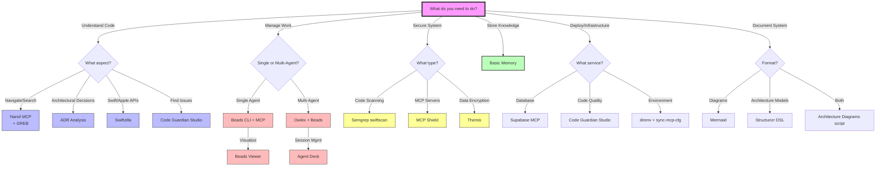
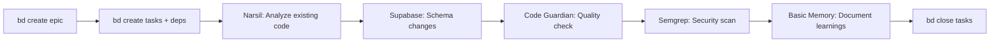

# Tool Decision Matrix - When to Use Which AI Tool

**Purpose**: Quick reference guide for selecting the right tool(s) for specific development tasks in the I Do Blueprint project.

**Related Documentation**:
- [[ai-tools/core-documentation/architecture-overview|Architecture Overview]] - How tools work together
- [[ai-tools/core-documentation/best-practices|Best Practices Guide]] - Usage guidelines
- [[ai-tools/_index|AI Tools Master Index]] - Complete tool catalog

---

## Quick Decision Tree



---

## Task-Based Decision Matrix

### Code Understanding & Navigation

| Task | Primary Tool | Secondary Tools | When to Use |
|------|--------------|-----------------|-------------|
| **Find function definition** | Narsil MCP | - | Always - fastest with 76 specialized tools |
| **Find similar code** | GREB MCP | Narsil (neural mode) | Refactoring, duplicate detection |
| **Search Swift docs** | Swiftzilla | - | Learning Apple APIs, finding examples |
| **Understand call hierarchy** | Narsil MCP | - | Debugging, impact analysis |
| **Track architectural decisions** | ADR Analysis | Basic Memory | Design reviews, onboarding |
| **Find technical debt hotspots** | Code Guardian Studio | Narsil | Refactoring prioritization |
| **Analyze dependencies** | Narsil MCP | - | Before major refactoring |
| **Search by semantic meaning** | GREB + Narsil (neural) | - | "Find retry logic patterns" style queries |

**Example Prompt Patterns**:
```
❌ Don't: "Find the login code"  
✅ Do: "Use Narsil to find all functions that call authenticate() and show their call stack"

❌ Don't: "Are there similar functions?"
✅ Do: "Use GREB to find code semantically similar to handlePayment() - I'm looking for other financial transaction patterns"

❌ Don't: "How do I use URLSession?"
✅ Do: "Use Swiftzilla to find URLSession examples for downloading JSON data with error handling"
```

### Task & Project Management

| Task | Primary Tool | Secondary Tools | When to Use |
|------|--------------|-----------------|-------------|
| **Create work plan** | Beads CLI | - | Start of feature, epic breakdown |
| **Find next task** | Beads `bd ready` | Beads Viewer | Daily workflow, agent context |
| **Visualize dependencies** | Beads Viewer | - | Planning, debugging blockers |
| **Track blockers** | Beads (status=blocked) | - | When dependencies exist |
| **Multi-agent coordination** | Owlex | Beads, Agent Deck | Team projects, parallel work |
| **Session handoff** | Agent Deck | Beads notes | Multi-day work, agent switching |
| **Sync across machines** | Beads (git) | - | Working on multiple devices |
| **Compact old tasks** | Beads `bd compact` | - | Large projects (>1000 tasks) |

**Decision Logic**:
```python
if number_of_agents == 1:
    use("Beads CLI + MCP")
    if need_visualization:
        use("Beads Viewer")
elif number_of_agents > 1:
    use("Owlex")  # Agent orchestration
    use("Agent Deck")  # Session management
    use("Beads")  # Shared task DAG
```

**Example Workflows**:
```bash
# Solo developer starting a feature
bd create "Implement RSVP feature" -p 1 --type epic
bd create "Design database schema" -p 1 --parent bd-abc
bd create "Build API endpoints" -p 1 --parent bd-abc  
bd dep add bd-xyz bd-uvw  # API depends on schema

# Multi-agent team
owlex assign agent-1 backend
owlex assign agent-2 frontend  
bd create "Backend auth" --assignee agent-1
bd create "Frontend login UI" --assignee agent-2
bd dep add frontend-task backend-task
```

### Security & Compliance

| Task | Primary Tool | Secondary Tools | When to Use |
|------|--------------|-----------------|-------------|
| **Pre-commit security scan** | Semgrep (`swiftscan`) | - | Every commit (via git hook) |
| **Audit MCP servers** | MCP Shield | - | Weekly, after adding new servers |
| **Find secrets in code** | Semgrep (`p/secrets`) | - | Pre-commit, CI/CD |
| **Encrypt sensitive data** | Themis | - | User data, API keys in app |
| **Check Swift vulnerabilities** | Semgrep (custom rules) | - | iOS/macOS projects |
| **Generate SBOM** | Narsil MCP | - | Compliance, supply chain security |
| **Vulnerability scanning** | Narsil + OSV database | Semgrep | Dependency audit |

**Security Workflow Priority**:
1. **Daily**: `swiftscan .` before every commit
2. **Weekly**: `mcpscan-all` to audit MCP configurations
3. **Monthly**: `bd create "Security audit" -p0` for comprehensive review
4. **Release**: Full Semgrep + Narsil SBOM generation

**Git Hook Setup**:
```bash
# .git/hooks/pre-commit
#!/bin/bash
swiftscan . || exit 1
mcpscan --path .mcp.json || exit 1
./scripts/security-check.sh || exit 1
```

### Knowledge Management

| Task | Primary Tool | Secondary Tools | When to Use |
|------|--------------|-----------------|-------------|
| **Document design decision** | Basic Memory | ADR Analysis | After architectural choices |
| **Store learnings** | Basic Memory | - | End of complex debugging |
| **Search project knowledge** | Basic Memory | - | Before starting new work |
| **Link related concepts** | Basic Memory (relations) | - | Building knowledge graph |
| **Visualize knowledge** | Obsidian | Basic Memory | Human review, presentations |
| **Continue past conversation** | Basic Memory `build_context` | - | Multi-session work |
| **Find recent activity** | Basic Memory `recent_activity` | - | Daily standup, status updates |
| **Create concept maps** | Basic Memory `canvas` | Mermaid | Complex system visualization |

**Knowledge Capture Patterns**:
```markdown
## When to write a note:
✅ Complex bug that took >2 hours to solve
✅ Non-obvious architectural decision  
✅ Performance optimization technique
✅ Third-party API quirks/workarounds
✅ Team-specific coding patterns

❌ Don't write notes for:
❌ Standard language syntax
❌ Common best practices (already documented)
❌ Temporary workarounds (file a Beads issue instead)
```

**Example Memory Usage**:
```javascript
// During work
await memory.write_note({
  title: "RSVP Email Delivery Optimization",
  folder: "learnings/performance",
  content: `
  Observations:
  - [performance] Batching 100 emails reduced send time from 45s to 8s
  - [infrastructure] Supabase Edge Functions have 10s timeout limit
  
  Relations:
  - improves [[technical/email-system]]
  - uses [[infrastructure/supabase-edge-functions]]
  `
});

// Later retrieval
const context = await memory.build_context({
  url: "memory://learnings/performance/rsvp-email-delivery-optimization",
  depth: 2,  // Include related notes
  timeframe: "30d"
});
```

### Infrastructure & Deployment

| Task | Primary Tool | Secondary Tools | When to Use |
|------|--------------|-----------------|-------------|
| **Database migrations** | Supabase MCP | Beads (track tasks) | Schema changes |
| **Generate TypeScript types** | Supabase CLI | - | After DB schema updates |
| **Edge Function deployment** | Supabase MCP | - | Serverless functions |
| **Environment setup** | direnv | - | Per-directory config |
| **Sync MCP configs** | sync-mcp-cfg | - | Multiple AI clients |
| **Local dev database** | Supabase (local) | - | Development, testing |
| **Code quality monitoring** | Code Guardian Studio | Beads | Continuous improvement |

**Infrastructure Decision Tree**:
```
New database table needed?
├─ Development: `sb-reset` → Supabase MCP migration
├─ Staging: `sb db push` → review → `sb-gen-types`
└─ Production: `sb db push` → monitor → document in Basic Memory

New MCP server needed?
├─ Add to `.mcp.json`
├─ Run `sync-mcp-cfg` to update all clients
└─ Test with `mcpscan --path .mcp.json`
```

### Documentation & Visualization

| Task | Primary Tool | Secondary Tools | When to Use |
|------|--------------|-----------------|-------------|
| **Quick diagrams** | Mermaid | - | README, inline docs, chat responses |
| **Architecture diagrams** | Structurizr DSL | Mermaid | Formal C4 models, presentations |
| **Generate from code** | Narsil + Mermaid | - | Automated call graphs, dependency diagrams |
| **Interactive diagrams** | Narsil (--frontend) | - | Exploring large codebases |
| **Knowledge visualization** | Basic Memory (canvas) | Obsidian graph | System overviews |
| **Batch diagram generation** | `generate-diagrams.sh` | - | CI/CD, documentation updates |

**Diagram Selection Guide**:

| Diagram Type | Tool | Format | Best For |
|--------------|------|--------|----------|
| Sequence diagrams | Mermaid | Text | API flows, user journeys |
| Flowcharts | Mermaid | Text | Decision logic, algorithms |
| System context (C4) | Structurizr DSL | PlantUML | Architecture overview |
| Container diagram (C4) | Structurizr DSL | PlantUML | Service boundaries |
| Component diagram (C4) | Structurizr DSL | PlantUML | Internal structure |
| Call graphs | Narsil | Interactive | Code exploration |
| Knowledge graphs | Basic Memory | Canvas | Concept relationships |

---

## Complexity-Based Recommendations

### Simple Tasks (< 1 hour)
**Characteristics**: Single-file changes, clear requirements, no dependencies

**Minimal Toolset**:
- Narsil MCP (code navigation)
- Beads (optional - if needs tracking)
- Semgrep (pre-commit security)

**Example**: "Fix typo in validation message"
```bash
# Quick fix - no Beads needed
git checkout -b fix/typo
# AI uses Narsil to find validation code
# Make change, commit
swiftscan .  # Pre-commit security
git push
```

### Medium Tasks (1-8 hours)
**Characteristics**: Multi-file, some architectural decisions, testing needed

**Recommended Toolset**:
- Beads (track sub-tasks)
- Narsil MCP (code understanding)
- Supabase (if DB changes)
- Basic Memory (document decisions)
- Semgrep (security)

**Example**: "Add email confirmation to RSVP"
```bash
bd create "Add RSVP email confirmation" -p 1 -t task
bd create "Update schema for email status" -p 2
bd create "Implement email sending" -p 1
bd create "Add email templates" -p 2
bd dep add email-templates email-sending  # Templates needed first

# Work through tasks using bd ready
bd ready --json | jq '.[0].id'  # Get next task
# Use Supabase MCP for DB changes
# Document email service setup in Basic Memory
```

### Complex Tasks (1-5 days)
**Characteristics**: Epics with multiple features, cross-cutting concerns, team coordination

**Full Toolset**:
- Beads (epic/task hierarchy)
- Beads Viewer (dependency visualization)
- Owlex (if multi-agent)
- Narsil + GREB (code analysis)
- ADR Analysis (architectural decisions)
- Supabase (infrastructure)
- Basic Memory (knowledge accumulation)
- Code Guardian (quality monitoring)
- All security tools

**Example**: "Implement guest management system"
```bash
bd create "Epic: Guest Management System" -p 0 --type epic
# Create subtasks under epic
bd create "Design guest data model" -p 1 --parent epic-id
bd create "Build RSVP API endpoints" -p 1 --parent epic-id
bd create "Create admin dashboard" -p 2 --parent epic-id
bd create "Email notification system" -p 2 --parent epic-id

# Set up dependencies
bd dep add rsvp-api guest-model
bd dep add admin-dashboard rsvp-api
bd dep add email-system rsvp-api

# Use Beads Viewer to visualize
bv --show-deps epic-id

# Multi-agent? Use Owlex
owlex create-team "guest-mgmt" backend frontend
owlex assign agent-backend "RSVP API endpoints"
owlex assign agent-frontend "Admin dashboard"
```

---

## Anti-Patterns (What NOT to Do)

### ❌ Using Too Many Tools for Simple Tasks
```bash
# WRONG - overkill for a typo fix
bd create "Fix typo" -p 3
# Use ADR Analysis
# Use Code Guardian
# Document in Basic Memory
# Generate diagrams

# RIGHT
# Just fix it and commit with swiftscan
```

### ❌ Bypassing Security Tools
```bash
# WRONG
git commit -m "Quick fix" --no-verify

# RIGHT  
swiftscan .
git commit -m "Fix: Update validation logic"
```

### ❌ Not Using Beads for Multi-Step Work
```bash
# WRONG - AI loses context after 3 hours
Agent: "Create feature X"
[Makes plan in markdown, works for 3 hours]
[Context window fills up]
Agent: "Uh, what was I doing?"

# RIGHT
bd create "Feature X" --type epic
bd create "Step 1" --parent feature-x
# Agent always knows: bd ready shows next task
# Notes field preserves state across sessions
```

### ❌ Ignoring Dependency Relationships
```bash
# WRONG
bd create "Build UI" -p 1
bd create "Build API" -p 1
# Both tasks ready, but UI depends on API!

# RIGHT
bd create "Build API" -p 1
bd create "Build UI" -p 1
bd dep add ui-task api-task  # UI blocked until API done
```

### ❌ Not Documenting Important Decisions
```bash
# WRONG
# Spend 4 hours debugging OAuth flow
# Fix it
# Never document the solution
# Waste 4 hours again next month

# RIGHT
# After solving:
memory.write_note({
  title: "OAuth Token Refresh Timing Issue",
  folder: "learnings/auth",
  content: "Token refresh must happen 60s BEFORE expiry due to clock skew..."
})
```

---

## Tool Combination Recipes

### Recipe 1: Feature Development End-to-End


**Shell Commands**:
```bash
# 1. Plan work
bd create "Feature: Guest dietary preferences" -p 1 --type epic
bd create "Add dietary_notes column" -p 1 --parent epic-id
bd create "Update RSVP form" -p 2 --parent epic-id
bd dep add rsvp-form schema-change

# 2. Analyze existing patterns
# AI: Use Narsil to find similar form fields

# 3. Implement schema
# AI: Use Supabase to create migration

# 4. Quality check
# AI: Use Code Guardian to analyze new code

# 5. Security scan
swiftscan app/

# 6. Document
# AI: Use Basic Memory to store dietary requirements handling pattern

# 7. Close
bd close schema-change-task
bd close rsvp-form-task
bd close epic-id
```

### Recipe 2: Security Audit Workflow
```bash
# Daily
swiftscan .

# Weekly
mcpscan-all
bd create "Review security scan results" -p 1

# Monthly
bd create "Full security audit" -p 0 --type epic
bd create "Run Semgrep full scan" -p 1 --parent epic
bd create "Generate SBOM with Narsil" -p 1 --parent epic
bd create "MCP Shield audit" -p 1 --parent epic
bd create "Review Themis crypto usage" -p 2 --parent epic
```

### Recipe 3: Multi-Agent Code Review
```bash
# Agent 1: Review architecture
owlex assign agent-arch "ADR Analysis review"
# Use ADR Analysis to validate design patterns

# Agent 2: Review security
owlex assign agent-security "Security scan"
# Use Semgrep + MCP Shield

# Agent 3: Review quality
owlex assign agent-quality "Code quality assessment"
# Use Code Guardian + Narsil complexity analysis

# Handoff to human
agent-deck create-report --agents all
# Basic Memory: Store review findings
```

---

## Performance Considerations

### Tool Selection by Codebase Size

| Codebase Size | Recommended Tools | Notes |
|---------------|-------------------|-------|
| **Small (< 10k LOC)** | Narsil, Beads, Basic Memory | All tools run fast |
| **Medium (10-100k LOC)** | Add GREB for semantic search | Narsil still fast, GREB helps with fuzzy search |
| **Large (100k-500k LOC)** | Narsil + GREB + Code Guardian | Consider Narsil `--exclude` patterns |
| **Very Large (>500k LOC)** | Add Narsil neural embeddings | Use API-based embeddings (Voyage AI) |

### Tool Call Optimization

**Avoid Redundant Calls**:
```javascript
// ❌ BAD - calling Narsil 3 times
const file1 = await narsil.getFileContent("A.swift")
const file2 = await narsil.getFileContent("B.swift")
const file3 = await narsil.getFileContent("C.swift")

// ✅ GOOD - batch or filter
const files = await narsil.searchFiles("*.swift", {folder: "auth/"})
```

**Cache Expensive Operations**:
```bash
# Don't run full SBOM generation on every query
# Instead: Generate weekly, store in Basic Memory

bd create "Weekly SBOM generation" -p 2
# Cron or manual trigger
narsil-mcp --sbom > sbom-$(date +%Y%m%d).json
memory write_note "SBOM-$(date)" "$(<sbom.json)" "security/"
```

---

## Related Documentation

- **Architecture**: [[ai-tools/core-documentation/architecture-overview|System Architecture]]
- **Setup**: [[ai-tools/getting-started/first-time-setup|First-Time Setup]]
- **Best Practices**: [[ai-tools/core-documentation/best-practices|Development Best Practices]]
- **Workflows**: [[ai-tools/integration-patterns/_index|Integration Patterns]]
- **Performance**: [[ai-tools/core-documentation/performance-optimization|Performance Guide]]

---

**Last Updated**: 2025-12-30  
**Version**: 1.0  
**Maintainer**: Jessica Clark