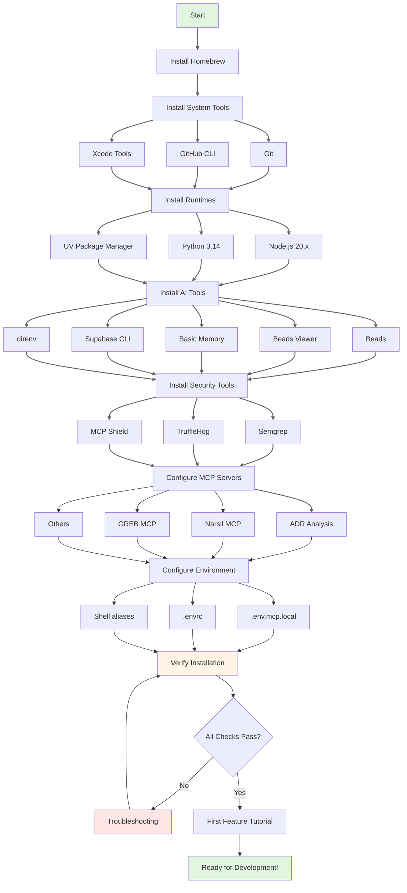

# First-Time Setup Guide - AI Development Environment

> **📚 For AI Agents**: This is a procedural setup guide. Follow steps sequentially. Each section has verification commands. Links to tool-specific documentation use `[[wikilink]]` format. Environment variables are in UPPER_CASE. Commands are in code blocks with explicit bash indicators.

> **👤 For Humans**: This guide takes 2-4 hours to complete. Bookmark sections you need to revisit. All commands are copy-paste ready. Jump to specific sections using the TOC.

---

## Document Metadata

**Last Updated**: 2025-12-30  
**Target Audience**: New developers, AI agents onboarding to I Do Blueprint  
**Prerequisites**: macOS 13.0+, admin access, internet connection  
**Estimated Time**: 2-4 hours  
**Success Criteria**: All verification checks pass, first feature tutorial completed  
**Related Docs**: [[ai-tools/getting-started/troubleshooting|Troubleshooting Guide]], [[ai-tools/getting-started/environment-verification|Environment Verification]], [[ai-tools/core-documentation/architecture-overview|Architecture Overview]]

---

## Table of Contents

**Quick Navigation for Humans**:
- [Prerequisites](#prerequisites) - System requirements and accounts
- [Installation Roadmap](#installation-roadmap) - Visual overview
- [Step-by-Step Setup](#step-by-step-setup) - Detailed instructions
- [Verification](#verification) - Test your setup
- [First Feature Tutorial](#first-feature-tutorial) - Hands-on practice
- [Troubleshooting](#troubleshooting-quick-reference) - Common issues

**For AI Agents**:
- Use section headers as navigation anchors
- Execute verification commands after each step
- Consult [[ai-tools/getting-started/troubleshooting|Troubleshooting Guide]] if any check fails
- Reference [[ai-tools/tool-docs/|Tool-Specific Documentation]] for detailed configuration

---

## Prerequisites

### System Requirements

```yaml
# AI Agent Parseable Format
system_requirements:
  operating_system: macOS 13.0+
  cpu: Intel or Apple Silicon
  memory: 16GB+ RAM (recommended)
  storage: 20GB+ free disk space
  network: Broadband internet connection
  permissions: Administrator access required
  
compatibility_matrix:
  macos_ventura: 13.0+  # Minimum
  macos_sonoma: 14.0+   # Recommended
  macos_sequoia: 15.0+  # Fully tested
```

**Human-Readable Requirements**:
- **Operating System**: macOS 13.0+ (Ventura or later)
- **Hardware**: 
  - 16GB+ RAM recommended (AI tools can be memory-intensive)
  - 20GB+ free disk space
  - Intel or Apple Silicon processor
- **Access**: Administrator privileges for some installations
- **Network**: Stable internet for downloads and MCP servers

### Required Accounts

**Create these accounts before starting** (save credentials in password manager):

| Service | Purpose | Sign-Up URL | Cost |
|---------|---------|-------------|------|
| **GitHub** | Code hosting, authentication | https://github.com/signup | Free |
| **Supabase** | Backend infrastructure | https://supabase.com/dashboard | Free tier available |
| **OpenRouter** | AI model API (ADR Analysis) | https://openrouter.ai | Pay-per-use |
| **GREB** | Semantic code search | https://greb.ai | Free tier available |
| **Swiftzilla** | Swift documentation search | https://swiftzilla.dev | Free tier available |

**Optional but Recommended**:
- **Sentry** (https://sentry.io) - Error tracking and monitoring
- **Google Cloud** (https://cloud.google.com) - OAuth, Sheets export

**🤖 AI Agent Note**: Store API keys in secure environment variables, never in code. See [[security/api-key-management-guide|API Key Management Guide]].

**👤 Human Note**: Use a password manager like 1Password or Bitwarden to store these credentials securely.

---

## Installation Roadmap



**Legend**:
- 🟢 Green: Start/Complete
- 🟡 Yellow: Verification checkpoint
- 🔴 Red: Error handling

---

## Step-by-Step Setup

### Step 1: Install Homebrew (Package Manager)

**Purpose**: Homebrew simplifies installation of command-line tools on macOS.  
**Related**: [[ai-tools/tool-docs/workflow/direnv|direnv documentation]] uses Homebrew

**Installation**:

```bash
# Install Homebrew
/bin/bash -c "$(curl -fsSL https://raw.githubusercontent.com/Homebrew/install/HEAD/install.sh)"

# Add Homebrew to PATH (follow on-screen instructions after install)
# For Apple Silicon (M1/M2/M3):
echo 'eval "$(/opt/homebrew/bin/brew shellenv)"' >> ~/.zshrc
eval "$(/opt/homebrew/bin/brew shellenv)"

# For Intel Macs:
echo 'eval "$(/usr/local/bin/brew shellenv)"' >> ~/.zshrc
eval "$(/usr/local/bin/brew shellenv)"
```

**Verification**:

```bash
brew --version
# Expected output: Homebrew 4.x.x or later
```

**❌ If verification fails**: See [[ai-tools/getting-started/troubleshooting#homebrew-installation-failed|Troubleshooting: Homebrew Installation]]

---

### Step 2: Install System Tools

#### Git (Version Control)

**Purpose**: Git manages code versions and enables collaboration.  
**Related**: [[ai-tools/tool-docs/workflow/beads|Beads]] relies on Git for task synchronization

```bash
# Install Git
brew install git

# Configure Git (use your GitHub credentials)
git config --global user.name "Your Full Name"
git config --global user.email "your.email@example.com"

# Recommended: Set default branch to main
git config --global init.defaultBranch main

# Verification
git --version
# Expected: git version 2.40.0 or later
```

**🤖 AI Agent Note**: Git configuration is user-specific. Verify with `git config --list --global`.

#### GitHub CLI

**Purpose**: GitHub CLI enables programmatic GitHub operations.  
**Integration**: Used by [[ai-tools/integration-patterns/feature-development-end-to-end|Feature Development Workflow]]

```bash
# Install GitHub CLI
brew install gh

# Authenticate with GitHub
gh auth login
# Prompts:
# 1. Choose: GitHub.com
# 2. Protocol: HTTPS
# 3. Authenticate: Login with a web browser
# 4. Follow browser prompts

# Verification
gh auth status
# Expected: ✓ Logged in to github.com account <your-username> (<your-email>)
```

**❌ If verification fails**: See [[ai-tools/getting-started/troubleshooting#github-authentication|Troubleshooting: GitHub Authentication]]

#### Xcode Command Line Tools

**Purpose**: Required for compiling Swift code and iOS/macOS development.  
**Critical For**: Building I Do Blueprint application

```bash
# Install Xcode Command Line Tools
xcode-select --install
# A GUI dialog will appear - click "Install" and agree to license

# Verification
xcodebuild -version
# Expected: Xcode 15.0 or later

# Accept license if needed
sudo xcodebuild -license accept
```

**🤖 AI Agent Note**: If full Xcode.app is installed, command line tools are included. Verify with `xcode-select -p`.

**❌ If verification fails**: See [[ai-tools/getting-started/troubleshooting#xcode-command-line-tools-issues|Troubleshooting: Xcode Tools]]

---

### Step 3: Install Runtime Environments

#### Node.js (JavaScript Runtime)

**Purpose**: Required for npm-based MCP servers.  
**Used By**: [[ai-tools/tool-docs/code-intelligence/adr-analysis-server|ADR Analysis Server]], [[ai-tools/tool-docs/security/mcp-shield|MCP Shield]]

```bash
# Install Node.js LTS (Long Term Support)
brew install node

# Verification
node --version  # Expected: v20.19.6 or later
npm --version   # Expected: 10.8.2 or later
```

**Version Requirements**:
```yaml
node:
  minimum: 18.0.0
  recommended: 20.x LTS
  your_version: <check with node --version>
```

#### Python 3 (Python Runtime)

**Purpose**: Required for Python-based MCP servers.  
**Used By**: [[ai-tools/tool-docs/knowledge/basic-memory|Basic Memory]], [[ai-tools/tool-docs/workflow/beads|Beads]], [[ai-tools/tool-docs/infrastructure/code-guardian|Code Guardian]]

```bash
# Install Python 3.14
brew install python@3.14

# Verification
python3 --version
# Expected: Python 3.14.2 or later

# Verify pip
pip3 --version
# Expected: pip 24.x or later
```

#### UV (Fast Python Package Manager)

**Purpose**: Modern, fast Python package installer (replaces pip for speed).  
**Performance**: 10-100x faster than pip for package installation  
**Critical For**: Installing [[ai-tools/tool-docs/workflow/beads|Beads]] and [[ai-tools/tool-docs/knowledge/basic-memory|Basic Memory]]

```bash
# Install UV
brew install uv

# Verification
uv --version
# Expected: uv 0.9.20 or later
```

**🤖 AI Agent Note**: Use `uvx` for installing Python CLI tools globally, `uv pip` for package installation.

---

### Step 4: Install AI Development Tools

#### Beads (Git-Backed Task Tracking)

**Purpose**: Local-first task tracking with git synchronization.  
**Documentation**: [[ai-tools/tool-docs/workflow/beads|Beads - Git-Backed Task Tracking]]  
**Integration**: Core to [[ai-tools/integration-patterns/daily-workflow|Daily Workflow Patterns]]

```bash
# Install Beads CLI
brew install beads

# Verification
bd --version
# Expected: beads v0.5.x or later

# Initialize in project (IMPORTANT: Run from project root)
cd ~/Development/nextjs-projects/I\ Do\ Blueprint
bd init
# Expected output: ✓ Initialized beads in .beads/

# Verify initialization
ls -la .beads/
# Should show: issues.db, config.json
```

**🤖 AI Agent Context**:
```yaml
beads:
  storage: .beads/issues.db
  format: JSON lines (append-only)
  backup: Auto-backed up to git
  commands:
    create: bd create --title "..." --type task|bug|feature
    list: bd list --status=open|in_progress|closed
    update: bd update <id> --status=in_progress
    close: bd close <id>
    sync: bd sync  # Push/pull from git
```

#### Beads Viewer (Task Visualization)

**Purpose**: Graph visualization and AI-powered task triage.  
**Documentation**: [[ai-tools/tool-docs/workflow/beads-viewer|Beads Viewer - Graph-Aware Task Visualization]]  
**Key Feature**: `bv --robot-triage` provides AI-powered task prioritization

```bash
# Install Beads Viewer
brew install beads-viewer

# Verification
bv --version
# Expected: beads-viewer v0.2.x or later

# Test triage (from project root with .beads/)
cd ~/Development/nextjs-projects/I\ Do\ Blueprint
bv --robot-triage
# Should show task recommendations
```

**🤖 AI Agent Usage**:
```bash
# Get prioritized task recommendations
bv --robot-triage

# View dependency graph
bv --graph

# Export to HTML
bv --export tasks.html
```

#### Basic Memory (Knowledge Management)

**Purpose**: Local-first knowledge graphs with semantic search.  
**Documentation**: [[ai-tools/tool-docs/knowledge/basic-memory|Basic Memory - Local-First Knowledge Graphs]]  
**Critical For**: [[ai-tools/integration-patterns/session-management|Session Management Protocol]]

```bash
# Install Basic Memory globally with uv
uv tool install basic-memory

# Verification
basic-memory --version
# Expected: basic-memory v0.3.x or later

# Initialize project
basic-memory init i-do-blueprint
# Creates: ~/Documents/basic-memory/i-do-blueprint/

# Verify initialization
ls -la ~/Documents/basic-memory/i-do-blueprint/
# Should show: .basic-memory/, notes/, projects/
```

**🤖 AI Agent Context**:
```yaml
basic_memory:
  project_name: i-do-blueprint
  storage: ~/Documents/basic-memory/i-do-blueprint/
  search: mcp__basic-memory__search_notes
  write: mcp__basic-memory__write_note
  context: mcp__basic-memory__build_context
  usage:
    - Store architectural decisions
    - Document patterns and pitfalls
    - Build context for long conversations
```

**Related Workflows**:
- [[ai-tools/integration-patterns/session-management|Session Management Protocol]]
- [[ai-tools/core-documentation/best-practices#knowledge-management|Best Practices: Knowledge Management]]

#### Supabase CLI

**Purpose**: Interact with Supabase backend (database migrations, edge functions).  
**Documentation**: [[ai-tools/tool-docs/infrastructure/supabase|Supabase - Database & Backend Infrastructure]]  
**Critical For**: Database operations, deployment workflows

```bash
# Add Supabase tap to Homebrew
brew tap supabase/tap

# Install Supabase CLI
brew install supabase

# Authenticate with Supabase
supabase login
# Opens browser for authentication

# Verification
supabase --version
# Expected: 1.x.x or later

supabase projects list
# Should show your projects (requires authentication)
```

**🤖 AI Agent Note**: Supabase CLI requires authentication token. Store in keychain, never in code.

#### direnv (Per-Directory Environment Management)

**Purpose**: Automatically load environment variables when entering project directory.  
**Documentation**: [[ai-tools/tool-docs/workflow/direnv|direnv - Per-Directory Environment Management]]  
**Security**: See [[security/api-key-management-guide|API Key Management Guide]]

```bash
# Install direnv
brew install direnv

# Add hook to shell (CRITICAL - enables auto-loading)
echo 'eval "$(direnv hook zsh)"' >> ~/.zshrc
source ~/.zshrc

# Verification
direnv version
# Expected: 2.x.x or later
```

**⚠️ IMPORTANT**: direnv won't work until you create `.envrc` and `.env.mcp.local` (Step 7).

---

### Step 5: Install Security Tools

**Overview**: Security tools prevent secrets from leaking and identify vulnerabilities.  
**Integration**: [[ai-tools/integration-patterns/security-scanning|Security Scanning Workflow]]

#### Semgrep (SAST/SCA Scanner)

**Purpose**: Static analysis for Swift code security.  
**Documentation**: [[ai-tools/tool-docs/security/semgrep|Semgrep - Swift Security Scanning (SAST/SCA)]]

```bash
# Install Semgrep
brew install semgrep

# Verification
semgrep --version
# Expected: 1.x.x or later

# Install custom Swift rules (optional but recommended)
git clone https://github.com/akabe1/akabe1-semgrep-rules.git ~/akabe1-semgrep-rules

# Test scan (from project root)
cd ~/Development/nextjs-projects/I\ Do\ Blueprint
semgrep --config p/swift --config p/secrets .
```

**🤖 AI Agent Usage**:
```bash
# Full Swift security scan with custom rules
swiftscan() {
  semgrep --config ~/akabe1-semgrep-rules/ios/swift/ \
          --config p/swift \
          --config p/secrets \
          "$@"
}

# Use in workflow
swiftscan . --json > security-report.json
```

#### TruffleHog (Secret Scanner)

**Purpose**: Detect secrets in code, git history, and files.  
**Documentation**: [[security/trufflehog-security-audit|TruffleHog Security Audit]]

```bash
# Install TruffleHog
brew install trufflehog

# Verification
trufflehog --version
# Expected: 3.x.x or later

# Test scan (from project root)
cd ~/Development/nextjs-projects/I\ Do\ Blueprint
trufflehog filesystem . --json
```

**⚠️ Security Note**: TruffleHog scans git history. If it finds old secrets, they must be rotated even if already removed from code.

#### MCP Shield (MCP Server Security Auditor)

**Purpose**: Audit MCP servers for security vulnerabilities.  
**Documentation**: [[ai-tools/tool-docs/security/mcp-shield|MCP Shield - MCP Server Security Auditing]]

```bash
# Install globally via npm
npm install -g mcp-shield

# Verification
npx mcp-shield --version
# Expected: 0.x.x or later

# Test scan (run after .mcp.json configured)
npx mcp-shield --config .mcp.json
```

**🤖 AI Agent Note**: Run MCP Shield before deploying new MCP servers. See [[security/mcp-security-audit|MCP Security Audit Report]].

---

### Step 6: Install MCP Servers

**Overview**: MCP (Model Context Protocol) servers provide AI agents with specialized capabilities.  
**Architecture**: See [[ai-tools/core-documentation/architecture-overview#mcp-layer|Architecture: MCP Layer]]

#### Configure .mcp.json

```bash
cd ~/Development/nextjs-projects/I\ Do\ Blueprint

# Copy example configuration
cp .mcp.json.example .mcp.json

# Edit with your preferred editor
nano .mcp.json
# Or: code .mcp.json (VS Code)
# Or: vim .mcp.json
```

**🤖 AI Agent - Complete .mcp.json Structure**:

```json
{
  "mcpServers": {
    "adr-analysis": {
      "type": "stdio",
      "command": "npx",
      "args": ["-y", "mcp-adr-analysis-server"],
      "env": {
        "ADR_DIRECTORY": "docs/adrs",
        "LOG_LEVEL": "ERROR",
        "OPENROUTER_API_KEY": "${OPENROUTER_API_KEY}",
        "PROJECT_PATH": "${PROJECT_PATH}"
      }
    },
    "basic-memory": {
      "type": "stdio",
      "command": "uvx",
      "args": ["basic-memory", "mcp"]
    },
    "beads": {
      "type": "stdio",
      "command": "uvx",
      "args": ["beads-mcp"]
    },
    "code-guardian": {
      "type": "stdio",
      "command": "/Users/YOUR_USERNAME/.nvm/versions/node/v20.19.6/bin/node",
      "args": ["/Users/YOUR_USERNAME/Development/mcp-servers/code-guardian/dist/index.js"],
      "env": {
        "CCG_PROJECT_ROOT": "${PROJECT_PATH}"
      }
    },
    "greb-mcp": {
      "type": "stdio",
      "command": "greb-mcp",
      "env": {
        "GREB_API_KEY": "${GREB_API_KEY}"
      }
    },
    "narsil-mcp": {
      "type": "stdio",
      "command": "narsil-mcp",
      "args": [
        "--repos", "${PROJECT_PATH}",
        "--git",
        "--call-graph",
        "--lsp"
      ],
      "env": {
        "NARSIL_ENABLED_CATEGORIES": "Repository,Symbols,Search,CallGraph,DataFlow,Git,LSP",
        "NARSIL_DISABLED_TOOLS": "neural_search,find_semantic_clones,..."
      }
    },
    "supabase": {
      "type": "stdio",
      "command": "npx",
      "args": [
        "-y",
        "mcp-remote",
        "https://mcp.supabase.com/mcp?project_ref=YOUR_PROJECT_REF"
      ]
    },
    "swiftzilla": {
      "type": "stdio",
      "command": "npx",
      "args": [
        "-y",
        "@swiftzilla/mcp",
        "--api-key",
        "${SWIFTZILLA_API_KEY}"
      ]
    },
    "owlex": {
      "type": "stdio",
      "command": "owlex-server"
    }
  }
}
```

**⚠️ IMPORTANT**: Replace `YOUR_USERNAME` and `YOUR_PROJECT_REF` with your actual values.

**Related Documentation**:
- [[ai-tools/tool-docs/code-intelligence/adr-analysis-server|ADR Analysis Server]]
- [[ai-tools/tool-docs/code-intelligence/narsil-mcp|Narsil MCP - Code Intelligence]]
- [[ai-tools/tool-docs/code-intelligence/greb-mcp|GREB MCP - Semantic Code Search]]
- [[ai-tools/tool-docs/orchestration/owlex|Owlex - Multi-Agent Orchestration]]

#### Install Native MCP Servers

**These require separate installation** (not auto-installed via npx):

```bash
# Narsil MCP (code intelligence with LSP support)
brew install narsil-mcp
narsil-mcp --version

# GREB MCP (semantic code search)
brew install greb-mcp
greb-mcp --version

# Owlex (multi-agent orchestration)
brew install owlex-server
owlex-server --version
```

**🤖 AI Agent Context**:

```yaml
mcp_servers:
  auto_install:  # Via npx -y
    - adr-analysis
    - supabase
    - swiftzilla
  
  manual_install:  # Via brew/uv
    - narsil-mcp
    - greb-mcp
    - owlex-server
    - basic-memory
    - beads-mcp
  
  local_development:  # Custom paths
    - code-guardian
    - local-file-organizer
```

---

### Step 7: Configure Environment Variables

**Purpose**: Store API keys and configuration securely.  
**Security**: See [[security/api-key-management-guide|API Key Management Guide]] for best practices

#### Create .env.mcp.local

```bash
cd ~/Development/nextjs-projects/I\ Do\ Blueprint

# Create environment file (NEVER commit to git!)
touch .env.mcp.local

# Secure permissions (readable only by you)
chmod 600 .env.mcp.local

# Edit with your API keys
nano .env.mcp.local
```

#### Environment Variables Template

**Copy and fill in your actual values**:

```bash
# === Project Configuration ===
export PROJECT_PATH="/Users/YOUR_USERNAME/Development/nextjs-projects/I Do Blueprint"

# === AI Model API Keys ===
export OPENROUTER_API_KEY="sk-or-v1-YOUR_KEY_HERE"        # From openrouter.ai
export GREB_API_KEY="greb_YOUR_KEY_HERE"                  # From greb.ai
export SWIFTZILLA_API_KEY="swz_YOUR_KEY_HERE"            # From swiftzilla.dev

# === Supabase Configuration ===
export SUPABASE_URL="https://YOUR_PROJECT_REF.supabase.co"
export SUPABASE_ANON_KEY="eyJhbGciOiJIUzI1NiIsInR5cCI6IkpXVCJ9..."  # Public anon key (safe in client)
export SUPABASE_SERVICE_ROLE_KEY="eyJhbGciOiJIUzI1NiIsInR5cCI6IkpXVCJ9..."  # ADMIN KEY - NEVER expose in client!

# === Optional: Error Tracking ===
export SENTRY_DSN="https://YOUR_KEY@o123456.ingest.sentry.io/123456"

# === Optional: Google Integration ===
export GOOGLE_CLIENT_ID="YOUR_ID.apps.googleusercontent.com"
export GOOGLE_CLIENT_SECRET="GOCSPX-YOUR_SECRET"
```

**🤖 AI Agent Security Notes**:

```yaml
api_key_safety:
  public_keys:  # Safe to expose in client
    - SUPABASE_ANON_KEY
    - SENTRY_DSN (if using Sentry)
  
  private_keys:  # NEVER expose
    - OPENROUTER_API_KEY
    - GREB_API_KEY
    - SWIFTZILLA_API_KEY
    - SUPABASE_SERVICE_ROLE_KEY
    - GOOGLE_CLIENT_SECRET
  
  storage:
    - Use .env.mcp.local (git-ignored)
    - Never hardcode in source
    - Never log to console
    - Use keychain for user-specific secrets
```

#### Activate direnv

```bash
# Allow direnv to load .env.mcp.local
direnv allow .

# Verify environment variables loaded
echo $PROJECT_PATH
# Expected: /Users/YOUR_USERNAME/Development/nextjs-projects/I Do Blueprint

echo $OPENROUTER_API_KEY | cut -c1-10
# Expected: sk-or-v1- (first 10 chars only, don't expose full key)

# Check all critical vars
env | grep -E "(PROJECT_PATH|OPENROUTER|GREB|SUPABASE|SWIFTZILLA)"
```

**❌ If verification fails**: See [[ai-tools/getting-started/troubleshooting#environment-variables-not-loading|Troubleshooting: Environment Variables]]

---

### Step 8: Configure Shell Aliases (Optional but Recommended)

**Purpose**: Speed up common workflows with shortcuts.  
**Related**: [[ai-tools/shell-reference/shell-aliases|Shell Aliases and Functions Reference]]

```bash
# Open shell configuration
nano ~/.zshrc
# Or: code ~/.zshrc (VS Code)

# Scroll to bottom and add these aliases
```

**Recommended Aliases for I Do Blueprint**:

```bash
# === I Do Blueprint Development ===

# Project Navigation
alias idb='cd ~/Development/nextjs-projects/I\ Do\ Blueprint'
alias idb-docs='cd ~/Development/nextjs-projects/I\ Do\ Blueprint/docs'
alias idb-tests='cd ~/Development/nextjs-projects/I\ Do\ Blueprint/I\ Do\ BlueprintTests'

# Build & Test (see CLAUDE.md for detailed build commands)
alias idb-build='xcodebuild build -project "I Do Blueprint.xcodeproj" -scheme "I Do Blueprint" -destination "platform=macOS"'
alias idb-test='xcodebuild test -project "I Do Blueprint.xcodeproj" -scheme "I Do Blueprint" -destination "platform=macOS"'
alias idb-clean='xcodebuild clean -project "I Do Blueprint.xcodeproj" -scheme "I Do Blueprint"'

# Task Management
alias idb-ready='bd ready'                              # Show ready tasks
alias idb-triage='bv --robot-triage'                   # AI-powered task triage
alias idb-status='bd stats && bd list --status=in_progress'

# Knowledge Management
alias idb-mem='basic-memory search --project i-do-blueprint'
alias idb-context='basic-memory build-context memory://projects/i-do-blueprint'

# Security Scanning
alias idb-scan='swiftscan .'                           # Swift security scan
alias idb-secrets='trufflehog filesystem .'            # Secret detection
alias idb-mcp-audit='npx mcp-shield --config .mcp.json'

# Session Management
alias idb-start='echo "🚀 Starting I Do Blueprint session..." && cd ~/Development/nextjs-projects/I\ Do\ Blueprint && direnv allow . && bd ready'
alias idb-end='echo "💾 Ending session..." && bd sync && git status'

# Swift security scan wrapper (uses custom Semgrep rules)
swiftscan() {
  semgrep --config ~/akabe1-semgrep-rules/ios/swift/ \
          --config p/swift \
          --config p/secrets \
          "$@"
}

# Quick project health check
idb-health() {
  echo "📊 I Do Blueprint Health Check"
  echo ""
  echo "📋 Tasks:"
  bd stats
  echo ""
  echo "🔒 Git Status:"
  git status --short
  echo ""
  echo "🏗️  Build Status:"
  xcodebuild build -project "I Do Blueprint.xcodeproj" \
                   -scheme "I Do Blueprint" \
                   -destination 'platform=macOS' \
                   -quiet && echo "✅ Build passing" || echo "❌ Build failing"
}
```

**Activate Aliases**:

```bash
# Reload shell configuration
source ~/.zshrc

# Test an alias
idb-status
```

**🤖 AI Agent Usage**:
```bash
# Start development session
idb-start

# Check what's ready to work on
idb-ready

# Run health check
idb-health

# End session (sync Beads, check git)
idb-end
```

---

## Verification

**Purpose**: Ensure all tools installed correctly before proceeding.  
**Related**: [[ai-tools/getting-started/environment-verification|Environment Setup Verification (detailed script)]]

### Automated Verification

```bash
# Run comprehensive verification script
cd ~/Development/nextjs-projects/I\ Do\ Blueprint
./scripts/verify-tooling.sh
```

**Expected Output**:

```
Verifying project tooling...
✓ GitHub CLI authenticated
✓ Xcode Command Line Tools installed
✓ Supabase CLI authenticated
✓ Swift installed: Apple Swift version 5.9.x

Tooling verification complete!
```

### Manual Verification Checklist

**🤖 AI Agents**: Execute each command and verify output matches expected pattern.

#### System Tools

```bash
# Git
git --version
# Expected: git version 2.40.0+

# GitHub CLI
gh auth status
# Expected: ✓ Logged in to github.com account <your-username>

# Xcode
xcodebuild -version
# Expected: Xcode 15.0+ and Build version
```

#### Runtime Environments

```bash
# Node.js
node --version
# Expected: v20.19.6+

npm --version
# Expected: 10.8.2+

# Python
python3 --version
# Expected: Python 3.14.2+

# UV
uv --version
# Expected: uv 0.9.20+
```

#### AI Development Tools

```bash
# Beads
bd --version
# Expected: beads v0.5.x+

# Beads Viewer
bv --version
# Expected: beads-viewer v0.2.x+

# Basic Memory
basic-memory --version
# Expected: basic-memory v0.3.x+

# Supabase
supabase --version
# Expected: 1.x.x+

# direnv
direnv version
# Expected: 2.x.x
```

#### Security Tools

```bash
# Semgrep
semgrep --version
# Expected: 1.x.x+

# TruffleHog
trufflehog --version
# Expected: 3.x.x+

# MCP Shield
npx mcp-shield --version
# Expected: 0.x.x+
```

#### MCP Servers

```bash
# Narsil
narsil-mcp --version
# Expected: narsil-mcp 0.x.x

# GREB
greb-mcp --version
# Expected: greb-mcp 0.x.x

# Owlex
owlex-server --version
# Expected: owlex 0.x.x
```

#### Environment Variables

```bash
# Project path
echo $PROJECT_PATH
# Expected: /Users/.../I Do Blueprint

# API keys (show only first 10 chars for security)
echo $OPENROUTER_API_KEY | cut -c1-10
# Expected: sk-or-v1-

echo $GREB_API_KEY | cut -c1-5
# Expected: greb_

echo $SUPABASE_URL
# Expected: https://...supabase.co
```

#### MCP Server Connectivity

```bash
# Start Claude Code and check MCP servers
claude mcp list
```

**Expected Output**:

```
✓ adr-analysis (connected)
✓ basic-memory (connected)
✓ beads (connected)
✓ code-guardian (connected)
✓ greb-mcp (connected)
✓ narsil-mcp (connected)
✓ supabase (connected)
✓ swiftzilla (connected)
✓ owlex (connected)
```

**❌ If any MCP server fails**: See [[ai-tools/getting-started/troubleshooting#mcp-server-wont-connect|Troubleshooting: MCP Server Connection]]

---

## First Feature Tutorial

**Purpose**: Hands-on verification of your setup using real workflows.  
**Related**: [[ai-tools/integration-patterns/feature-development-end-to-end|Feature Development End-to-End Workflow]]

### Tutorial: Create and Complete a Simple Task

#### Step 1: Create Task in Beads

```bash
# Navigate to project
cd ~/Development/nextjs-projects/I\ Do\ Blueprint
# Or use alias: idb

# Create a simple task
bd create \
  --title "Add hello world utility function" \
  --description "Verify AI tools setup by creating a simple utility function" \
  --type task \
  --priority 2

# Expected output:
# ✓ Created beads-xxx: Add hello world utility function

# Verify task created
bd list --status=open

# Expected: Should show your new task
```

**🤖 AI Agent Context**:
```yaml
beads_task:
  id: beads-xxx  # Note the ID for later steps
  title: Add hello world utility function
  status: open
  priority: 2 (medium)
  type: task
```

#### Step 2: Document in Basic Memory

```bash
# Create a knowledge note
basic-memory write-note \
  --project i-do-blueprint \
  --title "Hello World Feature Tutorial" \
  --folder tutorials \
  --content "# Hello World Tutorial

This is a test feature created during first-time setup to verify all AI tools are working correctly.

## Steps
1. Created Beads task: beads-xxx
2. Documented in Basic Memory
3. Used Narsil MCP to search codebase
4. Completed and synced task

## Verification
- [x] Beads tracking works
- [x] Basic Memory storage works
- [x] MCP servers connected
- [x] Git synchronization works"

# Expected output:
# ✓ Created note: tutorials/hello-world-feature-tutorial

# Verify note created
basic-memory search --project i-do-blueprint --query "hello world"

# Expected: Should find your tutorial note
```

#### Step 3: Use Narsil MCP to Search Codebase

**Start Claude Code**:

```bash
# Start Claude Code interactive session
claude
```

**In Claude Code, ask**:

```
Using Narsil MCP, find all utility files in the I Do Blueprint project.
Show me where I should add a new utility function.
```

**🤖 Expected AI Behavior**:
- Claude will use `narsil-mcp` tool to search for utility files
- Should find files like `Utilities/`, `Extensions/`, etc.
- Will recommend location for new utility function

**👤 Human Note**: This verifies that Claude Code can successfully:
1. Connect to Narsil MCP server
2. Search your codebase semantically
3. Provide contextual recommendations

#### Step 4: Implement Simple Function (Optional)

**If you want to practice the full workflow**, create a simple utility:

```bash
# Navigate to Utilities directory (or wherever Narsil suggested)
cd "I Do Blueprint/Utilities"

# Create simple utility file
cat > HelloWorldUtility.swift << 'EOF'
import Foundation

/// Simple utility to verify AI development environment setup
enum HelloWorldUtility {
    /// Returns a greeting message
    /// - Parameter name: Name to greet
    /// - Returns: Greeting string
    static func greet(_ name: String = "World") -> String {
        return "Hello, \(name)! AI Development Environment is ready! 🎉"
    }
    
    /// Verifies setup by printing greeting
    static func verifySetup() {
        print(greet("I Do Blueprint"))
    }
}
EOF

# Add to git
git add HelloWorldUtility.swift
git commit -m "feat: Add HelloWorldUtility for setup verification

- Created simple utility function
- Part of first-time setup tutorial
- Verifies AI tools integration"
```

#### Step 5: Complete the Task

```bash
# Close the Beads task (replace beads-xxx with your actual task ID)
bd close beads-xxx --reason "Completed hello world tutorial - verified all tools working"

# Expected output:
# ✓ Closed beads-xxx: Add hello world utility function

# Sync Beads to git
bd sync

# Expected output:
# ✓ Synced beads database to git

# Verify final state
bd stats

# Expected: Shows task in completed count
```

**🤖 AI Agent Context**:
```yaml
tutorial_completion:
  task_id: beads-xxx
  status: completed
  verification:
    - beads_tracking: ✓
    - basic_memory_storage: ✓
    - narsil_search: ✓
    - git_workflow: ✓
    - mcp_connectivity: ✓
```

### Success Criteria

**✅ All systems working if**:

1. **Beads**: Task created, listed, updated, and closed successfully
2. **Basic Memory**: Note created and searchable
3. **Narsil MCP**: Found relevant files in codebase
4. **Git Integration**: bd sync worked without errors
5. **Claude Code**: Successfully connected to all MCP servers

**❌ If any step failed**: Consult [[ai-tools/getting-started/troubleshooting|Troubleshooting Guide]]

---

## Troubleshooting Quick Reference

**Full Guide**: [[ai-tools/getting-started/troubleshooting|Troubleshooting Guide - AI Development Environment]]

### Common Issues

| Issue | Quick Fix | Full Solution |
|-------|-----------|---------------|
| `command not found: <tool>` | `source ~/.zshrc` | [[ai-tools/getting-started/troubleshooting#command-not-found-after-installation\|Troubleshooting § 1.2]] |
| `direnv: .envrc is blocked` | `direnv allow .` | [[ai-tools/getting-started/troubleshooting#direnv-envrc-is-blocked\|Troubleshooting § 3.1]] |
| MCP server won't connect | Check API keys in `.env.mcp.local` | [[ai-tools/getting-started/troubleshooting#mcp-server-wont-connect\|Troubleshooting § 2.1]] |
| Build fails | `xcodebuild -resolvePackageDependencies` | [[ai-tools/getting-started/troubleshooting#xcode-build-fails\|Troubleshooting § 4.1]] |
| `401 Unauthorized` from API | Regenerate API key | [[ai-tools/getting-started/troubleshooting#api-keys-not-working\|Troubleshooting § 3.3]] |

### Emergency Recovery

**If nothing works**, see [[ai-tools/getting-started/troubleshooting#complete-environment-reset|Troubleshooting: Emergency Recovery Procedures]].

---

## Next Steps

**🎉 Congratulations! Your AI development environment is ready.**

### For Humans - Learning Path

1. **Understand the Architecture**  
   Read [[ai-tools/core-documentation/architecture-overview|AI Tools Ecosystem - Architecture Overview]]

2. **Learn Best Practices**  
   Study [[ai-tools/core-documentation/best-practices|Best Practices Guide - AI-Assisted Development]]

3. **Master Daily Workflows**  
   Practice [[ai-tools/integration-patterns/daily-workflow|Daily Workflow Patterns]]

4. **Learn When to Use Which Tool**  
   Reference [[ai-tools/core-documentation/tool-decision-matrix|Tool Decision Matrix]]

5. **Deep Dive into Tools**  
   Explore [[ai-tools/tool-docs/|Tool-Specific Documentation]]

### For AI Agents - Onboarding Protocol

```yaml
ai_agent_onboarding:
  step_1:
    action: Read project guidelines
    resources:
      - CLAUDE.md (project root)
      - AGENTS.md (if exists)
  
  step_2:
    action: Load architectural context
    tool: mcp__basic-memory__build_context
    args:
      url: memory://projects/i-do-blueprint
      depth: 2
  
  step_3:
    action: Review recent work
    tool: mcp__basic-memory__recent_activity
    args:
      timeframe: 7d
      project: i-do-blueprint
  
  step_4:
    action: Get task priorities
    command: bv --robot-triage
  
  step_5:
    action: Check ready work
    command: bd ready --limit 10
  
  step_6:
    action: Consult tool decision matrix
    resource: [[ai-tools/core-documentation/tool-decision-matrix|Tool Decision Matrix]]
  
  step_7:
    action: Begin work following workflows
    workflows:
      - [[ai-tools/integration-patterns/feature-development-end-to-end|Feature Development]]
      - [[ai-tools/integration-patterns/security-scanning|Security Scanning]]
      - [[ai-tools/integration-patterns/multi-agent-coordination|Multi-Agent Coordination]]
```

### Recommended Reading Order

**For comprehensive understanding** (4-6 hours):

1. [[ai-tools/core-documentation/architecture-overview|Architecture Overview]] (30 min)
2. [[ai-tools/core-documentation/best-practices|Best Practices Guide]] (60 min)
3. [[ai-tools/core-documentation/tool-decision-matrix|Tool Decision Matrix]] (30 min)
4. [[ai-tools/integration-patterns/daily-workflow|Daily Workflow Patterns]] (30 min)
5. [[ai-tools/integration-patterns/feature-development-end-to-end|Feature Development End-to-End]] (60 min)
6. Tool-specific docs as needed (15-30 min each)

**For quick start** (30 min):

1. [[ai-tools/core-documentation/tool-decision-matrix|Tool Decision Matrix]]
2. [[ai-tools/integration-patterns/daily-workflow|Daily Workflow Patterns]]
3. Start working, reference other docs as needed

---

## Maintenance

### Weekly Tasks

```bash
# Update all tools
brew update && brew upgrade
npm update -g
uv tool upgrade --all

# Sync Beads
bd sync

# Check for security updates
npx mcp-shield --config .mcp.json
```

### Monthly Tasks

```bash
# Compact old Beads tasks
bd compact --older-than 90d

# Archive old Basic Memory notes
basic-memory cleanup --project i-do-blueprint --older-than 90d

# Audit API key rotation
# See [[security/api-key-management-guide#rotation-schedule|API Key Rotation Schedule]]
```

---

## Getting Help

### Documentation Resources

**Guides**:
- [[ai-tools/getting-started/troubleshooting|Troubleshooting Guide]] - Common problems and solutions
- [[ai-tools/getting-started/environment-verification|Environment Verification]] - Detailed verification script
- [[ai-tools/core-documentation/architecture-overview|Architecture Overview]] - System design and data flows
- [[ai-tools/core-documentation/best-practices|Best Practices Guide]] - Development standards

**Tool Documentation**:
- [[ai-tools/tool-docs/workflow/beads|Beads - Git-Backed Task Tracking]]
- [[ai-tools/tool-docs/knowledge/basic-memory|Basic Memory - Local-First Knowledge Graphs]]
- [[ai-tools/tool-docs/code-intelligence/narsil-mcp|Narsil MCP - Code Intelligence]]
- [[ai-tools/tool-docs/infrastructure/supabase|Supabase - Database & Backend]]
- See [[ai-tools/tool-docs/|All Tool Documentation]]

**Workflows**:
- [[ai-tools/integration-patterns/daily-workflow|Daily Workflow Patterns]]
- [[ai-tools/integration-patterns/feature-development-end-to-end|Feature Development End-to-End]]
- [[ai-tools/integration-patterns/security-scanning|Security Scanning Workflow]]
- [[ai-tools/integration-patterns/multi-agent-coordination|Multi-Agent Coordination]]

**Security**:
- [[security/api-key-management-guide|API Key Management Guide]]
- [[security/mcp-security-audit|MCP Security Audit Report]]
- [[security/security-architecture-multi-tenancy|Security Architecture]]

### Community & Support

- **Project Documentation**: `CLAUDE.md` in project root
- **GitHub Issues**: https://github.com/your-org/i-do-blueprint/issues
- **Team Resources**: Check your team's internal wiki
- **Claude Code Documentation**: https://docs.anthropic.com/claude/docs/claude-code

### Emergency Contacts

- **Setup Issues**: Create GitHub issue with `setup` label
- **Security Concerns**: Email security@yourcompany.com
- **Critical Bugs**: Ping @tech-lead in team chat

---

## Appendix A: Version Compatibility Matrix

```yaml
tool_versions:
  system:
    macos:
      minimum: "13.0"
      recommended: "14.0+"
      tested: "15.0"
    
  package_managers:
    homebrew:
      minimum: "4.0.0"
      recommended: "latest"
    
  version_control:
    git:
      minimum: "2.30.0"
      recommended: "2.40.0+"
    
  runtimes:
    node:
      minimum: "18.0.0"
      recommended: "20.x LTS"
      your_version: <check with node --version>
    
    python:
      minimum: "3.12.0"
      recommended: "3.14.x"
      your_version: <check with python3 --version>
    
    uv:
      minimum: "0.8.0"
      recommended: "0.9.x"
      your_version: <check with uv --version>
  
  development:
    xcode:
      minimum: "14.0"
      recommended: "15.x"
      your_version: <check with xcodebuild -version>
    
    swift:
      minimum: "5.7"
      recommended: "5.9+"
  
  ai_tools:
    beads:
      minimum: "0.5.0"
      recommended: "latest"
    
    beads_viewer:
      minimum: "0.2.0"
      recommended: "latest"
    
    basic_memory:
      minimum: "0.3.0"
      recommended: "latest"
    
  mcp_servers:
    narsil:
      minimum: "0.1.0"
      recommended: "latest"
    
    greb:
      minimum: "0.1.0"
      recommended: "latest"
```

**Check Your Versions**:

```bash
# Run this script to generate your version report
cat > /tmp/version-check.sh << 'EOF'
#!/bin/bash
echo "=== Version Compatibility Report ==="
echo ""
echo "System:"
echo "  macOS: $(sw_vers -productVersion)"
echo ""
echo "Package Managers:"
echo "  Homebrew: $(brew --version | head -1)"
echo ""
echo "Version Control:"
echo "  Git: $(git --version)"
echo ""
echo "Runtimes:"
echo "  Node: $(node --version)"
echo "  Python: $(python3 --version)"
echo "  UV: $(uv --version)"
echo ""
echo "Development:"
echo "  Xcode: $(xcodebuild -version | head -1)"
echo "  Swift: $(swift --version | head -1)"
echo ""
echo "AI Tools:"
echo "  Beads: $(bd --version 2>/dev/null || echo 'Not installed')"
echo "  Beads Viewer: $(bv --version 2>/dev/null || echo 'Not installed')"
echo "  Basic Memory: $(basic-memory --version 2>/dev/null || echo 'Not installed')"
echo ""
echo "MCP Servers:"
echo "  Narsil: $(narsil-mcp --version 2>/dev/null || echo 'Not installed')"
echo "  GREB: $(greb-mcp --version 2>/dev/null || echo 'Not installed')"
EOF

chmod +x /tmp/version-check.sh
/tmp/version-check.sh
```

---

## Appendix B: Quick Command Reference

### Beads (Task Management)

```bash
# Create
bd create --title "Task name" --type task|bug|feature --priority 0-4

# List
bd list --status=open|in_progress|closed
bd ready  # Ready to work (no blockers)

# Update
bd update <id> --status=in_progress
bd update <id> --priority=1

# Complete
bd close <id> --reason "Done!"

# Sync
bd sync  # Push/pull from git
```

### Basic Memory (Knowledge Management)

```bash
# Write
basic-memory write-note --project i-do-blueprint \
  --title "Note Title" \
  --folder path/to/folder \
  --content "Content here"

# Search
basic-memory search --project i-do-blueprint --query "search term"

# Build Context
basic-memory build-context memory://projects/i-do-blueprint

# Recent Activity
basic-memory recent-activity --timeframe 7d --project i-do-blueprint
```

### Beads Viewer (Task Triage)

```bash
# AI-powered triage
bv --robot-triage

# Dependency graph
bv --graph

# Export HTML
bv --export tasks.html
```

### Security Scanning

```bash
# Swift security scan
swiftscan .

# Secret detection
trufflehog filesystem .

# MCP server audit
npx mcp-shield --config .mcp.json
```

### Build & Test

```bash
# Build
xcodebuild build -project "I Do Blueprint.xcodeproj" \
  -scheme "I Do Blueprint" \
  -destination 'platform=macOS'

# Test
xcodebuild test -project "I Do Blueprint.xcodeproj" \
  -scheme "I Do Blueprint" \
  -destination 'platform=macOS'

# Clean
xcodebuild clean -project "I Do Blueprint.xcodeproj" \
  -scheme "I Do Blueprint"
```

---

## Relations

**Getting Started**:
- next_step [[ai-tools/getting-started/troubleshooting|Troubleshooting Guide]]
- next_step [[ai-tools/getting-started/environment-verification|Environment Setup Verification]]

**Core Documentation**:
- learn_next [[ai-tools/core-documentation/architecture-overview|AI Tools Ecosystem - Architecture Overview]]
- learn_next [[ai-tools/core-documentation/best-practices|Best Practices Guide - AI-Assisted Development]]
- learn_next [[ai-tools/core-documentation/tool-decision-matrix|Tool Decision Matrix]]

**Tool Documentation**:
- tool_guide [[ai-tools/tool-docs/workflow/beads|Beads - Git-Backed Task Tracking]]
- tool_guide [[ai-tools/tool-docs/workflow/beads-viewer|Beads Viewer - Graph-Aware Task Visualization]]
- tool_guide [[ai-tools/tool-docs/knowledge/basic-memory|Basic Memory - Local-First Knowledge Graphs]]
- tool_guide [[ai-tools/tool-docs/code-intelligence/narsil-mcp|Narsil MCP - Code Intelligence Server]]
- tool_guide [[ai-tools/tool-docs/code-intelligence/greb-mcp|GREB MCP - Semantic Code Search]]
- tool_guide [[ai-tools/tool-docs/infrastructure/supabase|Supabase - Database & Backend Infrastructure]]
- tool_guide [[ai-tools/tool-docs/workflow/direnv|direnv - Per-Directory Environment Management]]
- tool_guide [[ai-tools/tool-docs/security/semgrep|Semgrep - Swift Security Scanning (SAST/SCA)]]
- tool_guide [[ai-tools/tool-docs/security/mcp-shield|MCP Shield - MCP Server Security Auditing]]
- tool_guide [[ai-tools/tool-docs/orchestration/owlex|Owlex - Multi-Agent Orchestration]]

**Integration Workflows**:
- workflow [[ai-tools/integration-patterns/daily-workflow|Daily Workflow Patterns]]
- workflow [[ai-tools/integration-patterns/feature-development-end-to-end|Feature Development End-to-End Workflow]]
- workflow [[ai-tools/integration-patterns/security-scanning|Security Scanning Workflow]]
- workflow [[ai-tools/integration-patterns/session-management|Session Management Protocol]]
- workflow [[ai-tools/integration-patterns/multi-agent-coordination|Multi-Agent Coordination Workflow]]

**Security**:
- security [[security/api-key-management-guide|API Key Management Guide - direnv + Pre-commit Hooks]]
- security [[security/mcp-security-audit|MCP Security Audit Report]]
- security [[security/security-architecture-multi-tenancy|Security Architecture - Multi-Tenancy and RLS]]

**Project Context**:
- project [[projects/i-do-blueprint/i-do-blueprint-project-overview|I Do Blueprint - Project Overview]]
- project [[projects/i-do-blueprint/i-do-blueprint-comprehensive-issue-remediation|I Do Blueprint - Comprehensive Issue Remediation Summary]]

**Master Index**:
- index [[ai-tools/ai-tools-master-index|AI Tools - Master Index]]