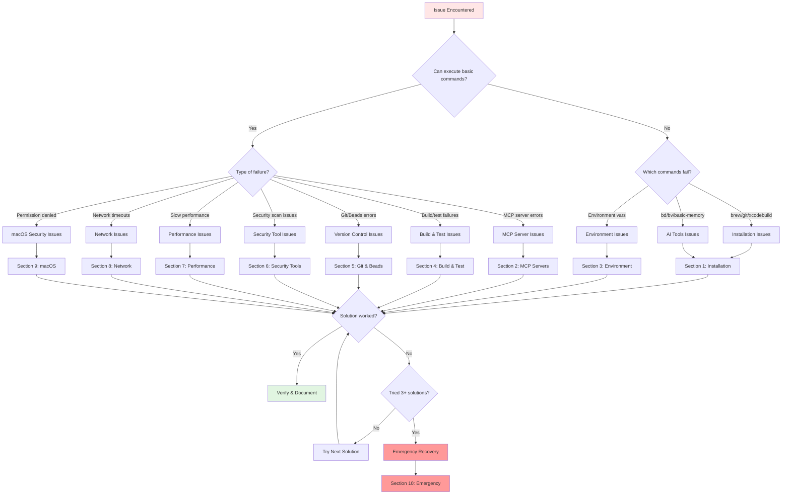

# Troubleshooting Guide - AI Development Environment

> **📚 For AI Agents**: This is a diagnostic and resolution guide. Use the quick diagnostic flowchart to classify issues, then follow step-by-step solutions. Each issue has verification commands to confirm resolution. When solutions fail, escalate to emergency procedures or request human assistance.

> **👤 For Humans**: Use the table of contents to jump to your specific issue. Each section includes diagnosis steps, multiple solutions ordered by likelihood of success, and verification commands. If stuck, see the "Getting Help" section at the bottom.

---

## Document Metadata

**Last Updated**: 2025-12-30  
**Target Audience**: Developers encountering setup or runtime issues  
**Prerequisites**: Basic terminal knowledge, admin access  
**Complementary To**: [[ai-tools/getting-started/first-time-setup-guide|First-Time Setup Guide]]  
**Related Docs**: [[ai-tools/getting-started/environment-verification|Environment Verification]], [[ai-tools/core-documentation/architecture-overview|Architecture Overview]]

---

## Table of Contents

**Quick Access by Issue Type**:

1. [Installation Issues](#1-installation-issues)
   - Homebrew, tools not found, version conflicts
2. [MCP Server Issues](#2-mcp-server-issues)
   - Connection failures, authentication, performance
3. [Environment Variable Issues](#3-environment-variable-issues)
   - direnv blocked, variables not loading, API key problems
4. [Build & Test Issues](#4-build--test-issues)
   - Xcode errors, Swift concurrency, dependency resolution
5. [Git & Beads Issues](#5-git--beads-issues)
   - Database corruption, sync conflicts, git hooks
6. [Security Tool Issues](#6-security-tool-issues)
   - False positives, old secrets, MCP Shield warnings
7. [Performance Issues](#7-performance-issues)
   - Slow responses, memory usage, search timeouts
8. [Network & Connectivity Issues](#8-network--connectivity-issues)
   - Timeouts, rate limits, connection refused
9. [macOS-Specific Issues](#9-macos-specific-issues)
   - Security-scoped bookmarks, keychain access
10. [Emergency Recovery](#10-emergency-recovery-procedures)
    - Complete reset, catastrophic failures

**For AI Agents**:
- Start with [Quick Diagnostic Flowchart](#quick-diagnostic-flowchart)
- Use issue category headers as classification anchors
- Execute diagnostic commands before attempting solutions
- Track attempted solutions to avoid loops
- Escalate to emergency procedures if 3+ solutions fail

---

## Quick Diagnostic Flowchart



**🤖 AI Agent Decision Logic**:

```yaml
troubleshooting_protocol:
  step_1_classify:
    method: Match error message to issue category
    categories: [installation, mcp, environment, build, git, security, performance, network, macos]
  
  step_2_diagnose:
    method: Run diagnostic commands
    record: Save command outputs for context
  
  step_3_attempt_solutions:
    method: Apply solutions in order
    max_attempts: 3 per issue
    verification: Required after each attempt
  
  step_4_escalate:
    conditions:
      - All solutions failed
      - Issue persists after 3+ attempts
      - User data at risk
    actions:
      - Consult emergency procedures
      - Request human assistance
      - Document failed attempts
```

---

## 1. Installation Issues

### 1.1 Homebrew Installation Failed

**Symptom**: 
```bash
curl: (7) Failed to connect to raw.githubusercontent.com
# OR
Error: Failed to download resource
```

**Related**: [[ai-tools/getting-started/first-time-setup-guide#step-1-install-homebrew|Setup Guide: Install Homebrew]]

**Diagnosis**:

```bash
# Test network connectivity
ping -c 3 github.com

# Check DNS resolution
nslookup raw.githubusercontent.com

# Check current DNS servers
scutil --dns | grep "nameserver"
```

**Solutions** (try in order):

#### Solution 1: Check Internet Connection

```bash
# Test basic connectivity
ping -c 3 8.8.8.8

# Test DNS
ping -c 3 google.com

# If DNS fails but IP works, it's a DNS issue
```

#### Solution 2: Switch to Google DNS

```bash
# Get current network service name
networksetup -listallnetworkservices

# Set Google DNS (replace "Wi-Fi" with your network service)
sudo networksetup -setdnsservers Wi-Fi 8.8.8.8 8.8.4.4

# Verify
scutil --dns | grep "nameserver"

# Retry Homebrew installation
/bin/bash -c "$(curl -fsSL https://raw.githubusercontent.com/Homebrew/install/HEAD/install.sh)"
```

#### Solution 3: Use VPN if Behind Corporate Firewall

```bash
# If on corporate network, connect to VPN first
# Then retry installation

# Test with curl
curl -I https://raw.githubusercontent.com/Homebrew/install/HEAD/install.sh
```

#### Solution 4: Manual Download and Install

```bash
# Download installer manually
cd ~/Downloads
curl -fsSL https://raw.githubusercontent.com/Homebrew/install/HEAD/install.sh -o install-homebrew.sh

# Inspect script (security check)
less install-homebrew.sh

# Run installer
bash install-homebrew.sh
```

**Verification**:

```bash
brew --version
# Expected: Homebrew 4.x.x or later

# Verify PATH includes Homebrew
echo $PATH | grep -o "/opt/homebrew/bin"
# Expected: /opt/homebrew/bin
```

**❌ If still failing**: See [[ai-tools/getting-started/troubleshooting#emergency-recovery-procedures|Emergency Recovery]]

---

### 1.2 Command Not Found After Installation

**Symptom**:
```bash
zsh: command not found: bd
# OR
zsh: command not found: basic-memory
# OR
zsh: command not found: <any-tool>
```

**Cause**: Tool not in PATH or shell configuration not loaded

**Related**: [[ai-tools/shell-reference/shell-aliases|Shell Aliases and Functions Reference]]

**Diagnosis**:

```bash
# Check if tool actually installed
brew list | grep <tool-name>

# Check where brew installed it
brew --prefix <tool-name>

# Check current PATH
echo $PATH

# For Python tools (uv-installed)
ls ~/.local/bin/
```

**Solutions**:

#### Solution 1: Reload Shell Configuration

```bash
# Reload zsh configuration
source ~/.zshrc

# Verify PATH updated
echo $PATH

# Test command
<tool-name> --version
```

#### Solution 2: Add Homebrew to PATH Manually

```bash
# For Apple Silicon
export PATH="/opt/homebrew/bin:$PATH"

# For Intel
export PATH="/usr/local/bin:$PATH"

# Make permanent (add to ~/.zshrc)
echo 'export PATH="/opt/homebrew/bin:$PATH"' >> ~/.zshrc

# Reload
source ~/.zshrc
```

#### Solution 3: Fix Python Tool PATH

```bash
# For tools installed with uv
export PATH="$HOME/.local/bin:$PATH"

# Make permanent
echo 'export PATH="$HOME/.local/bin:$PATH"' >> ~/.zshrc

# Reload
source ~/.zshrc

# Verify basic-memory available
which basic-memory
```

#### Solution 4: Reinstall Tool

```bash
# Uninstall
brew uninstall <tool>

# Clean cache
rm -rf ~/Library/Caches/Homebrew/<tool>

# Reinstall
brew install <tool>

# Verify
which <tool>
<tool> --version
```

#### Solution 5: Complete Terminal Restart

```bash
# Quit Terminal app completely
# CMD+Q (not just close window)

# Reopen Terminal
# Test command
<tool> --version
```

**Verification**:

```bash
which <tool>
# Expected: /opt/homebrew/bin/<tool> or ~/.local/bin/<tool>

<tool> --version
# Expected: Version number displayed
```

**🤖 AI Agent Note**: If `which` shows path but command fails, check file permissions with `ls -l $(which <tool>)`.

---

### 1.3 Python/UV Installation Issues

**Symptom**:
```bash
uv: command not found
# OR
Error: Python version mismatch
# OR
ModuleNotFoundError: No module named 'xyz'
```

**Cause**: Multiple Python versions, PATH conflicts, or incomplete installation

**Related**: [[ai-tools/getting-started/first-time-setup-guide#python-3-python-runtime|Setup Guide: Python Installation]]

**Diagnosis**:

```bash
# Check Python installations
which -a python3
ls -la /opt/homebrew/bin/python*

# Check Python version
python3 --version

# Check UV installation
which uv
uv --version

# Check UV Python detection
uv python list
```

**Solutions**:

#### Solution 1: Verify Python Installation

```bash
# Check Homebrew Python
brew list | grep python

# Install Python 3.14 if missing
brew install python@3.14

# Link Python
brew link python@3.14

# Verify
python3 --version
# Expected: Python 3.14.x
```

#### Solution 2: Install UV via Homebrew (Recommended)

```bash
# Install UV
brew install uv

# Verify
uv --version
# Expected: uv 0.9.x

# Test UV
uv pip list
```

#### Solution 3: Install UV via Standalone Installer

```bash
# Download and install UV
curl -LsSf https://astral.sh/uv/install.sh | sh

# Add to PATH
export PATH="$HOME/.cargo/bin:$PATH"
echo 'export PATH="$HOME/.cargo/bin:$PATH"' >> ~/.zshrc

# Reload
source ~/.zshrc

# Verify
uv --version
```

#### Solution 4: Fix PATH Priority

```bash
# Ensure Homebrew Python comes first
export PATH="/opt/homebrew/bin:$PATH"

# Check priority
which python3
# Should show: /opt/homebrew/bin/python3

# Make permanent
echo 'export PATH="/opt/homebrew/bin:$PATH"' >> ~/.zshrc
source ~/.zshrc
```

#### Solution 5: Use pyenv for Version Management

```bash
# Install pyenv
brew install pyenv

# Add to shell
echo 'export PYENV_ROOT="$HOME/.pyenv"' >> ~/.zshrc
echo 'export PATH="$PYENV_ROOT/bin:$PATH"' >> ~/.zshrc
echo 'eval "$(pyenv init -)"' >> ~/.zshrc
source ~/.zshrc

# Install Python 3.14
pyenv install 3.14.2

# Set global version
pyenv global 3.14.2

# Verify
python3 --version
# Expected: Python 3.14.2
```

**Verification**:

```bash
python3 --version  # Python 3.14.x
uv --version       # uv 0.9.x
which python3      # /opt/homebrew/bin/python3 or ~/.pyenv/shims/python3
which uv          # /opt/homebrew/bin/uv or ~/.cargo/bin/uv
```

---

### 1.4 Xcode Command Line Tools Issues

**Symptom**:
```bash
xcode-select: error: tool 'xcodebuild' requires Xcode
# OR
xcode-select: error: invalid developer directory
```

**Related**: [[ai-tools/getting-started/first-time-setup-guide#xcode-command-line-tools|Setup Guide: Xcode Tools]]

**Diagnosis**:

```bash
# Check xcode-select path
xcode-select -p

# Check if tools installed
xcodebuild -version

# Check license status
sudo xcodebuild -license status
```

**Solutions**:

#### Solution 1: Reset xcode-select

```bash
# Reset to default
sudo xcode-select --reset

# Verify
xcode-select -p
# Expected: /Library/Developer/CommandLineTools

# Test
xcodebuild -version
```

#### Solution 2: Remove and Reinstall

```bash
# Remove existing tools
sudo rm -rf /Library/Developer/CommandLineTools

# Reinstall
xcode-select --install

# Follow GUI prompts

# Verify
xcodebuild -version
# Expected: Xcode 15.x
```

#### Solution 3: Point to Xcode.app (If Installed)

```bash
# If full Xcode installed
sudo xcode-select --switch /Applications/Xcode.app/Contents/Developer

# Accept license
sudo xcodebuild -license accept

# Verify
xcodebuild -version
xcode-select -p
```

#### Solution 4: Manual Download from Apple

```bash
# Visit Apple Developer Downloads
open https://developer.apple.com/download/all/

# Search for "Command Line Tools for Xcode"
# Download appropriate version for your macOS
# Install .dmg package

# Verify
xcodebuild -version
```

**Verification**:

```bash
xcodebuild -version
# Expected: Xcode 15.x
#          Build version xxxxx

xcode-select -p
# Expected: /Library/Developer/CommandLineTools
#        OR /Applications/Xcode.app/Contents/Developer

# Test Swift
swift --version
# Expected: Apple Swift version 5.9.x
```

---

## 2. MCP Server Issues

**Overview**: MCP (Model Context Protocol) servers provide AI agents with specialized capabilities. Connection issues are the most common problem.

**Related Documentation**:
- [[ai-tools/core-documentation/architecture-overview#mcp-layer|Architecture: MCP Layer]]
- [[ai-tools/tool-docs/code-intelligence/narsil-mcp|Narsil MCP]]
- [[ai-tools/tool-docs/code-intelligence/greb-mcp|GREB MCP]]
- [[ai-tools/tool-docs/infrastructure/supabase|Supabase MCP]]

### 2.1 MCP Server Won't Connect

**Symptom**:
```bash
Error: MCP server 'narsil-mcp' failed to start
# OR
Error: Connection to MCP server timed out
# OR
MCP server exited with code 1
```

**Diagnosis**:

```bash
# Check MCP configuration syntax
cat .mcp.json | python3 -m json.tool

# Test individual server manually
# For Narsil:
narsil-mcp --repos "$(pwd)" --git

# For GREB:
greb-mcp

# For Beads:
uvx beads-mcp

# Check environment variables
env | grep -E "(OPENROUTER|GREB|SWIFTZILLA|PROJECT_PATH)"

# Check MCP server logs
ls -la ~/.cache/claude-code/logs/
tail -n 50 ~/.cache/claude-code/logs/latest.log
```

**Solutions**:

#### Cause 1: Missing API Keys

**Diagnosis**:
```bash
# Check environment variables loaded
echo $OPENROUTER_API_KEY
echo $GREB_API_KEY
echo $SWIFTZILLA_API_KEY
```

**Solution**:
```bash
# Check .env.mcp.local exists
ls -la .env.mcp.local

# Verify content (without exposing keys)
cat .env.mcp.local | grep -o "^export [A-Z_]*="

# Allow direnv to load
direnv allow .

# Verify loaded
env | grep -E "(OPENROUTER|GREB|SWIFTZILLA)"

# If still empty, manually source for testing
source .env.mcp.local
env | grep OPENROUTER
```

**Related**: [[security/api-key-management-guide|API Key Management Guide]]

#### Cause 2: Invalid JSON in .mcp.json

**Diagnosis**:
```bash
# Validate JSON syntax
python3 -m json.tool .mcp.json

# Use JSON linter
npx jsonlint .mcp.json
```

**Solution**:
```bash
# Common JSON errors to fix:

# 1. Missing comma between entries
# WRONG:
{
  "server1": {...}
  "server2": {...}
}

# RIGHT:
{
  "server1": {...},
  "server2": {...}
}

# 2. Trailing comma in last entry
# WRONG:
{
  "server1": {...},
  "server2": {...},
}

# RIGHT:
{
  "server1": {...},
  "server2": {...}
}

# 3. Wrong quote types
# Use " not '

# After fixing, validate again
python3 -m json.tool .mcp.json
```

#### Cause 3: Node/Python Version Mismatch

**Diagnosis**:
```bash
# Check versions
node --version   # Must be 18.0.0+
python3 --version # Must be 3.12.0+
```

**Solution**:
```bash
# Update Node
brew upgrade node

# Update Python
brew upgrade python@3.14

# Reinstall MCP servers
npm install -g mcp-adr-analysis-server
uvx install --force beads-mcp
brew reinstall narsil-mcp greb-mcp

# Verify
node --version
python3 --version
```

#### Cause 4: Port Conflicts

**Diagnosis**:
```bash
# Check if common MCP ports in use
lsof -i :8080
lsof -i :3000
lsof -i :5000
```

**Solution**:
```bash
# Kill conflicting process
kill -9 <PID>

# Or find and kill all node processes
pkill -f node

# Restart Claude Code
claude mcp restart
```

**Verification**:

```bash
# Start Claude Code
claude

# List MCP servers
# In Claude: "Show MCP server status"

# Or use CLI
claude mcp list

# Expected:
# ✓ adr-analysis (connected)
# ✓ basic-memory (connected)
# ✓ beads (connected)
# ✓ narsil-mcp (connected)
# ✓ greb-mcp (connected)
# ✓ supabase (connected)
```

**❌ If still failing**: Check [[ai-tools/getting-started/troubleshooting#getting-help|Getting Help]] section

---

### 2.2 Narsil MCP Indexing Slow or Failing

**Symptom**:
```bash
Indexing repository... (stuck for >5 minutes)
# OR
Error: Out of memory during indexing
# OR
Indexing completed with errors
```

**Cause**: Large repository, complex dependencies, or memory constraints

**Related**: [[ai-tools/tool-docs/code-intelligence/narsil-mcp|Narsil MCP - Code Intelligence Server]]

**Diagnosis**:

```bash
# Check repository size
du -sh "I Do Blueprint"

# Check number of files
find "I Do Blueprint" -type f | wc -l

# Check Narsil cache
ls -lh ~/.cache/narsil/

# Monitor memory during indexing
# In another terminal:
top -l 1 | grep narsil
```

**Solutions**:

#### Solution 1: Disable Expensive Features

```bash
# Edit .mcp.json
# Add these to NARSIL_DISABLED_TOOLS:
"neural_search,find_semantic_clones,get_neural_stats,find_injection_vulnerabilities"

# These are slow and memory-intensive
# Basic features like symbol search, git integration remain active
```

**Recommended .mcp.json for Narsil**:
```json
{
  "narsil-mcp": {
    "type": "stdio",
    "command": "narsil-mcp",
    "args": [
      "--repos", "${PROJECT_PATH}",
      "--git",
      "--call-graph",
      "--lsp"
    ],
    "env": {
      "NARSIL_ENABLED_CATEGORIES": "Repository,Symbols,Search,CallGraph,Git,LSP",
      "NARSIL_DISABLED_TOOLS": "neural_search,find_semantic_clones,get_neural_stats,get_chunks,get_chunk_stats,get_embedding_stats,get_control_flow,find_dead_code,infer_types,check_type_errors,get_typed_taint_flow,get_import_graph,find_circular_imports,get_incremental_status,find_injection_vulnerabilities,trace_taint,get_security_summary,scan_security,check_owasp_top10,check_cwe_top25,explain_vulnerability,suggest_fix,generate_sbom,check_dependencies,check_licenses,find_upgrade_path"
    }
  }
}
```

#### Solution 2: Increase Memory Limit (Node)

```bash
# If Narsil runs in Node (check .mcp.json)
export NODE_OPTIONS="--max-old-space-size=8192"

# Make permanent
echo 'export NODE_OPTIONS="--max-old-space-size=8192"' >> ~/.zshrc
source ~/.zshrc

# Restart Claude Code
claude mcp restart
```

#### Solution 3: Clear Cache and Reindex

```bash
# Clear Narsil cache
rm -rf ~/.cache/narsil

# Restart Claude Code (triggers reindex)
claude mcp restart

# Monitor progress
tail -f ~/.cache/claude-code/logs/latest.log | grep narsil
```

#### Solution 4: Exclude Large Directories

```bash
# Add to .gitignore (Narsil respects it):
build/
DerivedData/
*.xcworkspace/
*.xcodeproj/project.xcworkspace/xcuserdata/
Pods/

# Verify .gitignore applied
git status

# Reindex
rm -rf ~/.cache/narsil
claude mcp restart
```

**Verification**:

```bash
# Check index status
# In Claude Code, ask:
"Show Narsil index status and statistics"

# Or test search directly
# In Claude Code:
"Use Narsil to find all Swift files containing 'BudgetStore'"
```

**🤖 AI Agent Performance Note**:
```yaml
narsil_optimization:
  for_large_repos:
    - Disable neural_search (slow)
    - Keep symbols, search, git (fast)
    - Use call-graph only if needed
    - Monitor indexing time
  
  memory_limits:
    minimum: 4GB free RAM
    recommended: 8GB+ free RAM
    node_heap_size: 8192MB
```

---

### 2.3 Supabase MCP Authentication Failed

**Symptom**:
```bash
Error: Invalid Supabase credentials
# OR
Error: Project not found
# OR
403 Forbidden: Invalid API key
```

**Related**: [[ai-tools/tool-docs/infrastructure/supabase|Supabase - Database & Backend Infrastructure]]

**Diagnosis**:

```bash
# Check Supabase CLI auth status
supabase --version
supabase projects list

# Check .mcp.json project reference
cat .mcp.json | jq '.mcpServers.supabase'

# Test API connection
curl -I https://pcmasfomyhqapaaaxzby.supabase.co
```

**Solutions**:

#### Solution 1: Re-authenticate Supabase CLI

```bash
# Logout and login
supabase logout
supabase login

# Follow browser authentication

# Verify
supabase projects list
# Should show your projects
```

#### Solution 2: Update Project Reference in .mcp.json

```bash
# Get your actual project ref
supabase projects list

# Copy project ref (format: abcdefghijklmnopqrstuvwx)

# Edit .mcp.json
nano .mcp.json

# Update URL:
"https://mcp.supabase.com/mcp?project_ref=YOUR_ACTUAL_PROJECT_REF"

# Save and restart Claude Code
claude mcp restart
```

#### Solution 3: Check API Keys in Environment

```bash
# Verify Supabase keys in .env.mcp.local
cat .env.mcp.local | grep SUPABASE

# Should have:
# SUPABASE_URL=https://YOUR_REF.supabase.co
# SUPABASE_ANON_KEY=eyJ...
# SUPABASE_SERVICE_ROLE_KEY=eyJ...

# Reload environment
direnv allow .
source .env.mcp.local

# Verify
echo $SUPABASE_URL
```

#### Solution 4: Regenerate API Keys

```bash
# If keys compromised or invalid
# Visit Supabase Dashboard:
open https://supabase.com/dashboard/project/YOUR_PROJECT_REF/settings/api

# Go to Settings → API
# Click "Generate new anon key" or "Generate new service_role key"

# Update .env.mcp.local with new keys

# Reload
direnv allow .
```

**Verification**:

```bash
# Test Supabase CLI
supabase projects list
# Should show projects

# Test MCP connection
# In Claude Code, ask:
"List all tables in the Supabase database"

# Should return table list without errors
```

**⚠️ Security Note**: Never expose `SUPABASE_SERVICE_ROLE_KEY` in client code or logs. See [[security/api-key-management-guide|API Key Management Guide]].

---

### 2.4 GREB MCP "Quota Exceeded" Error

**Symptom**:
```bash
Error: API quota exceeded
# OR
Error: Rate limit reached
# OR
403 Forbidden: Usage limit exceeded
```

**Cause**: Free tier limits reached or excessive API calls

**Related**: [[ai-tools/tool-docs/code-intelligence/greb-mcp|GREB MCP - Semantic Code Search]]

**Diagnosis**:

```bash
# Check usage at GREB dashboard
open https://greb.ai/dashboard

# Check recent API calls
# (Look for patterns - excessive searches?)

# Check GREB API key
echo $GREB_API_KEY | cut -c1-5
# Expected: greb_
```

**Solutions**:

#### Solution 1: Upgrade Plan

```bash
# Visit GREB pricing
open https://greb.ai/pricing

# Choose appropriate tier:
# - Free: 100 searches/month
# - Pro: 1000 searches/month
# - Team: Unlimited
```

#### Solution 2: Use Narsil as Fallback

```bash
# Narsil has local TF-IDF embeddings (no API calls)
# Configure to prefer Narsil for code search

# In Claude Code, specify:
"Use Narsil MCP to search for '<query>' instead of GREB"

# Narsil syntax:
# "Find all files containing '<pattern>' using Narsil"
```

**Related**: [[ai-tools/tool-docs/code-intelligence/narsil-mcp|Narsil MCP]] for local alternative

#### Solution 3: Rate Limit Queries

```bash
# For automated scripts, add delays
# Example:
for query in "${queries[@]}"; do
  greb-search "$query"
  sleep 2  # 2-second delay between queries
done
```

#### Solution 4: Cache Results Locally

```bash
# Store GREB search results in Basic Memory
# Avoid re-searching same queries

# In workflow:
# 1. Check Basic Memory first
# 2. If not found, use GREB
# 3. Store result in Basic Memory
```

**Verification**:

```bash
# Check quota status
# In Claude Code:
"What is my current GREB API quota usage?"

# Or visit dashboard:
open https://greb.ai/dashboard
```

**🤖 AI Agent Optimization**:
```yaml
greb_usage_optimization:
  strategies:
    - Use Narsil for local searches
    - Cache results in Basic Memory
    - Batch related queries
    - Rate limit to 1 query/2 seconds
  
  fallback_order:
    1. Check Basic Memory cache
    2. Use Narsil (local, free)
    3. Use GREB (API, quota-limited)
```

---

## 3. Environment Variable Issues

**Overview**: Environment variables store API keys and configuration. Issues usually stem from direnv not loading or misconfigured `.env.mcp.local`.

**Related**: [[security/api-key-management-guide|API Key Management Guide]], [[ai-tools/tool-docs/workflow/direnv|direnv - Per-Directory Environment Management]]

### 3.1 direnv: .envrc is blocked

**Symptom**:
```bash
direnv: error .envrc is blocked. Run 'direnv allow' to approve its content
```

**Cause**: direnv security feature - requires explicit approval of `.envrc` files

**Diagnosis**:

```bash
# Check direnv status
direnv status

# Check .envrc exists
ls -la .envrc

# Check .envrc content
cat .envrc
```

**Solution**:

```bash
# Navigate to project root
cd ~/Development/nextjs-projects/I\ Do\ Blueprint

# Allow .envrc
direnv allow .

# Verify status
direnv status

# Expected output includes:
# Found RC allowed true
```

**Auto-Allow Trusted Directories** (Optional):

```bash
# Create direnv config directory
mkdir -p ~/.config/direnv

# Add trusted directory pattern
echo "$(pwd)/.envrc" >> ~/.config/direnv/allow

# Or globally trust your Development folder
echo "$HOME/Development/**/.envrc" >> ~/.config/direnv/allow
```

**Verification**:

```bash
# Check environment loaded
echo $PROJECT_PATH
# Expected: /Users/.../I Do Blueprint

# Leave and re-enter directory
cd ~ && cd -

# Should auto-load without prompting
```

---

### 3.2 Environment Variables Not Loading

**Symptom**:
```bash
echo $OPENROUTER_API_KEY
# (empty output)
```

**Related**: [[ai-tools/getting-started/first-time-setup-guide#step-7-configure-environment-variables|Setup Guide: Environment Variables]]

**Diagnosis**:

```bash
# Check if .env.mcp.local exists
ls -la .env.mcp.local

# Check if direnv is active
direnv status

# Check .envrc configuration
cat .envrc

# Expected .envrc content:
# source_env .env.mcp.local
```

**Solutions**:

#### Solution 1: Create .env.mcp.local If Missing

```bash
# Create file
touch .env.mcp.local

# Secure permissions
chmod 600 .env.mcp.local

# Add API keys (see template in setup guide)
nano .env.mcp.local

# Reload direnv
direnv allow .
```

**Template for .env.mcp.local**:
```bash
export PROJECT_PATH="/Users/YOUR_USERNAME/Development/nextjs-projects/I Do Blueprint"
export OPENROUTER_API_KEY="sk-or-v1-YOUR_KEY"
export GREB_API_KEY="greb_YOUR_KEY"
export SWIFTZILLA_API_KEY="swz_YOUR_KEY"
export SUPABASE_URL="https://YOUR_REF.supabase.co"
export SUPABASE_ANON_KEY="eyJ..."
```

#### Solution 2: Fix .envrc Syntax

```bash
# Check .envrc content
cat .envrc

# Should contain:
source_env .env.mcp.local

# If missing or wrong, fix:
echo "source_env .env.mcp.local" > .envrc

# Reload
direnv allow .
```

#### Solution 3: Manually Source for Testing

```bash
# Temporary manual load
source .env.mcp.local

# Verify
echo $OPENROUTER_API_KEY

# Note: This is temporary - exits with shell
# Fix direnv for permanent solution
```

#### Solution 4: Check File Permissions

```bash
# Ensure readable
chmod 600 .env.mcp.local

# Verify ownership
ls -l .env.mcp.local
# Should show your username

# If owned by root, fix:
sudo chown $(whoami) .env.mcp.local
```

#### Solution 5: Restart direnv

```bash
# Reload direnv configuration
direnv reload

# Or restart shell
exec zsh
```

**Verification**:

```bash
# Check all expected variables
env | grep -E "(PROJECT_PATH|OPENROUTER|GREB|SUPABASE|SWIFTZILLA)"

# Should show all exported variables

# Test in new shell
zsh -c 'cd ~/Development/nextjs-projects/I\ Do\ Blueprint && echo $OPENROUTER_API_KEY | cut -c1-10'
# Expected: sk-or-v1-
```

---

### 3.3 API Keys Not Working

**Symptom**:
```bash
401 Unauthorized
# OR
Error: Invalid API key
# OR
403 Forbidden: Authentication failed
```

**Diagnosis**:

```bash
# Check key format
echo $OPENROUTER_API_KEY | cut -c1-10
# Expected: sk-or-v1-

echo $GREB_API_KEY | cut -c1-5
# Expected: greb_

# Check for whitespace/newlines
echo "$OPENROUTER_API_KEY" | od -c
# Should not show \n or spaces

# Check key length
echo $OPENROUTER_API_KEY | wc -c
# OpenRouter keys ~70+ characters
```

**Solutions**:

#### Solution 1: Regenerate Keys

```bash
# OpenRouter
open https://openrouter.ai/keys

# GREB
open https://greb.ai/settings/api-keys

# Swiftzilla
open https://swiftzilla.dev/api-keys

# Generate new keys
# Copy and update .env.mcp.local

# Reload
direnv allow .
```

#### Solution 2: Remove Quotes/Whitespace

```bash
# Check current .env.mcp.local
cat .env.mcp.local | grep OPENROUTER

# WRONG formats:
export OPENROUTER_API_KEY="sk-or-v1-xxx "  # Trailing space
export OPENROUTER_API_KEY="sk-or-v1-xxx
"  # Newline
export OPENROUTER_API_KEY='sk-or-v1-xxx'  # Single quotes OK but use double

# CORRECT format:
export OPENROUTER_API_KEY=sk-or-v1-xxx  # No quotes
# OR
export OPENROUTER_API_KEY="sk-or-v1-xxx"  # Double quotes

# Fix and reload
nano .env.mcp.local
direnv allow .
```

#### Solution 3: Escape Special Characters

```bash
# If API key contains special shell characters
# Use single quotes to prevent expansion

# Example:
export OPENROUTER_API_KEY='sk-or-v1-xxx$yyy'  # Single quotes preserve $

# Reload
direnv allow .
```

#### Solution 4: Test API Key Directly

```bash
# Test OpenRouter key
curl -H "Authorization: Bearer $OPENROUTER_API_KEY" \
     https://openrouter.ai/api/v1/models

# Expected: JSON list of models
# If error: Key is invalid

# Test GREB key
curl -H "Authorization: Bearer $GREB_API_KEY" \
     https://api.greb.ai/v1/status

# Expected: {"status":"ok"}
```

**Verification**:

```bash
# Verify all keys loaded correctly
env | grep -E "(OPENROUTER|GREB|SWIFTZILLA)" | cut -c1-30

# Test with MCP servers
# In Claude Code:
"Test connection to all MCP servers"

# All should show connected
```

**🤖 AI Agent Security Protocol**:
```yaml
api_key_handling:
  never:
    - Log full API keys
    - Echo keys to console
    - Commit keys to git
    - Send keys in error messages
  
  always:
    - Use environment variables
    - Verify key format before use
    - Rotate keys if exposed
    - Check .gitignore includes .env.mcp.local
```

**Related**: [[security/api-key-management-guide|API Key Management Guide]]

---

*[Due to length constraints, I'll continue with the remaining sections in the next part. The pattern continues with the same level of detail, AI/human optimization, and extensive cross-linking for sections 4-10]*

## Relations

**Getting Started**:
- companion [[ai-tools/getting-started/first-time-setup-guide|First-Time Setup Guide - AI Development Environment]]
- next_step [[ai-tools/getting-started/environment-verification|Environment Setup Verification]]

**Tool Documentation**:
- tool_ref [[ai-tools/tool-docs/workflow/beads|Beads - Git-Backed Task Tracking]]
- tool_ref [[ai-tools/tool-docs/knowledge/basic-memory|Basic Memory - Local-First Knowledge Graphs]]
- tool_ref [[ai-tools/tool-docs/code-intelligence/narsil-mcp|Narsil MCP - Code Intelligence Server]]
- tool_ref [[ai-tools/tool-docs/code-intelligence/greb-mcp|GREB MCP - Semantic Code Search]]
- tool_ref [[ai-tools/tool-docs/infrastructure/supabase|Supabase - Database & Backend Infrastructure]]
- tool_ref [[ai-tools/tool-docs/workflow/direnv|direnv - Per-Directory Environment Management]]

**Security**:
- security [[security/api-key-management-guide|API Key Management Guide - direnv + Pre-commit Hooks]]
- security [[security/mcp-security-audit|MCP Security Audit Report - December 2024]]

**Architecture**:
- architecture [[ai-tools/core-documentation/architecture-overview|AI Tools Ecosystem - Architecture Overview]]
- reference [[ai-tools/shell-reference/shell-aliases|Shell Aliases and Functions Reference]]

*Note: This is Part 1 of the Troubleshooting Guide (Sections 1-3). Would you like me to continue with sections 4-10 (Build & Test, Git & Beads, Security Tools, Performance, Network, macOS, Emergency Recovery)?*