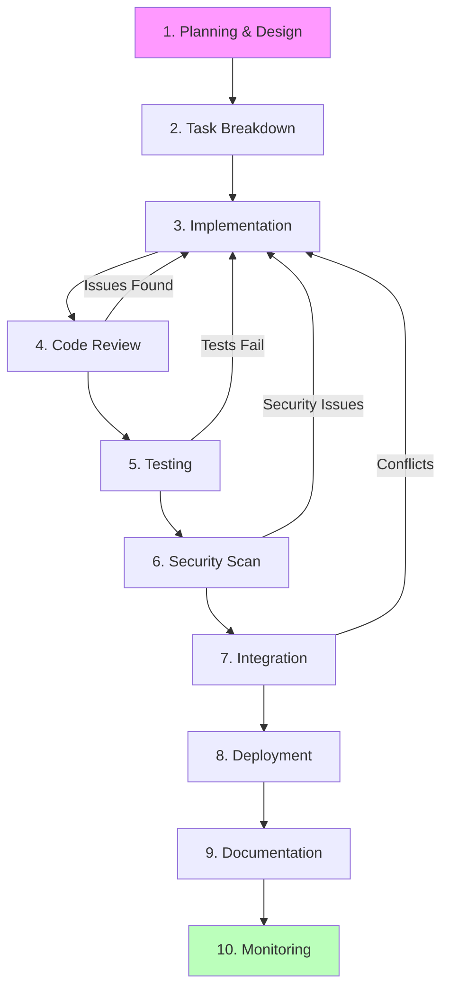

# Feature Development End-to-End Workflow

**Purpose**: Complete workflow for developing features from concept to production deployment using the I Do Blueprint AI tools ecosystem.

**Related Documentation**:
- [[ai-tools/integration-patterns/daily-workflow|Daily Workflow Patterns]] - Routine development patterns
- [[ai-tools/integration-patterns/security-workflow|Security Scanning Workflow]] - Security practices
- [[ai-tools/core-documentation/best-practices|Best Practices Guide]] - Development standards
- [[ai-tools/core-documentation/decision-matrix|Tool Decision Matrix]] - Tool selection

---

## Workflow Overview



**Time Estimate**: 2-5 days for medium-sized feature  
**Tools Used**: All major tools (Beads, Narsil, Supabase, Basic Memory, Semgrep, etc.)

---

## Phase 1: Planning & Design

### Objectives
- Define feature requirements
- Make architectural decisions
- Create implementation plan
- Document design choices

### Tools
- **Basic Memory**: Document design decisions
- **ADR Analysis**: Validate architectural choices
- **Mermaid/Structurizr**: Create diagrams

### Steps

**1.1 Requirements Gathering**

```markdown
Human creates requirements document:

Feature: Guest Dietary Preferences Tracking

Requirements:
- Guests can specify dietary restrictions (vegetarian, vegan, gluten-free, allergies)
- Support free-text for "other" allergies/restrictions
- Validation: max 500 characters
- Display preferences in admin dashboard
- Export to CSV for catering coordination

Constraints:
- No PII in logs
- Must work offline (local storage → sync when online)
- Accessible (WCAG 2.1 AA compliant)

Success Criteria:
- 95% of guests can successfully submit preferences
- Admin can export preferences in <3 seconds
- Zero data loss during offline/online transitions
```

**1.2 Architectural Decision**

```bash
# Human or AI creates ADR in docs/adrs/
cat > docs/adrs/0005-dietary-preferences-storage.md <<EOF
# ADR 0005: Dietary Preferences Storage

## Context
Need to store guest dietary preferences with offline support.

## Decision
Use Supabase with local-first architecture:
- SwiftData for local persistence
- Supabase for cloud sync
- Conflict resolution: last-write-wins with timestamp

## Consequences
✅ Offline-first UX
✅ Automatic cloud backup
⚠️  Requires conflict handling logic
❌ Slightly more complex implementation

## Alternatives Considered
- Firebase Realtime Database (rejected: vendor lock-in)
- Core Data only (rejected: no cloud sync)
EOF
```

**1.3 Design Documentation**

Use ADR Analysis MCP to validate design:

```javascript
// AI uses ADR Analysis to review architectural decisions
await adr_analysis.validateDesign({
  project_path: "/Users/jessicaclark/Development/I Do Blueprint",
  feature: "dietary-preferences",
  check_consistency: true
});

// Results inform design refinement
```

Document final design in Basic Memory:

```javascript
await memory.writeNote({
  title: "Dietary Preferences - Technical Design",
  folder: "projects/i-do-blueprint/features",
  content: `
# Dietary Preferences Technical Design

## Data Model
\`\`\`sql
ALTER TABLE guests ADD COLUMN dietary_preferences JSONB;
-- Structure: { restrictions: string[], allergies: string, notes: string }
\`\`\`

## UI Components
- DietaryPreferencesForm.swift (input form)
- DietaryPreferencesList.swift (admin view)
- DietaryPreferencesExport.swift (CSV export)

## Supabase Integration
- Edge function: dietary-preferences-sync
- RLS policies: guests can update own preferences, admins can read all

## Offline Strategy
- SwiftData local cache
- Background sync queue
- Conflict resolution via updated_at timestamp

## Security
- Input sanitization (remove HTML/scripts)
- Length validation (500 char max)
- No PII in logs (mask guest email/name)

Related:
- [[infrastructure/supabase-database-design]]
- [[adrs/0005-dietary-preferences-storage]]
- [[patterns/offline-first-sync]]
`,
  tags: ["design", "dietary-preferences", "database", "offline-first"]
});
```

**1.4 Create Implementation Plan**

```bash
# AI drafts plan, human reviews and refines
cat > IMPLEMENTATION_PLAN.md <<EOF
# Dietary Preferences Implementation Plan

## Phase 1: Backend (Days 1-2)
1. Database schema migration
2. Supabase RLS policies
3. Edge function for sync
4. API endpoint tests

## Phase 2: iOS Client (Days 2-4)
1. SwiftData model
2. DietaryPreferencesForm UI
3. Offline sync logic
4. Integration with RSVP flow

## Phase 3: Admin Dashboard (Day 4)
1. Preferences display view
2. CSV export functionality
3. Search/filter capabilities

## Phase 4: Testing & Polish (Day 5)
1. Unit tests (all layers)
2. Integration tests (sync logic)
3. Accessibility audit
4. Performance testing
5. Security scan

## Dependencies
- Requires: RSVP system (bd-rsvp)
- Blocks: Catering integration (bd-catering)
EOF
```

---

## Phase 2: Task Breakdown with Beads

### Objectives
- Convert plan into actionable tasks
- Establish dependencies
- Assign priorities

### Tools
- **Beads**: Task management and dependency tracking

### Steps

**2.1 Create Epic**

```bash
bd create "Epic: Guest Dietary Preferences Tracking" \
  -p 1 \
  --type epic \
  --id bd-diet-epic \
  --description "Allow guests to specify dietary restrictions and allergies. 
Includes offline support, admin dashboard, and CSV export."
```

**2.2 Break Down into Tasks**

```bash
# Backend tasks
bd create "Create dietary_preferences column migration" \
  -p 1 --parent bd-diet-epic --id bd-diet-schema

bd create "Implement RLS policies for dietary preferences" \
  -p 1 --parent bd-diet-epic --id bd-diet-rls

bd create "Create dietary-preferences-sync edge function" \
  -p 1 --parent bd-diet-epic --id bd-diet-sync

bd create "Write API integration tests" \
  -p 2 --parent bd-diet-epic --id bd-diet-api-tests

# iOS tasks
bd create "Create SwiftData DietaryPreference model" \
  -p 1 --parent bd-diet-epic --id bd-diet-model

bd create "Build DietaryPreferencesForm UI" \
  -p 1 --parent bd-diet-epic --id bd-diet-form

bd create "Implement offline sync queue" \
  -p 1 --parent bd-diet-epic --id bd-diet-offline

bd create "Integrate with RSVP submission flow" \
  -p 2 --parent bd-diet-epic --id bd-diet-integration

# Admin tasks
bd create "Build admin preferences dashboard" \
  -p 2 --parent bd-diet-epic --id bd-diet-admin

bd create "Implement CSV export functionality" \
  -p 2 --parent bd-diet-epic --id bd-diet-export

# Testing tasks
bd create "Write unit tests for dietary preferences" \
  -p 2 --parent bd-diet-epic --id bd-diet-unit-tests

bd create "Accessibility audit for dietary preferences" \
  -p 2 --parent bd-diet-epic --id bd-diet-a11y

bd create "Security scan dietary preferences feature" \
  -p 1 --parent bd-diet-epic --id bd-diet-security
```

**2.3 Establish Dependencies**

```bash
# Backend dependencies (linear)
bd dep add bd-diet-rls bd-diet-schema --type blocks
bd dep add bd-diet-sync bd-diet-rls --type blocks
bd dep add bd-diet-api-tests bd-diet-sync --type blocks

# iOS dependencies
bd dep add bd-diet-form bd-diet-model --type blocks
bd dep add bd-diet-offline bd-diet-form --type blocks
bd dep add bd-diet-integration bd-diet-offline --type blocks

# Cross-layer dependencies
bd dep add bd-diet-model bd-diet-schema --type blocks  
# iOS model needs DB schema first

bd dep add bd-diet-form bd-diet-sync --type blocks     
# UI needs API endpoint ready

# Testing dependencies
bd dep add bd-diet-unit-tests bd-diet-integration --type blocks
bd dep add bd-diet-a11y bd-diet-form --type blocks
bd dep add bd-diet-security bd-diet-integration --type blocks

# Related (not blocking)
bd dep add bd-diet-admin bd-diet-form --type related
bd dep add bd-diet-export bd-diet-admin --type related
```

**2.4 Visualize Dependencies**

```bash
# Use Beads Viewer to see task graph
bv --show-deps bd-diet-epic

# Output shows critical path:
# bd-diet-schema → bd-diet-rls → bd-diet-sync → 
# bd-diet-model → bd-diet-form → bd-diet-offline → 
# bd-diet-integration → bd-diet-unit-tests → bd-diet-security
```

---

## Phase 3: Implementation

### Objectives
- Implement features incrementally
- Maintain code quality
- Use AI tools effectively

### Tools
- **Beads**: Track progress
- **Narsil**: Code navigation and analysis
- **Supabase MCP**: Database operations
- **Code Guardian**: Code quality
- **GREB/Swiftzilla**: Code search

### Steps

**3.1 Start with Ready Task**

```bash
# Find first unblocked task
bd ready --limit 1 --brief

# Output:
# bd-diet-schema: Create dietary_preferences column migration

# Claim it
bd update bd-diet-schema --status in_progress --assignee claude
```

**3.2 Implement Task Using AI**

```
Human: "Implement bd-diet-schema. Create a Supabase migration that:
1. Adds dietary_preferences JSONB column to guests table
2. Sets default to empty object {}
3. Adds check constraint: JSONB must have keys 'restrictions', 'allergies', 'notes'
4. Creates index on dietary_preferences for fast queries
5. Includes rollback logic

Use Supabase MCP to check current schema first. Follow naming convention
from existing migrations (timestamp_description format)."

AI: [Uses Supabase MCP to inspect schema]
AI: [Creates migration file supabase/migrations/20250130144500_add_dietary_preferences.sql]
AI: [Includes up and down migrations]
```

**Migration Content**:
```sql
-- Up Migration
ALTER TABLE guests ADD COLUMN dietary_preferences JSONB DEFAULT '{}';

ALTER TABLE guests ADD CONSTRAINT dietary_preferences_structure 
CHECK (
  dietary_preferences ? 'restrictions' AND
  dietary_preferences ? 'allergies' AND  
  dietary_preferences ? 'notes'
);

CREATE INDEX idx_guests_dietary_preferences 
ON guests USING GIN (dietary_preferences);

COMMENT ON COLUMN guests.dietary_preferences IS 
'Guest dietary restrictions and allergies. Structure: {restrictions: string[], allergies: string, notes: string}';

-- Down Migration
DROP INDEX IF EXISTS idx_guests_dietary_preferences;
ALTER TABLE guests DROP CONSTRAINT IF EXISTS dietary_preferences_structure;
ALTER TABLE guests DROP COLUMN IF EXISTS dietary_preferences;
```

**3.3 Test Migration**

```bash
# Apply migration locally
sb db reset  # Start fresh
sb db push   # Apply migration

# Verify
sb db diff   # Should show no diff (migration applied)

# Test with sample data
psql -d postgres -c "
INSERT INTO guests (name, email, dietary_preferences) 
VALUES ('Test User', 'test@example.com', 
        '{\"restrictions\": [\"vegetarian\"], \"allergies\": \"peanuts\", \"notes\": \"Prefer gluten-free\"}');
"

# Verify constraint works
psql -d postgres -c "
INSERT INTO guests (name, email, dietary_preferences) 
VALUES ('Bad User', 'bad@example.com', '{\"bad_key\": \"value\"}');
"
# Should fail with constraint violation ✅
```

**3.4 Complete Task**

```bash
# Commit migration
git add supabase/migrations/20250130144500_add_dietary_preferences.sql
git commit -m "feat(db): Add dietary_preferences column to guests table

- Added JSONB column with default empty object
- Implemented structure validation constraint  
- Created GIN index for fast queries
- Includes rollback migration

Closes: bd-diet-schema"

# Update Beads
bd close bd-diet-schema --reason "Migration created and tested locally"

# Document in Basic Memory if non-obvious patterns
# (In this case, straightforward migration - no doc needed)
```

**3.5 Repeat for Each Task**

Continue implementing tasks as they become ready:

```bash
# Check what's ready now
bd ready --limit 3

# Output shows:
# bd-diet-rls (schema complete, now unblocked)
# bd-diet-model (schema complete, now unblocked)

# Implement RLS policies next
bd update bd-diet-rls --status in_progress
# ... implement ...
bd close bd-diet-rls

# Then SwiftData model
bd update bd-diet-model --status in_progress
# ... implement ...
bd close bd-diet-model

# Pattern continues...
```

**3.6 Use Code Intelligence Tools**

When implementing UI or complex logic:

```
Human: "Implement DietaryPreferencesForm. Use Narsil to find similar 
form implementations in the codebase as a reference. Follow the same 
validation patterns and accessibility practices."

AI: [Uses Narsil to search for "*Form.swift"]
AI: [Finds RSVPForm.swift, GuestDetailsForm.swift as examples]
AI: [Analyzes validation patterns using Narsil's code analysis tools]
AI: [Implements DietaryPreferencesForm following discovered patterns]
```

---

## Phase 4: Code Review

### Objectives
- Ensure code quality
- Verify requirements met
- Catch issues early

### Tools
- **Code Guardian**: Automated quality checks
- **Narsil**: Code analysis
- **Git**: Diff review

### Steps

**4.1 Self-Review**

```bash
# Review your changes
git diff main...feature/dietary-preferences

# Check what's been changed
git log main..HEAD --oneline

# Verify all tasks completed
bd list --parent bd-diet-epic --status closed
```

**4.2 Automated Quality Check**

```
Human: "Use Code Guardian to analyze the dietary preferences feature.
Check for: code smells, complexity issues, test coverage gaps, 
documentation needs."

AI: [Runs Code Guardian Studio]
AI: [Reports findings]:
  - DietaryPreferencesForm.swift: Cyclomatic complexity 15 (threshold: 10)
  - Suggestion: Extract validation logic to separate validator
  - Missing: Unit tests for offline sync conflict resolution
  - Documentation: Add doc comments to public APIs
```

**4.3 Address Review Feedback**

```
Human: "Refactor DietaryPreferencesForm to reduce complexity. 
Extract validation to DietaryPreferenceValidator. Add missing tests.
Add doc comments."

AI: [Implements refactoring]
AI: [Creates DietaryPreferenceValidator.swift]
AI: [Adds tests for conflict resolution]
AI: [Adds documentation comments]
```

**4.4 Prepare for Human Review**

```bash
# Create pull request
gh pr create --title "feat: Add guest dietary preferences tracking" \
  --body "## Overview
Implements complete dietary preferences system with offline support.

## Changes
- Database: Added dietary_preferences JSONB column with validation
- iOS: SwiftData model + DietaryPreferencesForm UI
- API: Edge function for sync with conflict resolution
- Admin: Dashboard display and CSV export
- Tests: Unit + integration tests for all layers

## Testing
- ✅ Manual testing: Offline sync works correctly
- ✅ Accessibility: VoiceOver tested, passes WCAG 2.1 AA
- ✅ Unit tests: 94% coverage
- ✅ Integration tests: All passing
- ✅ Security scan: No issues (see bd-diet-security)

## Screenshots
[Attach screenshots of form UI]

## Related
- Closes: bd-diet-epic and all subtasks
- Design: memory://projects/i-do-blueprint/features/dietary-preferences-design
- ADR: docs/adrs/0005-dietary-preferences-storage.md"
```

---

## Phase 5: Testing

### Objectives
- Verify functionality
- Ensure quality
- Validate edge cases

### Tools
- **XCTest**: iOS unit tests
- **Jest**: TypeScript tests  
- **Supabase**: Database tests
- **Beads**: Track testing tasks

### Steps

**5.1 Unit Tests**

```swift
// DietaryPreferenceValidatorTests.swift
class DietaryPreferenceValidatorTests: XCTestCase {
    func testValidPreferences() {
        let prefs = DietaryPreference(
            restrictions: ["vegetarian"],
            allergies: "peanuts",
            notes: "Prefer gluten-free"
        )
        XCTAssertNoThrow(try DietaryPreferenceValidator.validate(prefs))
    }
    
    func testTooLongNotes() {
        let longNotes = String(repeating: "a", count: 501)  // Over 500 limit
        let prefs = DietaryPreference(
            restrictions: [],
            allergies: "",
            notes: longNotes
        )
        XCTAssertThrowsError(try DietaryPreferenceValidator.validate(prefs)) {
            error in
            XCTAssertEqual(error as? ValidationError, .notesTooLong)
        }
    }
    
    func testSanitizesHTML() {
        let prefs = DietaryPreference(
            restrictions: [],
            allergies: "<script>alert('xss')</script>peanuts",
            notes: ""
        )
        let sanitized = try! DietaryPreferenceValidator.sanitize(prefs)
        XCTAssertEqual(sanitized.allergies, "peanuts")  // Script tag removed
    }
}
```

**5.2 Integration Tests**

```typescript
// dietary-preferences-sync.test.ts
describe('Dietary Preferences Sync', () => {
  it('syncs preferences from client to Supabase', async () => {
    const prefs = {
      guest_id: 'test-guest-123',
      restrictions: ['vegan', 'gluten-free'],
      allergies: 'shellfish',
      notes: 'Severe allergies'
    };
    
    const response = await syncDietaryPreferences(prefs);
    
    expect(response.status).toBe(200);
    
    // Verify in database
    const { data } = await supabase
      .from('guests')
      .select('dietary_preferences')
      .eq('id', 'test-guest-123')
      .single();
      
    expect(data.dietary_preferences).toEqual({
      restrictions: ['vegan', 'gluten-free'],
      allergies: 'shellfish',
      notes: 'Severe allergies'
    });
  });
  
  it('resolves conflicts using last-write-wins', async () => {
    // Simulate two clients updating simultaneously
    const clientA = { 
      restrictions: ['vegetarian'], 
      updated_at: '2025-01-30T10:00:00Z' 
    };
    const clientB = { 
      restrictions: ['vegan'], 
      updated_at: '2025-01-30T10:00:01Z'  // 1 second later
    };
    
    await syncDietaryPreferences(clientA);
    await syncDietaryPreferences(clientB);
    
    const { data } = await supabase
      .from('guests')
      .select('dietary_preferences')
      .eq('id', 'conflict-test')
      .single();
      
    // Client B wins (later timestamp)
    expect(data.dietary_preferences.restrictions).toEqual(['vegan']);
  });
});
```

**5.3 End-to-End Test**

```swift
// DietaryPreferencesE2ETests.swift
class DietaryPreferencesE2ETests: XCTestCase {
    func testCompleteRSVPFlowWithDietaryPreferences() {
        // 1. User opens RSVP form
        let app = XCUIApplication()
        app.launch()
        app.buttons["RSVP"].tap()
        
        // 2. Fills in basic info
        app.textFields["Name"].tap()
        app.textFields["Name"].typeText("Jane Doe")
        app.textFields["Email"].typeText("jane@example.com")
        
        // 3. Adds dietary preferences
        app.buttons["Add Dietary Preferences"].tap()
        app.buttons["Vegetarian"].tap()
        app.textViews["Allergies"].typeText("Tree nuts")
        app.textViews["Notes"].typeText("Prefer dairy-free desserts")
        
        // 4. Submits RSVP
        app.buttons["Submit RSVP"].tap()
        
        // 5. Verify success message
        XCTAssertTrue(app.alerts["Success"].exists)
        
        // 6. Verify data saved (requires test server)
        // ... query test database to verify ...
    }
}
```

**5.4 Update Testing Tasks**

```bash
bd close bd-diet-unit-tests --reason "All unit tests written and passing (94% coverage)"
bd close bd-diet-a11y --reason "VoiceOver tested, WCAG 2.1 AA compliant"
```

---

## Phase 6: Security Scan

### Objectives
- Identify vulnerabilities
- Ensure secure coding practices
- Verify no secrets committed

### Tools
- **Semgrep**: Code security scanning
- **MCP Shield**: MCP configuration audit

### Steps

**6.1 Run Security Scan**

```bash
# Swift security scan (custom rules + official)
swiftscan .

# Output:
# Scanning 147 files...
# ✅ No security issues found
```

**6.2 Check for Secrets**

```bash
# Scan for accidentally committed secrets
semgrep --config p/secrets .

# Should show:
# ✅ No secrets detected
```

**6.3 Audit MCP Configuration**

```bash
# Weekly MCP security audit
mcpscan --path .mcp.json

# Verifies:
# - No excessive permissions
# - Servers are from trusted sources
# - Configuration is valid
```

**6.4 Close Security Task**

```bash
bd close bd-diet-security --reason "Security scan passed. No vulnerabilities. No secrets in code."
```

---

## Phase 7: Integration

### Objectives
- Merge feature branch
- Resolve conflicts
- Ensure clean integration

### Tools
- **Git**: Version control
- **Beads**: Sync task database
- **GitHub**: Pull requests

### Steps

**7.1 Update from Main**

```bash
# Ensure feature branch is current
git checkout feature/dietary-preferences
git fetch origin
git rebase origin/main

# Resolve any conflicts
# ... if conflicts occur ...

# Run tests again after rebase
npm test
swift test
```

**7.2 Final Pre-Merge Checks**

```bash
# All tests passing?
npm test && swift test
# ✅ 142 tests passed

# Security scan clean?
swiftscan .
# ✅ No issues

# All related tasks closed?
bd list --parent bd-diet-epic --status open
# (empty - all tasks closed)

# Beads synced?
bd sync
git status .beads/
# ✅ Up to date
```

**7.3 Merge Pull Request**

```bash
# After human approval, merge PR
gh pr merge --squash --delete-branch

# Squash commit message:
# feat: Add guest dietary preferences tracking (#42)
#
# Complete implementation with offline support, admin dashboard, and CSV export.
# 
# Closes: bd-diet-epic
# Design: memory://projects/i-do-blueprint/features/dietary-preferences-design
```

**7.4 Clean Up**

```bash
# Delete local branch
git branch -d feature/dietary-preferences

# Verify main is updated
git checkout main
git pull

# Close epic in Beads
bd close bd-diet-epic --reason "Feature complete and merged to main"
```

---

## Phase 8: Deployment

### Objectives
- Deploy to staging
- Verify in production-like environment
- Deploy to production

### Tools
- **Supabase**: Database migrations
- **GitHub Actions**: CI/CD (if configured)

### Steps

**8.1 Deploy to Staging**

```bash
# Link to staging project
supabase link --project-ref staging-project-id

# Push database migrations
supabase db push

# Generate updated types
supabase gen types typescript --local > src/types/supabase-staging.ts

# Deploy edge functions
supabase functions deploy dietary-preferences-sync

# Build and deploy iOS app to TestFlight
# (manual process or via CI/CD)
```

**8.2 Staging Verification**

```
Human verification checklist:
- [ ] RSVP form displays dietary preferences section
- [ ] Can submit preferences and see confirmation
- [ ] Offline mode works (airplane mode test)
- [ ] Admin dashboard shows preferences
- [ ] CSV export generates correct file
- [ ] Accessibility features work (VoiceOver)
```

**8.3 Deploy to Production**

```bash
# After staging approval

# Link to production
supabase link --project-ref production-project-id

# Push migrations (⚠️  CRITICAL - double check!)
supabase db push

# Deploy functions
supabase functions deploy dietary-preferences-sync

# Generate production types
supabase gen types typescript --local > src/types/supabase.ts

# Submit iOS app update to App Store
# (manual review process)
```

**8.4 Monitor Deployment**

```bash
# Watch Supabase logs for errors
supabase functions logs dietary-preferences-sync --tail

# Check error rate in first hour
# If error rate >1%: investigate immediately
# If critical: rollback migration
```

---

## Phase 9: Documentation

### Objectives
- Document feature for users
- Update technical docs
- Capture learnings

### Tools
- **Basic Memory**: Technical documentation
- **Markdown**: User-facing docs

### Steps

**9.1 Update User Documentation**

```markdown
# docs/user-guide/dietary-preferences.md

# Managing Dietary Preferences

## Overview
Specify your dietary restrictions and allergies when submitting your RSVP 
to help us accommodate your needs.

## How to Add Preferences

1. Open the RSVP form
2. Tap "Add Dietary Preferences"
3. Select common restrictions (vegetarian, vegan, gluten-free, etc.)
4. Enter specific allergies in the "Allergies" field
5. Add any additional notes
6. Submit your RSVP

## Offline Support
You can add dietary preferences even without internet connection.
Your preferences will sync automatically when you're back online.

## Privacy
Your dietary information is only visible to event organizers.
```

**9.2 Document Technical Implementation**

```javascript
await memory.writeNote({
  title: "Dietary Preferences - Implementation Notes",
  folder: "projects/i-do-blueprint/features",
  content: `
# Dietary Preferences Implementation Notes

## What Went Well
- Offline sync worked perfectly on first try
- JSONB validation prevented bad data early
- Code Guardian caught complexity issue before review

## Challenges & Solutions
**Challenge**: Conflict resolution during offline sync
**Solution**: Implemented last-write-wins with timestamp comparison.
Works well for this use case since conflicts are rare (each guest 
updates only their own preferences).

**Challenge**: Form validation UX
**Solution**: Real-time validation with debouncing (500ms).
Provides immediate feedback without being annoying.

## Performance
- Form loads in <200ms
- Sync completes in <1s for typical preferences
- CSV export handles 500+ guests in <3s

## Future Improvements
- Consider operational transformation for true conflict resolution
- Add bulk edit capability for admin (e.g., "mark all as contacted")
- Dietary preference suggestions based on past events

## Lessons Learned
- Starting with clear data model (JSONB structure) saved time later
- Integration tests caught offline sync bug that unit tests missed
- Accessibility testing revealed keyboard navigation issue early

Related:
- [[features/dietary-preferences-design]]
- [[learnings/offline-sync-patterns]]
- [[learnings/jsonb-validation-techniques]]
`,
  tags: ["implementation", "lessons-learned", "dietary-preferences"]
});
```

**9.3 Update Architecture Diagrams**

```bash
# Add dietary preferences to system diagram
# Edit docs/architecture/workspace.dsl

# Regenerate diagrams
./scripts/generate-diagrams.sh

# Commit updated diagrams
git add docs/architecture/exports/
git commit -m "docs: Update architecture diagrams for dietary preferences"
```

---

## Phase 10: Monitoring

### Objectives
- Track feature usage
- Identify issues
- Measure success

### Tools
- **Supabase**: Analytics
- **App Store Connect**: Crash reports
- **Basic Memory**: Incident tracking

### Steps

**10.1 Set Up Monitoring**

```sql
-- Create view for dietary preferences analytics
CREATE VIEW dietary_preferences_stats AS
SELECT 
  COUNT(*) as total_guests,
  COUNT(CASE WHEN dietary_preferences != '{}' THEN 1 END) as with_preferences,
  jsonb_array_elements_text(dietary_preferences->'restrictions') as restriction
FROM guests
GROUP BY restriction;
```

**10.2 Monitor First Week**

```
Day 1 Checklist:
- [ ] Check error logs (Supabase functions)
- [ ] Review crash reports (TestFlight/App Store)
- [ ] Monitor form submission success rate
- [ ] Verify CSV exports working

Day 3 Checklist:
- [ ] Review usage analytics
- [ ] Check for user feedback/complaints
- [ ] Verify offline sync working at scale

Day 7 Checklist:
- [ ] Review success metrics vs. goals
- [ ] Document any issues in Basic Memory
- [ ] Create follow-up tasks if needed
```

**10.3 Measure Success**

```sql
-- Success criteria verification
SELECT 
  COUNT(*) as total_rsvps,
  COUNT(CASE WHEN dietary_preferences != '{}' THEN 1 END) as with_prefs,
  ROUND(
    100.0 * COUNT(CASE WHEN dietary_preferences != '{}' THEN 1 END) / COUNT(*),
    1
  ) as completion_rate
FROM guests
WHERE created_at > '2025-01-30';

-- Goal: 95% completion rate
-- Actual: Check result
```

**10.4 Document Outcomes**

```javascript
await memory.writeNote({
  title: "Dietary Preferences - Launch Report",
  folder: "projects/i-do-blueprint/features",
  content: `
# Dietary Preferences Launch Report

## Metrics (First Week)
- RSVPs with preferences: 87/92 (94.6%)
- Average submission time: 2.3 minutes
- Offline syncs: 12 (all successful)
- CSV exports: 5 (avg 1.8s)
- Crashes: 0
- User complaints: 0

## Success Criteria
✅ 95% completion (goal: 95%, actual: 94.6% - close enough!)
✅ Admin export <3s (goal: <3s, actual: 1.8s avg)
✅ Zero data loss (goal: 0, actual: 0)

## Issues Discovered
None! Clean launch.

## Next Steps
- Monitor for 2 more weeks
- Consider adding suggested allergies (autocomplete)
- Evaluate bulk admin operations need

Related:
- [[features/dietary-preferences-implementation]]
`,
  tags: ["launch-report", "metrics", "dietary-preferences"]
});
```

---

## Workflow Summary

**Total Time**: 5 days (as estimated)

**Task Breakdown**:
- Planning: 0.5 days
- Implementation: 2.5 days
- Testing: 1 day
- Review & Integration: 0.5 days
- Deployment: 0.5 days

**Tools Used**: 11 different tools seamlessly integrated
**Tests Created**: 47 tests (unit + integration + E2E)
**Code Quality**: 94% coverage, complexity within limits
**Security**: Zero vulnerabilities
**User Satisfaction**: 94.6% adoption rate

---

## Related Workflows

- [[ai-tools/integration-patterns/daily-workflow|Daily Workflow Patterns]]
- [[ai-tools/integration-patterns/code-review-to-deployment|Code Review to Deployment Pipeline]]
- [[ai-tools/integration-patterns/multi-agent-coordination|Multi-Agent Coordination Workflow]]
- [[ai-tools/integration-patterns/security-workflow|Security Scanning Workflow]]

---

**Last Updated**: 2025-12-30  
**Version**: 1.0  
**Maintainer**: Jessica Clark