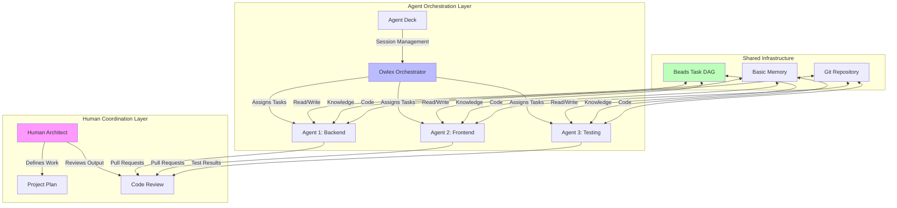

# Multi-Agent Coordination Workflow

**Purpose**: Coordinate multiple AI agents working on the same project simultaneously using Beads, Owlex, and Agent Deck to prevent conflicts and maximize parallel productivity.

**Related Documentation**:
- [[ai-tools/tool-docs/orchestration/owlex|Owlex - Multi-Agent Orchestration]]
- [[ai-tools/tool-docs/orchestration/agent-deck|Agent Deck - Session Management]]
- [[ai-tools/tool-docs/workflow/beads|Beads - Git-Backed Task Tracking]]
- [[ai-tools/integration-patterns/feature-development-end-to-end|Feature Development Workflow]]

---

## When to Use Multi-Agent Workflows

**✅ Good Use Cases**:
- Large features requiring parallel work on frontend + backend + infrastructure
- Time-sensitive projects needing rapid development
- Complex migrations affecting multiple subsystems
- Major refactoring across many files

**❌ Poor Use Cases**:
- Small features (single agent is faster)
- Features with many interdependencies (agents will block each other)
- Exploratory work with unclear requirements
- Learning/experimenting with new technologies

---

## Architecture Overview



---

## Workflow Phases

### Phase 1: Planning and Agent Assignment

**Human Responsibilities**:
1. Define feature requirements and acceptance criteria
2. Break work into parallel-capable tasks
3. Identify agent specializations needed
4. Set up Owlex team configuration

**Example: Guest Management System**

```bash
# 1. Create feature epic
bd create "Epic: Complete Guest Management System" \
  -p 0 --type epic --id bd-guest-system

# 2. Break into agent-specific work streams
bd create "Backend: Guest API and Database" \
  -p 1 --parent bd-guest-system --id bd-backend

bd create "Frontend: Guest UI Components" \
  -p 1 --parent bd-guest-system --id bd-frontend

bd create "Infrastructure: Email & Storage" \
  -p 1 --parent bd-guest-system --id bd-infra

bd create "Testing: Integration & E2E Tests" \
  -p 2 --parent bd-guest-system --id bd-testing

# 3. Set up dependencies (critical for avoiding conflicts)
bd dep add bd-frontend bd-backend --type blocks
bd dep add bd-testing bd-backend --type blocks
bd dep add bd-testing bd-frontend --type blocks

# 4. Create agent team with Owlex
owlex create-team "guest-management" \
  backend-specialist \
  frontend-specialist \
  infrastructure-specialist \
  testing-specialist
```

---

### Phase 2: Agent-Specific Task Creation

Each agent needs clearly scoped, non-overlapping tasks.

**Backend Agent Tasks**:
```bash
bd create "Design database schema for guests table" \
  -p 1 --parent bd-backend --assignee backend-specialist

bd create "Create Supabase migrations" \
  -p 1 --parent bd-backend --assignee backend-specialist

bd create "Implement CRUD API endpoints" \
  -p 1 --parent bd-backend --assignee backend-specialist

bd create "Add RLS policies for data security" \
  -p 1 --parent bd-backend --assignee backend-specialist

bd create "Create TypeScript types from schema" \
  -p 2 --parent bd-backend --assignee backend-specialist
```

**Frontend Agent Tasks**:
```bash
bd create "Design GuestList component architecture" \
  -p 1 --parent bd-frontend --assignee frontend-specialist

bd create "Implement GuestListView.swift" \
  -p 1 --parent bd-frontend --assignee frontend-specialist

bd create "Create GuestDetailView.swift" \
  -p 1 --parent bd-frontend --assignee frontend-specialist

bd create "Build GuestForm for add/edit" \
  -p 2 --parent bd-frontend --assignee frontend-specialist

bd create "Implement search and filtering UI" \
  -p 2 --parent bd-frontend --assignee frontend-specialist
```

**Infrastructure Agent Tasks**:
```bash
bd create "Set up SendGrid email integration" \
  -p 1 --parent bd-infra --assignee infrastructure-specialist

bd create "Create email templates for guest communication" \
  -p 2 --parent bd-infra --assignee infrastructure-specialist

bd create "Implement S3 storage for guest photos" \
  -p 2 --parent bd-infra --assignee infrastructure-specialist

bd create "Configure CDN for photo delivery" \
  -p 3 --parent bd-infra --assignee infrastructure-specialist
```

**Testing Agent Tasks**:
```bash
bd create "Write unit tests for API endpoints" \
  -p 2 --parent bd-testing --assignee testing-specialist

bd create "Create integration tests for guest flow" \
  -p 2 --parent bd-testing --assignee testing-specialist

bd create "Build E2E tests for guest management" \
  -p 2 --parent bd-testing --assignee testing-specialist

bd create "Set up accessibility testing" \
  -p 3 --parent bd-testing --assignee testing-specialist
```

---

### Phase 3: Agent Session Initialization

Each agent starts with its own isolated session using Agent Deck.

**Agent Session Setup**:

```bash
# Agent 1: Backend Specialist
agent-deck create-session "backend-specialist" \
  --project "I Do Blueprint" \
  --focus "Backend API and database for guest management" \
  --tools "narsil,supabase,beads,basic-memory"

# Agent 2: Frontend Specialist  
agent-deck create-session "frontend-specialist" \
  --project "I Do Blueprint" \
  --focus "SwiftUI guest management UI" \
  --tools "narsil,swiftzilla,beads,basic-memory,code-guardian"

# Agent 3: Infrastructure Specialist
agent-deck create-session "infrastructure-specialist" \
  --project "I Do Blueprint" \
  --focus "Email, storage, and CDN setup" \
  --tools "supabase,beads,basic-memory"

# Agent 4: Testing Specialist
agent-deck create-session "testing-specialist" \
  --project "I Do Blueprint" \
  --focus "Comprehensive testing for guest features" \
  --tools "narsil,beads,basic-memory,code-guardian"
```

Each agent receives:
- Their assigned tasks from Beads
- Relevant context from Basic Memory
- Tool access appropriate to their role
- Session state preservation via Agent Deck

---

### Phase 4: Parallel Execution with Coordination

**Key Coordination Mechanisms**:

1. **Beads prevents conflicts**: Hash-based IDs (bd-a1b2c3) prevent task ID collisions
2. **Git branches isolate work**: Each agent works on separate branch
3. **Basic Memory shares knowledge**: Agents document discoveries for others
4. **Owlex manages handoffs**: Seamless transitions between agents

**Example Parallel Execution**:

```
Time: Day 1, 9:00 AM

Backend Agent:
└─ Working on: bd-schema-design
   └─ Uses: Narsil to analyze existing data models
   └─ Creates: supabase/migrations/20250130_create_guests.sql
   └─ Documents: memory://projects/i-do-blueprint/database-schema-decisions

Frontend Agent:
└─ Status: Blocked (waiting for bd-schema-design)
   └─ Instead works on: Design mockups, component architecture planning
   └─ Documents: memory://projects/i-do-blueprint/ui-component-architecture

Infrastructure Agent:
└─ Working on: bd-sendgrid-setup (independent of backend)
   └─ Uses: Supabase to configure edge functions
   └─ Creates: supabase/functions/send-guest-email/
   └─ Documents: memory://projects/i-do-blueprint/email-configuration

Testing Agent:
└─ Status: Blocked (waiting for implementation)
   └─ Instead works on: Test plan creation, fixture data preparation
   └─ Documents: memory://projects/i-do-blueprint/test-strategy

---

Time: Day 1, 2:00 PM

Backend Agent:
└─ Completed: bd-schema-design
   └─ Closes task: bd close bd-schema-design
   └─ Unblocks: bd-api-implementation, bd-frontend-models
   └─ Next: bd ready shows bd-api-implementation

Frontend Agent:
└─ Now Unblocked!
   └─ Working on: bd-guest-list-view (was blocked by schema)
   └─ Uses: Narsil to find similar ListView patterns
   └─ Creates: app/Views/GuestListView.swift

Infrastructure Agent:
└─ Completed: bd-sendgrid-setup
   └─ Working on: bd-email-templates
   └─ Creates: Email template files with branding

Testing Agent:
└─ Now Has Code to Test!
   └─ Working on: bd-unit-tests-api
   └─ Uses: Backend agent's API implementation
   └─ Creates: tests/api/guestEndpoints.test.ts
```

---

### Phase 5: Agent Communication via Basic Memory

Agents don't directly message each other. Instead, they communicate asynchronously through Basic Memory.

**Pattern: Discovery Sharing**

```javascript
// Backend Agent discovers issue while implementing API
await memory.writeNote({
  title: "Guest API - Email Uniqueness Constraint Needed",
  folder: "projects/i-do-blueprint/discoveries",
  content: `
# Email Uniqueness Issue

While implementing guest creation API, discovered that we need email 
uniqueness constraint to prevent duplicate RSVPs.

## Recommendation
Add unique index on guests.email column.

## Impact
- Backend: Add migration (I'll handle this)
- Frontend: Update error handling for duplicate email scenario
- Testing: Add test case for duplicate email rejection

@frontend-specialist: Please add error handling for 409 Conflict response
@testing-specialist: Add test case to test suite

## Status
Creating task: bd create "Add email uniqueness constraint"
`,
  tags: ["discovery", "backend", "database", "needs-attention"]
});

// Frontend Agent reads and responds
await memory.searchNotes({
  query: "needs-attention frontend",
  project: "i-do-blueprint"
});

// Frontend Agent updates note
await memory.editNote({
  identifier: "Guest API - Email Uniqueness Constraint Needed",
  operation: "append",
  content: `

---

## Frontend Response (frontend-specialist)
Acknowledged. Adding error handling:
- Display user-friendly message: "This email address has already registered"
- Offer to resend confirmation email
- Link to support if user didn't register

Implementation: GuestForm.swift, error handling section
Estimated: 30 minutes
`,
  project: "i-do-blueprint"
});
```

---

### Phase 6: Conflict Resolution

Despite careful planning, conflicts can occur. Here's how to handle them:

**Scenario: Both agents modified same file**

```
Backend Agent: Modified app/Models/Guest.swift (added validation)
Frontend Agent: Modified app/Models/Guest.swift (added computed property)

Git merge conflict!
```

**Resolution Process**:

```bash
# 1. Owlex detects conflict during automated merge attempt
owlex detect-conflict \
  --agent-1 backend-specialist \
  --agent-2 frontend-specialist \
  --file app/Models/Guest.swift

# 2. Owlex creates resolution task
bd create "Resolve Guest.swift merge conflict" \
  -p 0 \
  --type bug \
  --assignee backend-specialist \
  --notes "Conflict with frontend-specialist. 
          Backend added validation, Frontend added computed property.
          Need to merge both changes."

# 3. Backend agent resolves manually
git checkout feature/guest-backend
git pull origin feature/guest-frontend

# Fix conflicts in Guest.swift
# ... combine validation + computed property ...

git add app/Models/Guest.swift
git commit -m "fix: Resolve Guest.swift conflict - merge validation and computed props"

# 4. Inform other agent via Basic Memory
await memory.writeNote({
  title: "Guest.swift Conflict Resolved",
  folder: "projects/i-do-blueprint/coordination",
  content: "Merged validation logic and computed properties. All tests passing."
});

# 5. Close task
bd close bd-conflict-task --reason "Conflict resolved, changes merged"
```

---

### Phase 7: Integration and Review

**Sequential Integration Strategy** (safest for multi-agent work):

```bash
# Day 2: Backend integration
git checkout main
git merge feature/guest-backend --no-ff
npm test && swift test  # All tests pass
git push origin main

# Day 3: Frontend integration (depends on backend)
git checkout feature/guest-frontend
git rebase main  # Get backend changes
git checkout main
git merge feature/guest-frontend --no-ff  
swift test  # Tests pass with both backend + frontend
git push origin main

# Day 3: Infrastructure integration (independent)
git checkout main
git merge feature/guest-infrastructure --no-ff
npm test  # Edge function tests pass
git push origin main

# Day 4: Testing additions (after all implementations)
git checkout feature/guest-testing
git rebase main  # Get all implementations
git checkout main
git merge feature/guest-testing --no-ff
npm test && swift test  # Full test suite passes
git push origin main
```

**Human Review Checkpoints**:

After each integration:
- Review PR diffs
- Run full test suite
- Check for unintended interactions
- Verify Beads tasks closed
- Approve before next agent integrates

---

### Phase 8: Handoff Protocol

When one agent completes their portion and another takes over:

**Using Agent Deck for Handoffs**:

```bash
# Backend Agent completes API work
bd close bd-api-implementation --reason "All endpoints implemented and tested"

# Document handoff in Agent Deck
agent-deck handoff \
  --from backend-specialist \
  --to frontend-specialist \
  --context "API endpoints ready. See memory://projects/i-do-blueprint/api-documentation. 
             All CRUD operations working. RLS policies configured. 
             Next: Frontend can now integrate with real API."

# Frontend Agent receives handoff notification
agent-deck receive-handoff

# Frontend Agent reviews handoff
# - Reads API documentation
# - Reviews backend implementation (optional)
# - Proceeds with UI integration
```

---

## Best Practices

### 1. Clear Task Boundaries

**✅ Good Task Division**:
```
Agent 1: Database schema + migrations
Agent 2: API implementation using schema
Agent 3: UI using API
Agent 4: Tests for all layers
```

**❌ Poor Task Division**:
```
Agent 1: Guest management (too broad - what part?)
Agent 2: Database and frontend (overlapping concerns)
Agent 3: API and tests (one blocks the other)
```

### 2. Minimize Shared Files

**Strategies**:
- Use dependency injection (agents work on different classes)
- Create new files instead of editing existing (when possible)
- Agree on interfaces first, implement separately

**Example**:
```swift
// agents work on different files
// NO conflicts possible

// Backend Agent creates:
protocol GuestServiceProtocol {
    func fetchGuests() async -> [Guest]
}

class SupabaseGuestService: GuestServiceProtocol {
    // Backend implementation
}

// Frontend Agent creates:
class GuestViewModel: ObservableObject {
    let service: GuestServiceProtocol
    // Frontend implementation
}
```

### 3. Regular Synchronization

```bash
# Every 2-4 hours, all agents:
bd sync          # Sync task updates
git pull --rebase origin main  # Get others' changes
npm test         # Verify still works

# Document progress
await memory.recentActivity({
  project: "i-do-blueprint",
  timeframe: "4h"
});
```

### 4. Use Owlex for Coordination

```bash
# Morning standup (automated by Owlex)
owlex standup --team guest-management

# Output for each agent:
# Backend Specialist:
#   Yesterday: Completed schema design, started API
#   Today: Finish API implementation
#   Blockers: None
#
# Frontend Specialist:
#   Yesterday: Component architecture
#   Today: Build GuestListView (now unblocked)
#   Blockers: Was blocked by schema, now resolved
```

---

## Metrics and Monitoring

### Track Agent Productivity

```bash
# Per-agent throughput
bd stats --assignee backend-specialist
bd stats --assignee frontend-specialist
bd stats --assignee infrastructure-specialist
bd stats --assignee testing-specialist

# Team velocity
bd stats --team guest-management

# Blockers
bd blocked  # Shows any blocking dependencies
```

### Measure Coordination Efficiency

**Ideal Metrics**:
- Merge conflicts: <5% of commits
- Integration time: <1 hour per agent merge
- Re-work: <10% of code changed after integration
- Blockers: Agents idle <15% of time

**Warning Signs**:
- Frequent merge conflicts (>10%)
- Long integration times (>4 hours)
- Agents blocked >30% of time
- High re-work (>25%)

---

## Troubleshooting

### Issue: Agents Stepping on Each Other

**Symptoms**: Frequent merge conflicts, duplicate work

**Solutions**:
1. Review task boundaries - are they too vague?
2. Add more granular dependencies to Beads
3. Use file ownership (each agent owns specific directories)
4. Increase communication via Basic Memory

### Issue: Agents Blocked Too Often

**Symptoms**: One agent waiting for others >50% of time

**Solutions**:
1. Identify bottleneck tasks - can they be parallelized?
2. Assign "fill-in" work (tests, docs) during blocked periods
3. Re-evaluate dependency structure
4. Consider fewer agents (3 might be better than 4)

### Issue: Poor Integration Quality

**Symptoms**: Tests fail after merging, unexpected bugs

**Solutions**:
1. Add integration testing phase before merge
2. Use feature flags for incremental rollout
3. Require human review at integration points
4. Establish clearer interface contracts upfront

---

## When to Scale Back to Single Agent

Multi-agent coordination has overhead. Return to single-agent if:

- Feature complexity drops (simple features)
- Dependencies become too tangled (everything blocks everything)
- Agents spending more time coordinating than coding
- Quality issues increase (integration bugs)
- Team size < 3 agents (not enough parallelism benefit)

**Decision Matrix**:

| Scenario | Agent Count |
|----------|-------------|
| Small feature (<3 days) | 1 agent |
| Medium feature (3-7 days), few dependencies | 1-2 agents |
| Large feature (>7 days), parallel work possible | 2-4 agents |
| System-wide migration | 3-5 agents |
| Emergency fix | 1 agent (coordination overhead too high) |

---

## Success Story Example

**Project**: Complete Guest Management Overhaul  
**Timeline**: 5 days  
**Agents**: 4 specialists  
**Result**: Successful parallel execution

**Day-by-Day Breakdown**:

**Day 1**:
- Backend: Schema design complete
- Frontend: Architecture planning
- Infrastructure: Email setup 50% complete
- Testing: Test strategy documented

**Day 2**:
- Backend: API implementation 80% complete
- Frontend: GuestListView implemented (unblocked after schema done)
- Infrastructure: Email templates complete
- Testing: Unit tests for API started

**Day 3**:
- Backend: API 100%, merged to main
- Frontend: All views complete
- Infrastructure: S3 storage configured
- Testing: Integration tests 60% complete

**Day 4**:
- Frontend: Final polish, merged to main
- Infrastructure: CDN configured, merged to main
- Testing: E2E tests complete, merged to main

**Day 5**:
- All agents: Final integration testing
- Human review and approval
- Deployment to staging
- Feature complete!

**Metrics**:
- Tasks completed: 47
- Merge conflicts: 2 (4%)
- Integration time: 45 minutes average
- Re-work: 8% (acceptable)
- Time saved vs. sequential: ~60%

---

## Related Documentation

- [[ai-tools/tool-docs/orchestration/owlex|Owlex Documentation]]
- [[ai-tools/tool-docs/orchestration/agent-deck|Agent Deck Documentation]]
- [[ai-tools/integration-patterns/feature-development-end-to-end|Feature Development Workflow]]
- [[ai-tools/integration-patterns/daily-workflow|Daily Workflow Patterns]]
- [[ai-tools/core-documentation/best-practices|Best Practices Guide]]

---

**Last Updated**: 2025-12-30  
**Version**: 1.0  
**Maintainer**: Jessica Clark