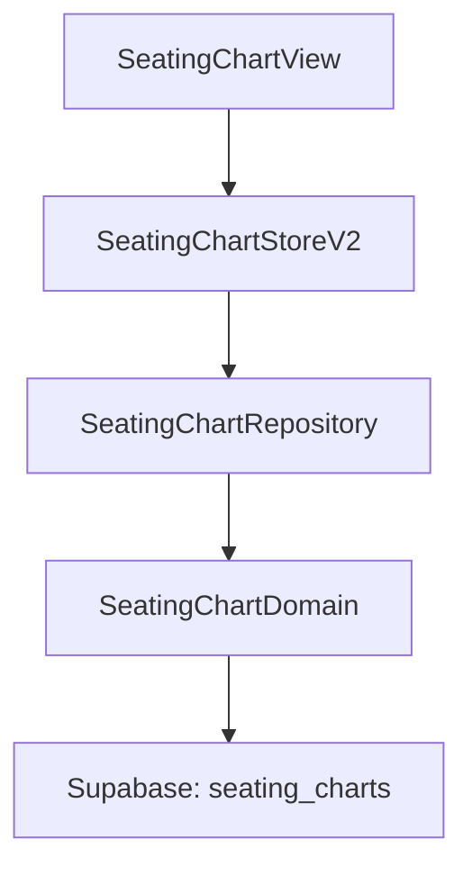
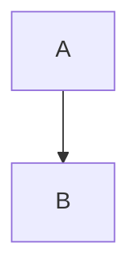

# Architecture Diagrams - Mermaid & Structurizr Integration

> **Complete guide to I Do Blueprint's documentation-as-code workflow**

## Overview

I Do Blueprint uses **two complementary diagramming tools** for architecture documentation: **Mermaid** for quick iteration and embedded diagrams, and **Structurizr DSL** for comprehensive C4 model views. Together, they provide both speed (Mermaid) and consistency (Structurizr), creating a powerful documentation-as-code workflow that lives alongside the codebase.

**This guide covers:**
- When to use Mermaid vs. Structurizr
- File organization and workflow
- Integration with Basic Memory
- Maintenance protocols
- Common patterns for I Do Blueprint

---

## Tool Selection Matrix

### Decision Framework

| Scenario | Tool | Why |
|----------|------|-----|
| Quick data flow sketch | **Mermaid** | Inline markdown, instant preview |
| Cache invalidation sequence | **Mermaid** | Sequence diagrams render natively |
| Store composition graph | **Mermaid** | Simple graph, changes frequently |
| Concurrency model | **Mermaid** | Actor boundaries, thread hops |
| Complete architecture overview | **Structurizr** | C4 model with multiple abstraction levels |
| Onboarding documentation | **Structurizr** | Context → Container → Component drill-down |
| Stakeholder presentations | **Structurizr** | Export high-quality PNGs |
| Multi-tenant RLS architecture | **Structurizr** | Complex relationships, many components |
| Marketing/one-off diagrams | **Neither** | Use visual tool (Figma, etc.) |

### Comparison Matrix

| Feature | Mermaid | Structurizr DSL |
|---------|---------|-----------------|
| **Iteration Speed** | ⚡ Instant (live preview) | 🐌 Slower (export step) |
| **Embedding** | ✅ Native in Markdown | ❌ PNG export needed |
| **Consistency** | ⚠️ Manual (copy/paste errors) | ✅ Automatic (model-based) |
| **Multiple Views** | ❌ One diagram per file | ✅ Many diagrams from one model |
| **Version Control** | ✅ Git-native | ✅ Git-native |
| **Setup** | 📦 Zero (works everywhere) | 🛠️ brew install structurizr-cli |
| **Maintenance** | 🔄 Edit each diagram | 🎯 Edit model once |
| **Stakeholders** | 👥 Developers | 👥 Developers + Executives |
| **Best For** | Specific patterns | Comprehensive architecture |

---

## File Organization

### I Do Blueprint Structure

```
docs/architecture/
├── workspace.dsl                      # 🏗️ Structurizr C4 model (EDIT THIS)
│
├── mermaid/                           # ⚡ Quick Mermaid diagrams
│   ├── data-flow.mermaid              # Five-layer architecture
│   ├── cache-strategy.mermaid         # Cache invalidation sequence
│   ├── store-composition.mermaid      # Store hierarchy
│   └── concurrency-model.mermaid      # Actor isolation model
│
└── exports/                           # 📊 Generated PNGs (AUTO-GENERATED)
    ├── SystemContext-001.png          # Structurizr: High-level view
    ├── Containers-001.png             # Structurizr: App + backend
    ├── Components-001.png             # Structurizr: Five layers detailed
    ├── DataFlowRead-001.png           # Structurizr: Read sequence
    ├── DataFlowWrite-001.png          # Structurizr: Write + cache invalidation
    ├── CacheMiss-001.png              # Structurizr: Post-invalidation flow
    └── DomainServiceDelegation-001.png # Structurizr: Repo → actor

scripts/
└── generate-diagrams.sh               # 🚀 Export script
```

**Rules:**
- ✅ **Edit**: `.dsl` and `.mermaid` source files
- ❌ **Never edit**: `.png` files in exports/ (auto-generated)
- ✅ **Commit both**: Source files AND generated PNGs

---

## Workflow Patterns

### Pattern 1: Quick Sketch (Mermaid)

**Scenario**: You need to document a new feature's data flow

**Steps:**
1. Create new `.mermaid` file in `docs/architecture/mermaid/`
2. Write diagram using Mermaid syntax
3. Preview in GitHub, Obsidian, or Mermaid Live
4. Iterate quickly until diagram is clear
5. Embed in documentation

**Example:**

```bash
# Create new diagram
cat > docs/architecture/mermaid/seating-chart-flow.mermaid << 'EOF'
```mermaid
graph TB
    View[SeatingChartView]
    Store[SeatingChartStoreV2]
    Repo[SeatingChartRepository]
    DB[(Supabase: seating_charts)]
    
    View -->|@Environment| Store
    Store -->|@Dependency| Repo
    Repo -->|async query| DB
    
    style View fill:#90EE90
    style Store fill:#87CEEB
    style Repo fill:#FFB6C1
    style DB fill:#FF6B6B
```
EOF

# Preview in GitHub or Obsidian
# (renders automatically)

# Commit
git add docs/architecture/mermaid/seating-chart-flow.mermaid
git commit -m "docs: Add seating chart data flow diagram"
```

**When to use:**
- New features (not yet in main architecture)
- Specific algorithmic patterns
- Temporary diagrams for PR explanations
- Diagrams that change frequently

---

### Pattern 2: Comprehensive Model (Structurizr)

**Scenario**: Major architectural change affects multiple components

**Steps:**
1. Edit `docs/architecture/workspace.dsl`
2. Update model (add/modify elements and relationships)
3. Regenerate PNGs via `./scripts/generate-diagrams.sh`
4. Review all affected diagrams
5. Update CLAUDE.md if needed
6. Commit both `.dsl` and `.png` files

**Example:**

```bash
# 1. Edit workspace.dsl
code docs/architecture/workspace.dsl

# Add new component:
# seatingChart = component "Seating Chart Service" "Manages table assignments" "Swift Actor"
# repositoryLayer -> seatingChart "Delegates seating logic"

# 2. Regenerate diagrams
./scripts/generate-diagrams.sh

# Output:
# Exporting diagrams from workspace.dsl...
# Generated diagrams:
# -rw-r--r--  1 jess  staff   45K Dec 30 10:30 Components-001.png
# -rw-r--r--  1 jess  staff   32K Dec 30 10:30 SystemContext-001.png
# ...
# ✅ Diagram export complete

# 3. Review changes
open docs/architecture/exports/Components-001.png

# 4. Commit everything
git add docs/architecture/workspace.dsl
git add docs/architecture/exports/*.png
git commit -m "docs: Add seating chart component to architecture model"
```

**When to use:**
- New containers or components
- Relationship changes (dependencies)
- Architectural decisions (ADRs)
- Stakeholder presentations
- Onboarding documentation updates

---

### Pattern 3: Hybrid Approach

**Scenario**: Both quick iteration AND comprehensive documentation

**Steps:**
1. **Start with Mermaid**: Quick sketch to think through the design
2. **Implement**: Build the feature
3. **Update Structurizr**: Add to comprehensive model once stable
4. **Keep Mermaid**: Use for PR documentation or specific pattern details

**Example:**

```bash
# Phase 1: Quick iteration (Mermaid)
echo '```mermaid
sequenceDiagram
    User->>GuestList: Add guest
    GuestList->>RSVP: Create RSVP record
    RSVP->>Email: Send invitation
```' > feature-sketch.md

# Phase 2: Implementation
# (write code)

# Phase 3: Add to Structurizr model
vim docs/architecture/workspace.dsl
# Add: guestList = component "Guest List Manager"
#      rsvpService = component "RSVP Service"
#      emailService = component "Email Service"

./scripts/generate-diagrams.sh

# Phase 4: Keep Mermaid for specific sequence
mv feature-sketch.md docs/architecture/mermaid/guest-invitation-sequence.mermaid
```

**Result:**
- **Mermaid**: Specific sequence (guest invitation)
- **Structurizr**: Components in architecture (Guest List Manager, RSVP Service, Email Service)

---

## Common Workflows

### 1. Architecture Changes

**Scenario**: You refactored repositories to use a new caching strategy

**Checklist:**
- [ ] Update `workspace.dsl` if components changed
- [ ] Update `cache-strategy.mermaid` if flow changed
- [ ] Regenerate Structurizr diagrams
- [ ] Update CLAUDE.md architecture section
- [ ] Update Basic Memory notes
- [ ] Commit all changes

**Commands:**
```bash
# 1. Update files
vim docs/architecture/workspace.dsl
vim docs/architecture/mermaid/cache-strategy.mermaid

# 2. Regenerate
./scripts/generate-diagrams.sh

# 3. Verify
git diff docs/architecture/

# 4. Commit
git add docs/architecture/
git commit -m "docs: Update architecture for new cache strategy

- Updated cache invalidation flow in workspace.dsl
- Revised cache-strategy.mermaid sequence diagram
- Regenerated all Structurizr views
"
```

---

### 2. New Feature Documentation

**Scenario**: Adding a new feature (e.g., Seating Chart)

**Workflow:**

```bash
# 1. Create Mermaid diagram for quick iteration
cat > docs/architecture/mermaid/seating-chart-flow.mermaid << 'EOF'

EOF

# 2. After implementation is stable, add to Structurizr
vim docs/architecture/workspace.dsl
# Add seatingChart component and relationships

# 3. Regenerate diagrams
./scripts/generate-diagrams.sh

# 4. Document in Basic Memory
# (use Basic Memory MCP to write note)

# 5. Commit everything
git add docs/architecture/
git commit -m "docs: Add seating chart feature to architecture"
```

---

### 3. Presentation Prep

**Scenario**: Need diagrams for stakeholder presentation

**Steps:**
1. Ensure Structurizr diagrams are up-to-date
2. Export high-resolution PNGs
3. Select appropriate abstraction level for audience

**Commands:**
```bash
# 1. Regenerate if needed
./scripts/generate-diagrams.sh

# 2. Open exports folder
open docs/architecture/exports

# 3. For non-technical stakeholders, use:
#    - SystemContext-001.png (users + external systems)
#    - Containers-001.png (app + backend)

# 4. For technical team, use:
#    - Components-001.png (five-layer architecture)
#    - DataFlowRead-001.png (read sequence)
#    - DataFlowWrite-001.png (write + cache)

# 5. Copy to presentation slides
cp docs/architecture/exports/SystemContext-001.png ~/Presentations/
```

---

### 4. Onboarding New Developer

**Recommended Sequence:**

**Day 1: High-Level Understanding**
1. **System Context** (Structurizr: SystemContext-001.png)
   - "What is I Do Blueprint?"
   - Users, external systems (Google Sheets, Sentry)

2. **Containers** (Structurizr: Containers-001.png)
   - "macOS app talks to Supabase"
   - Technology choices (SwiftUI, PostgreSQL)

**Day 2: Architecture Deep Dive**
3. **Components** (Structurizr: Components-001.png)
   - "Five-layer architecture"
   - Dependency injection, actor isolation

4. **Data Flow** (Mermaid: data-flow.mermaid)
   - "How data moves through layers"
   - @Environment, @Dependency, async/await

**Day 3: Specific Patterns**
5. **Store Composition** (Mermaid: store-composition.mermaid)
   - "How BudgetStoreV2 is organized"
   - Sub-stores (Affordability, Category, Payment)

6. **Cache Strategy** (Mermaid: cache-strategy.mermaid)
   - "How caching works"
   - Invalidation on writes

7. **Concurrency Model** (Mermaid: concurrency-model.mermaid)
   - "Thread safety with actors"
   - @MainActor boundaries, Sendable conformance

**Documentation Link:**
```markdown
# Architecture Overview

See [Architecture Diagrams](docs/architecture/) for visual reference.

**Start here:**
1. [System Context](docs/architecture/exports/SystemContext-001.png) - What is I Do Blueprint?
2. [Containers](docs/architecture/exports/Containers-001.png) - App + backend separation
3. [Components](docs/architecture/exports/Components-001.png) - Five-layer architecture
4. [Data Flow](docs/architecture/mermaid/data-flow.mermaid) - How data moves through the system
5. [Cache Strategy](docs/architecture/mermaid/cache-strategy.mermaid) - Caching and invalidation
```

---

## Integration with Basic Memory

### Storing Diagram Context

After generating or updating diagrams, document them in Basic Memory:

**Example (via MCP):**
```javascript
mcp__basic-memory__write_note({
  title: "Architecture Diagrams - December 2025 Update",
  folder: "architecture/diagrams",
  content: `
## Latest Architecture Diagrams

**Generated**: 2025-12-30  
**Structurizr Version**: 2025.11.09  
**Changes**: Added seating chart component

### System Context (Structurizr)


Shows I Do Blueprint in relation to:
- Users (wedding planning couples)
- External systems (Google Sheets for budget export, Sentry for error tracking)
- macOS Keychain for secure storage

### Container View (Structurizr)


Two main containers:
1. **SwiftUI Application** (client-side)
2. **Supabase Backend** (PostgreSQL + RLS)

### Component View (Structurizr)


Five-layer architecture with dependency injection:
1. **View Layer**: SwiftUI views (@Environment)
2. **Store Layer**: @MainActor ObservableObject
3. **Repository Layer**: async CRUD + cache
4. **Domain Services**: Swift actors (business logic)
5. **Supabase Backend**: PostgreSQL with RLS

### Mermaid Diagrams (Quick Reference)

**Data Flow** (\`data-flow.mermaid\`):
Shows how data flows through the five layers with @Environment and @Dependency injection.

**Cache Strategy** (\`cache-strategy.mermaid\`):
Sequence diagram showing cache invalidation on write operations.

**Store Composition** (\`store-composition.mermaid\`):
AppStores singleton → BudgetStoreV2 → sub-stores (Affordability, Category, Payment).

**Concurrency Model** (\`concurrency-model.mermaid\`):
Actor isolation boundaries and thread hopping (@MainActor → background actors).

## Related Decisions

- [[ADR-0001 Use Supabase for Backend]]
- [[ADR-0005 Cache Strategy with BudgetCacheStrategy]]
- [[Repository Pattern Implementation]]
- [[Domain Services Architecture]]
  `,
  project: "i-do-blueprint"
})
```

### Cross-Referencing

Link diagrams to related concepts:

```markdown
# Cache Strategy Patterns

See architecture diagrams for visual reference:
- [Cache invalidation sequence](../architecture/mermaid/cache-strategy.mermaid)
- [Component diagram](../architecture/exports/Components-001.png) showing cache layer

## Implementation

The \`BudgetCacheStrategy\` implements cache invalidation on write operations...
```

---

## Maintenance Protocol

### When Architecture Changes

**Checklist:**
- [ ] Code implementation updated
- [ ] workspace.dsl updated (if major change)
- [ ] Relevant .mermaid files updated
- [ ] Run `./scripts/generate-diagrams.sh`
- [ ] CLAUDE.md architecture section updated
- [ ] Basic Memory notes updated
- [ ] Commit both source and exports

### Quality Checklist

Before committing diagram updates:

- [ ] Diagrams match actual codebase structure
- [ ] Layer boundaries are clear (View → Store → Repository → Domain → Database)
- [ ] Cache flows show invalidation strategy
- [ ] Multi-tenancy (couple_id) is visible where relevant
- [ ] Concurrency model (actors, @MainActor) is clear
- [ ] External integrations are documented
- [ ] Colors are consistent with style guide
- [ ] All views in workspace.dsl compile without errors
- [ ] PNGs are readable at presentation size
- [ ] Mermaid diagrams render in GitHub/Obsidian

### Git Commit Message Template

```
docs: Update architecture diagrams for [change description]

Changes:
- Updated workspace.dsl to reflect [change]
- Updated [diagram-name].mermaid to show [change]
- Regenerated all PNG exports

Affects:
- [Component/Layer name]
- [Feature name]

Relates to: [Issue/PR/ADR reference]
```

**Examples:**

```
docs: Update architecture diagrams for seating chart feature

Changes:
- Added SeatingChartService component to workspace.dsl
- Created seating-chart-flow.mermaid for data flow
- Regenerated Components-001.png

Affects:
- Domain Services layer
- New seating chart feature

Relates to: PR #123
```

```
docs: Revise cache strategy in architecture diagrams

Changes:
- Updated cache invalidation flow in workspace.dsl
- Revised cache-strategy.mermaid sequence diagram
- Regenerated DataFlowWrite-001.png

Affects:
- Repository Layer
- Cache Strategy

Relates to: ADR-0005
```

---

## Troubleshooting

### Mermaid Not Rendering

**GitHub:**
- Check syntax: ` ```mermaid` (no space after backticks)
- Verify diagram type declaration (e.g., `graph TB`, `sequenceDiagram`)
- Test in [Mermaid Live](https://mermaid.live)

**Obsidian:**
- Enable in Settings → Editor → Mermaid diagrams
- Install "Mermaid Plugin" if using older version
- Check syntax at mermaid.live

**Solution:**
```markdown
<!-- ❌ Bad: Space breaks rendering -->


<!-- ✅ Good: No space -->

```

---

### Structurizr Export Fails

**Problem**: `./scripts/generate-diagrams.sh` produces no files

**Diagnostics:**
```bash
# 1. Validate workspace syntax
structurizr-cli validate -workspace docs/architecture/workspace.dsl

# 2. Check permissions
ls -la docs/architecture/exports

# 3. Verify Structurizr CLI version
structurizr-cli --version

# 4. Update if needed
brew upgrade structurizr-cli
```

**Common Errors:**
- **Missing closing braces `}`**: Check workspace.dsl syntax
- **Duplicate element names**: Each element must have unique name within scope
- **Invalid relationship syntax**: Use `->` not `→`
- **Undefined component references**: Ensure all referenced elements exist

---

### Diagrams Out of Sync

**Problem**: workspace.dsl and Mermaid diagrams show different architecture

**Solution**: Decide which is source of truth

```bash
# Option 1: Structurizr is source of truth
# Update Mermaid diagrams to match workspace.dsl
vim docs/architecture/mermaid/data-flow.mermaid

# Option 2: Mermaid represents specific detail
# Update workspace.dsl to add missing high-level component
vim docs/architecture/workspace.dsl

# Regenerate and verify
./scripts/generate-diagrams.sh
git diff docs/architecture/
```

---

## Advanced Patterns

### Pattern: Diagram Versioning

**Scenario**: Major architectural milestone (e.g., MVP vs. post-MVP)

**Approach**: Tag releases and archive old diagrams

```bash
# 1. Tag current version
git tag -a v1.0-architecture -m "MVP architecture diagrams"

# 2. Create archive
mkdir -p docs/architecture/archive/v1.0
cp docs/architecture/exports/*.png docs/architecture/archive/v1.0/

# 3. Continue with new architecture
vim docs/architecture/workspace.dsl
./scripts/generate-diagrams.sh

# 4. Document in Basic Memory
# "Architecture Evolution: MVP → Post-MVP"
```

---

### Pattern: Diagram Annotations

**Scenario**: Add context to generated diagrams for presentations

**Approach**: Export PNG, annotate in visual tool

```bash
# 1. Export high-res PNG
./scripts/generate-diagrams.sh

# 2. Open in annotation tool (Preview, Pixelmator, etc.)
open -a Preview docs/architecture/exports/Components-001.png

# 3. Add annotations:
# - Highlight new components
# - Add callout boxes for key points
# - Number elements for presentation flow

# 4. Save annotated version separately
# docs/architecture/presentations/components-annotated.png
```

**Don't** overwrite auto-generated PNGs with annotations.

---

### Pattern: Living Documentation

**Scenario**: Diagrams embedded in engineering wiki/docs

**Approach**: Reference from central documentation

**In Markdown docs:**
```markdown
# Architecture Overview

## System Context


*Last updated: 2025-12-30*

The system context shows...

## Five-Layer Architecture

```mermaid
%%{ init: { 'theme': 'forest' } }%%
graph TB
    View[View Layer] --> Store[Store Layer]
    Store --> Repo[Repository Layer]
    Repo --> Domain[Domain Services]
    Domain --> DB[(Supabase)]
    
    style View fill:#90EE90
    style Store fill:#87CEEB
    style Repo fill:#FFB6C1
    style Domain fill:#F0E68C
    style DB fill:#FF6B6B
\`\`\`

See [Component Diagram](exports/Components-001.png) for detailed view.
```

**In Basic Memory:**
```javascript
// Link to architectural concepts
write_note({
  title: "Five-Layer Architecture",
  content: `
## Layers

1. **View** (@MainActor SwiftUI)
2. **Store** (@MainActor ObservableObject)
3. **Repository** (async/await)
4. **Domain** (Swift actors)
5. **Supabase** (PostgreSQL + RLS)

See: [Architecture Diagrams](../architecture/exports/Components-001.png)
  `
})
```

---

## Summary

I Do Blueprint uses **Mermaid for speed** and **Structurizr for consistency**, creating a powerful documentation-as-code workflow. Mermaid handles specific patterns that change frequently (cache invalidation, store composition), while Structurizr maintains the comprehensive C4 model with multiple abstraction levels.

**Key Principles:**
- 🎯 **Right tool for right job** (Mermaid for speed, Structurizr for consistency)
- 📁 **Organized structure** (.mermaid for quick diagrams, workspace.dsl for comprehensive model)
- 🔄 **Automated generation** (./scripts/generate-diagrams.sh)
- ✅ **Version control both** (source files AND generated PNGs)
- 📚 **Integrated with Basic Memory** (diagram context stored alongside code concepts)

**Workflow Summary:**
1. **Quick iteration**: Mermaid diagrams in `docs/architecture/mermaid/`
2. **Comprehensive model**: Structurizr workspace.dsl
3. **Generate exports**: `./scripts/generate-diagrams.sh`
4. **Commit both**: Source and PNGs
5. **Document**: Update Basic Memory notes and CLAUDE.md

**I Do Blueprint Diagrams:**

| Type | Format | Purpose | Audience |
|------|--------|---------|----------|
| Data Flow | Mermaid | Five-layer architecture overview | Developers |
| Cache Strategy | Mermaid | Invalidation sequence | Developers |
| Store Composition | Mermaid | Store hierarchy | Developers |
| Concurrency Model | Mermaid | Actor isolation | Developers |
| System Context | Structurizr | High-level view + external systems | Executives, stakeholders |
| Containers | Structurizr | App + backend separation | Technical team |
| Components | Structurizr | Five layers detailed | Developers, architects |
| Dynamic Views | Structurizr | Read/write sequences | Developers |

---

**Last Updated**: December 30, 2025  
**I Do Blueprint Integration**: Active  
**Tools**: Mermaid.js 10.x + Structurizr CLI 2025.11.09