# Mermaid - Diagram as Code

> **JavaScript-based diagramming with Markdown-inspired text syntax**

## Overview

Mermaid is a JavaScript-based diagramming and charting tool that renders Markdown-inspired text definitions to create and modify complex diagrams dynamically. It enables developers and technical writers to create diagrams as code, solving the "doc-rot" problem where documentation becomes outdated quickly. With Mermaid, diagrams live alongside code in version control and can be embedded directly in Markdown files.

**Agent Attachments:**
- ❌ Qodo Gen (standalone tool, embedded in Markdown)
- ❌ Claude Code (standalone tool, embedded in Markdown)
- ❌ Claude Desktop (standalone tool, embedded in Markdown)
- ✅ **CLI/Shell** (agent-agnostic, renders in any Markdown viewer)
- ✅ **Markdown Native** (GitHub, Obsidian, GitLab, Notion all support Mermaid)

**I Do Blueprint Usage:**
- **Location**: `docs/architecture/mermaid/`
- **Files**: data-flow.mermaid, cache-strategy.mermaid, store-composition.mermaid, concurrency-model.mermaid
- **Purpose**: Quick iteration diagrams for specific architectural patterns

---

## Key Features

### 1. **Diagrams as Code**
- Text-based definitions in Markdown syntax
- No drag-and-drop required
- Git-friendly (diff, review, version control)
- Fast iteration - see changes instantly

### 2. **Markdown-Native Rendering**
- Works in GitHub, GitLab, Bitbucket
- Obsidian, Notion, Confluence support
- No export step needed
- Live preview in many editors

### 3. **20+ Diagram Types**
- Flowcharts & graphs
- Sequence diagrams
- Class diagrams (UML)
- State diagrams
- ER diagrams
- Gantt charts
- Pie charts
- Git graphs
- User journeys
- And more...

### 4. **Customization**
- Hand-drawn or classic look
- Custom themes (forest, dark, default, neutral)
- CSS styling for nodes and edges
- Color schemes and fonts
- Layout algorithms (Dagre, ELK)

### 5. **Security**
- Sandboxed iframe rendering option
- Prevents malicious script execution
- Safe for user-generated content
- Security-first design

---

## Installation & Setup

### No Installation Required

Mermaid renders natively in:
- GitHub/GitLab markdown files
- Obsidian vaults
- Many documentation platforms

Simply use triple backticks with `mermaid` language tag:

````markdown
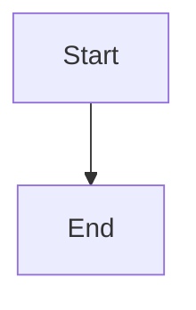
````

### Mermaid Live Editor

For testing and preview: **https://mermaid.live**

Features:
- Real-time preview
- Export to PNG/SVG
- Share diagrams via URL
- Auto-save history
- Configuration editor

### VS Code Extension

Install "Mermaid Preview" extension:
```bash
# Search in VS Code extensions
Mermaid Preview
```

Features:
- Live preview pane
- Syntax highlighting
- Auto-completion
- Error detection

---

## Diagram Types Reference

### 1. Flowcharts (Graph Diagrams)

**Best For**: Process flows, decision trees, algorithm visualization

**Basic Syntax:**
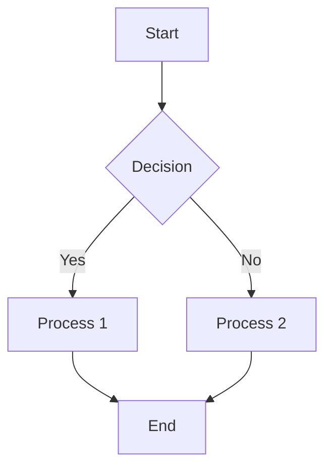

**Directions:**
- `TD` or `TB` - Top to bottom
- `BT` - Bottom to top
- `LR` - Left to right
- `RL` - Right to left

**Node Shapes (30+ available):**
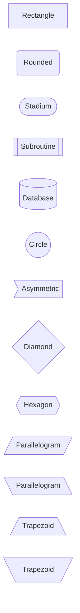

**New Semantic Shapes:**
```mermaid
flowchart LR
    A@{ shape: process, label: "Process" }
    B@{ shape: decision, label: "Decision" }
    C@{ shape: event, label: "Event" }
    D@{ shape: database, label: "Database" }
    E@{ shape: cloud, label: "Cloud" }
    F@{ shape: queue, label: "Queue" }
```

**Link Types:**
```mermaid
flowchart LR
    A --> B  %% Solid arrow
    C --- D  %% Solid line
    E -.-> F  %% Dotted arrow
    G ==> H  %% Thick arrow
    I --text--> J  %% Arrow with label
    K ---|text| L  %% Line with label
```

**Subgraphs:**
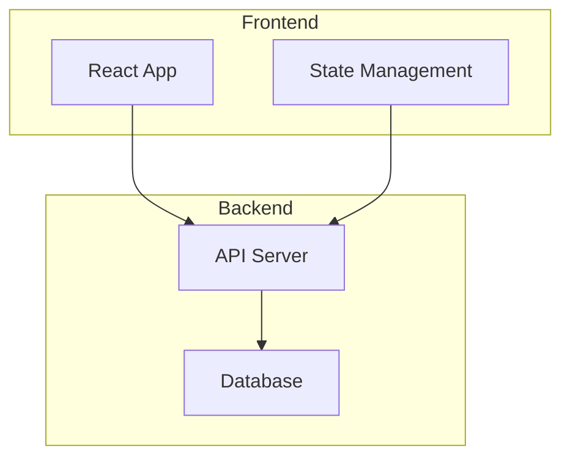

**Styling:**
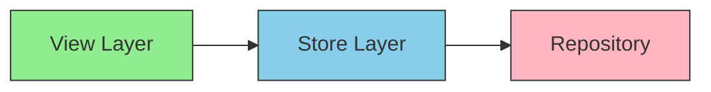

---

### 2. Sequence Diagrams

**Best For**: Message flows, API calls, actor interactions over time

**Basic Syntax:**
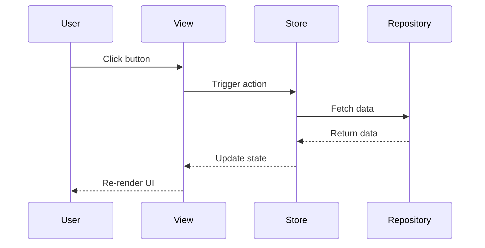

**Message Types:**
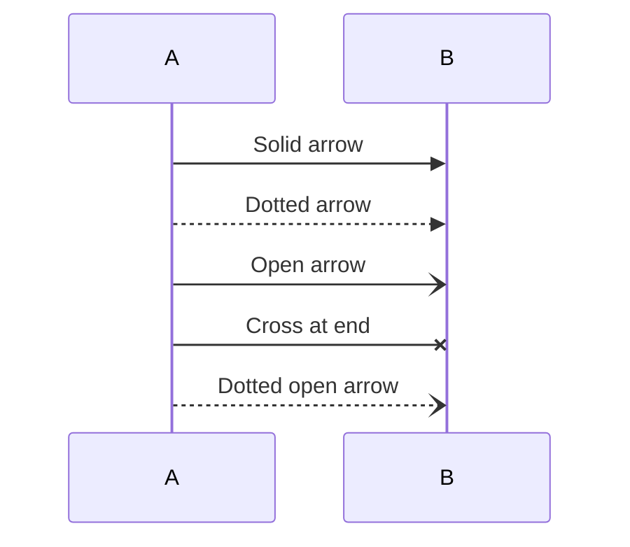

**Activation/Deactivation:**
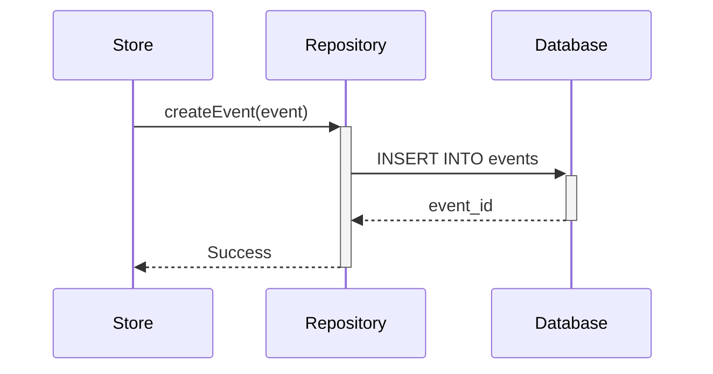

**Loops & Conditions:**
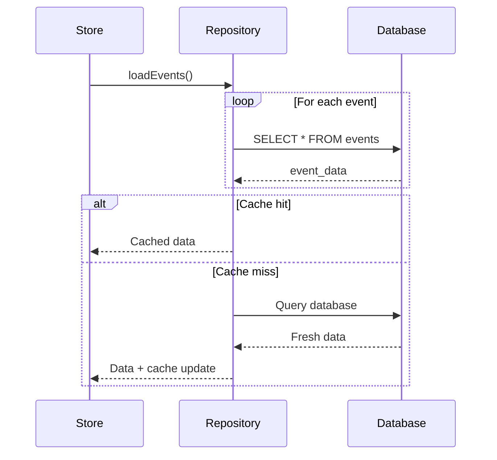

**Notes:**
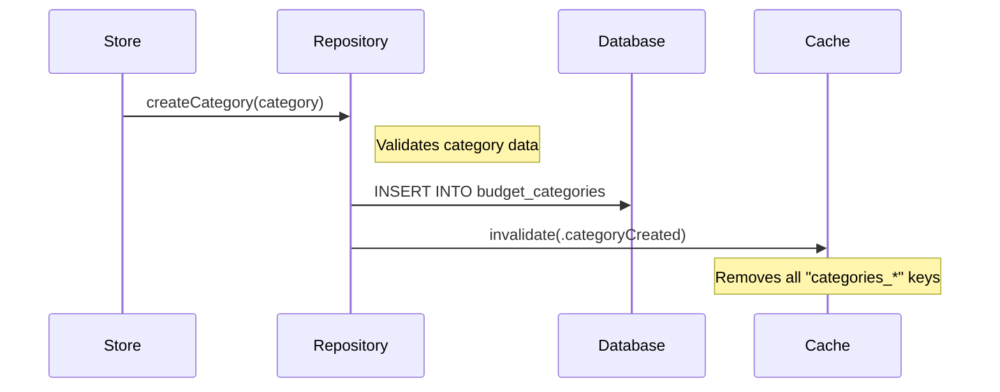

**Grouping with Boxes:**
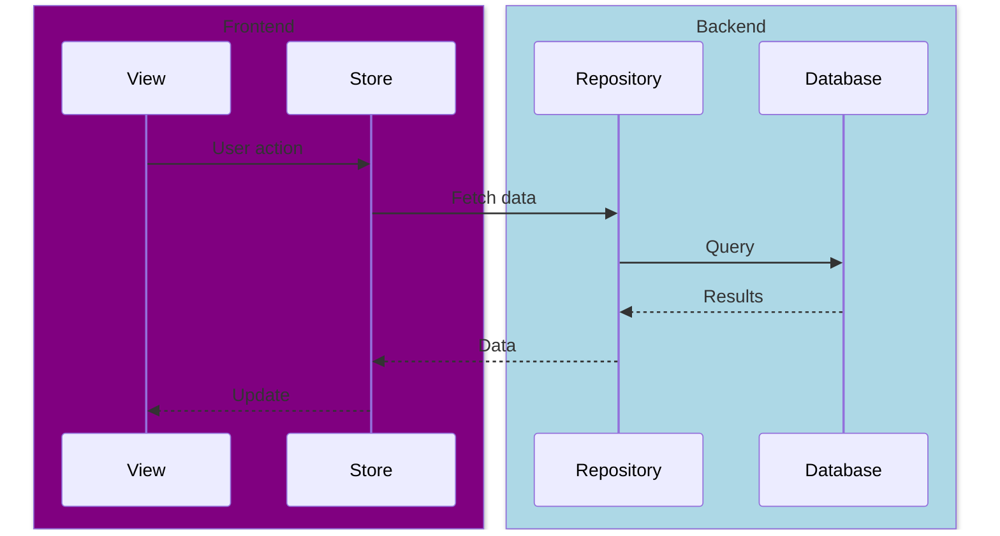

---

### 3. Class Diagrams (UML)

**Best For**: Object-oriented design, data models, system structure

**Basic Syntax:**
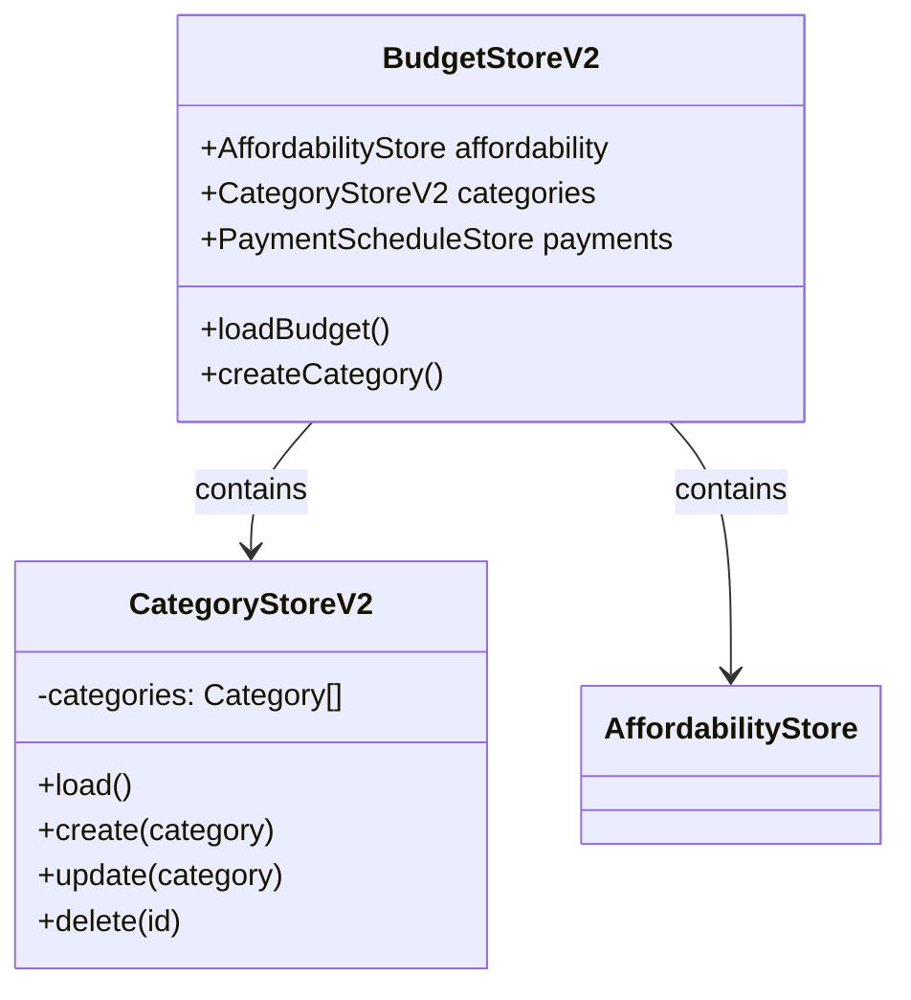

**Visibility Modifiers:**
- `+` Public
- `-` Private
- `#` Protected
- `~` Package/Internal

**Relationship Types:**
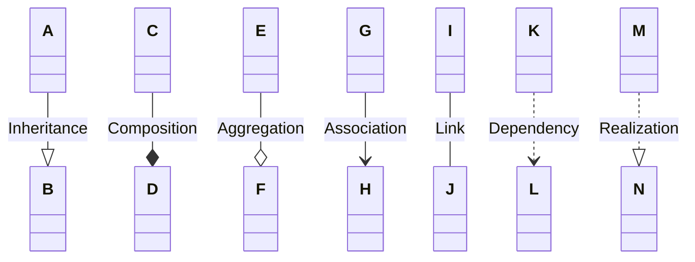

**Methods & Attributes:**
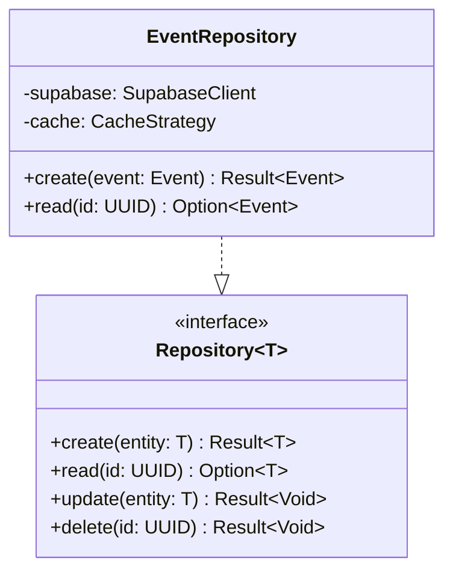

---

### 4. State Diagrams

**Best For**: Finite state machines, workflow states, UI states

**Basic Syntax:**
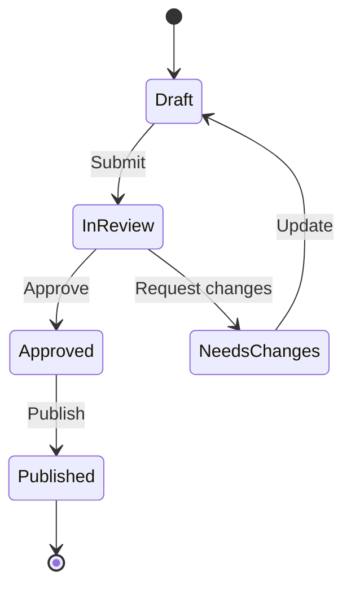

**Composite States:**
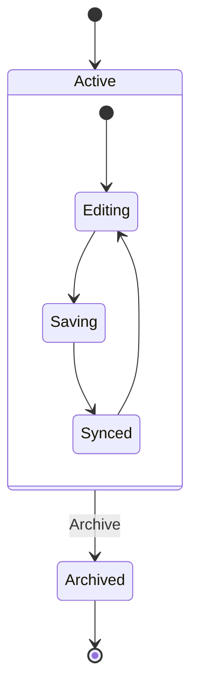

**Concurrent States:**
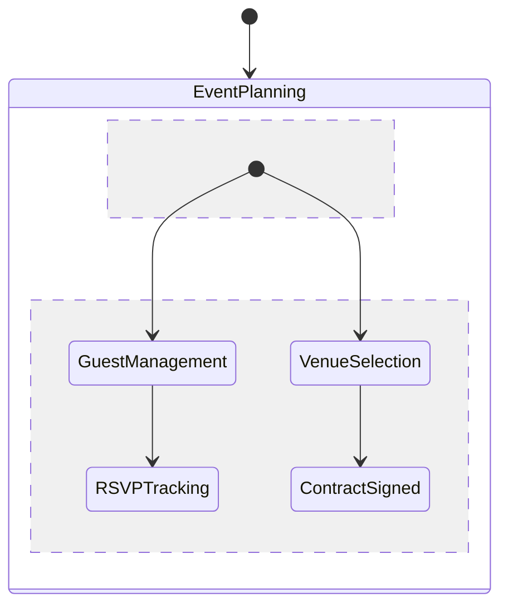

---

### 5. Entity Relationship Diagrams

**Best For**: Database schema, data modeling

**Basic Syntax:**
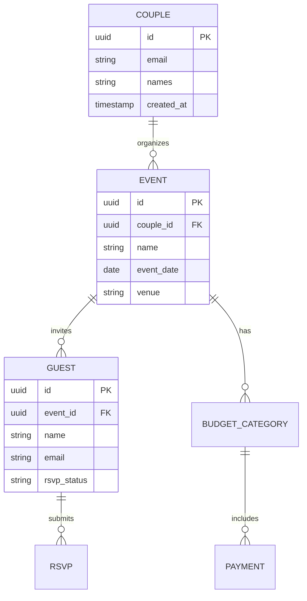

**Cardinality:**
- `||--||` One to one
- `||--o{` One to many
- `}o--o{` Many to many
- `||--o|` One to zero or one

---

### 6. Gantt Charts

**Best For**: Project timelines, sprint planning, task scheduling

**Basic Syntax:**
```mermaid
gantt
    title I Do Blueprint Development Schedule
    dateFormat YYYY-MM-DD
    section MVP Features
    User Authentication        :done,    auth, 2025-01-01, 14d
    Event Management          :active,  events, after auth, 21d
    Guest Management          :         guests, after events, 14d
    RSVP System              :         rsvp, after guests, 10d
    
    section Infrastructure
    Supabase Setup           :done,    db, 2025-01-01, 7d
    RLS Policies             :done,    rls, after db, 5d
    Caching Layer            :active,  cache, after rls, 10d
    
    section Testing
    Unit Tests               :         tests, 2025-02-15, 7d
    Integration Tests        :         integration, after tests, 5d
```

---

### 7. Pie & Donut Charts

**Best For**: Proportions, percentages, distributions

**Pie Chart:**
```mermaid
pie title Wedding Budget Breakdown
    "Venue" : 35
    "Catering" : 25
    "Photography" : 15
    "Music/DJ" : 10
    "Flowers" : 8
    "Other" : 7
```

**Donut Chart:**
```mermaid
%%{init: {'theme':'base', 'themeVariables': { 'pie1':'#90EE90', 'pie2':'#87CEEB', 'pie3':'#FFB6C1'}}}%%
pie
    title RSVP Status
    "Attending" : 120
    "Declined" : 30
    "Pending" : 45
```

---

### 8. Git Graph

**Best For**: Branch workflows, version control visualization

**Basic Syntax:**
```mermaid
gitGraph
    commit
    branch feature/auth
    checkout feature/auth
    commit
    commit
    checkout main
    branch feature/events
    checkout feature/events
    commit
    checkout main
    merge feature/auth
    checkout feature/events
    commit
    checkout main
    merge feature/events
```

---

### 9. User Journey

**Best For**: User experience flows, customer journey mapping

**Basic Syntax:**
```mermaid
journey
    title Wedding Guest RSVP Journey
    section Invitation
      Receive email: 5: Guest
      Open website: 4: Guest
      View event details: 5: Guest
    section RSVP
      Find RSVP form: 3: Guest
      Fill out form: 4: Guest
      Select meal preference: 4: Guest
      Submit RSVP: 5: Guest
    section Confirmation
      Receive confirmation: 5: Guest
      Add to calendar: 4: Guest
```

---

## I Do Blueprint Use Cases

### 1. Five-Layer Architecture (data-flow.mermaid)

```mermaid
graph TB
    subgraph "Presentation Layer"
        View[View Layer<br/>SwiftUI Views]
    end
    
    subgraph "State Management"
        Store[Store Layer<br/>@MainActor ObservableObject]
    end
    
    subgraph "Data Access"
        Repo[Repository Layer<br/>async CRUD + cache]
    end
    
    subgraph "Business Logic"
        Domain[Domain Services<br/>Actor-based]
    end
    
    subgraph "Infrastructure"
        DB[(Supabase<br/>PostgreSQL + RLS)]
    end
    
    View -->|@Environment| Store
    Store -->|@Dependency| Repo
    Repo -->|async/await| Domain
    Domain -->|Query| DB
    
    style View fill:#90EE90
    style Store fill:#87CEEB
    style Repo fill:#FFB6C1
    style Domain fill:#F0E68C
    style DB fill:#FF6B6B
```

**Purpose**: Quick visual reference for new developers
**Updates**: When layer responsibilities change

---

### 2. Cache Invalidation Sequence (cache-strategy.mermaid)

```mermaid
sequenceDiagram
    participant Store as BudgetStoreV2
    participant Repo as CategoryRepository
    participant Cache as BudgetCacheStrategy
    participant DB as Supabase
    
    Store->>+Repo: createCategory(category)
    Repo->>+DB: INSERT INTO budget_categories
    DB-->>-Repo: category_id
    
    Note over Repo,Cache: Cache Invalidation
    Repo->>Cache: invalidate(.categoryCreated)
    Cache->>Cache: remove("categories_*")
    Cache->>Cache: remove("budget_*")
    
    Repo-->>-Store: Success(category)
    Store->>Store: Update local state
    
    Note right of Store: Next read will<br/>trigger cache miss
```

**Purpose**: Document cache invalidation strategy
**Updates**: When invalidation rules change

---

### 3. Store Composition (store-composition.mermaid)

```mermaid
graph LR
    App[AppStores<br/>Singleton]
    
    Budget[BudgetStoreV2]
    Afford[AffordabilityStore]
    Category[CategoryStoreV2]
    Payment[PaymentScheduleStore]
    
    Event[EventStoreV2]
    Guest[GuestStoreV2]
    RSVP[RSVPStoreV2]
    
    App --> Budget
    App --> Event
    App --> Guest
    App --> RSVP
    
    Budget --> Afford
    Budget --> Category
    Budget --> Payment
    
    style App fill:#DDA0DD,stroke:#333,stroke-width:3px
    style Budget fill:#87CEEB,stroke:#333
    style Event fill:#87CEEB,stroke:#333
    style Afford fill:#FFE4B5,stroke:#333
    style Category fill:#FFE4B5,stroke:#333
    style Payment fill:#FFE4B5,stroke:#333
```

**Purpose**: Show store hierarchy and relationships
**Updates**: When new stores or sub-stores added

---

### 4. Concurrency Model (concurrency-model.mermaid)

```mermaid
graph TB
    subgraph "@MainActor Boundary"
        View[SwiftUI Views]
        Store[Stores<br/>@MainActor ObservableObject]
    end
    
    subgraph "Background Actors"
        Repo[Repositories<br/>Sendable conformance]
        Domain[Domain Services<br/>actor isolation]
    end
    
    View -->|"@Environment<br/>Main thread"| Store
    Store -->|"async call<br/>Thread hop"| Repo
    Repo -->|"actor isolation"| Domain
    
    Domain -.->|"async return<br/>Thread hop"| Repo
    Repo -.->|"@MainActor<br/>Back to main"| Store
    
    style View fill:#90EE90
    style Store fill:#87CEEB
    style Repo fill:#FFB6C1
    style Domain fill:#F0E68C
```

**Purpose**: Document Swift concurrency patterns
**Updates**: When actor boundaries change

---

## Configuration & Customization

### Frontmatter Configuration

Add YAML metadata at the start of the diagram:

```mermaid
---
config:
  theme: forest
  look: handDrawn
  layout: elk
---
flowchart TD
    A --> B
```

### Directive Configuration

Configure inline with `%%{init: {}}%%`:

```mermaid
%%{init: {'theme':'dark', 'themeVariables': { 'primaryColor':'#90EE90'}}}%%
flowchart TD
    A[Start] --> B[End]
```

### Themes

Built-in themes:
- `default` - Clean, professional
- `forest` - Green tones
- `dark` - Dark mode
- `neutral` - Grayscale
- `base` - Minimal styling

```mermaid
%%{init: {'theme':'forest'}}%%
flowchart LR
    A[View] --> B[Store] --> C[Repository]
```

### Custom Styling

**Class Definitions:**
```mermaid
flowchart TD
    A[Important]:::highlight
    B[Normal]
    C[Warning]:::warning
    
    classDef highlight fill:#90EE90,stroke:#333,stroke-width:4px
    classDef warning fill:#FF6B6B,stroke:#333,stroke-width:2px
```

**Link Styling:**
```mermaid
flowchart LR
    A --> B
    C --> D
    
    linkStyle 0 stroke:#FF6B6B,stroke-width:4px
    linkStyle 1 stroke:#90EE90,stroke-width:2px,stroke-dasharray: 5
```

### Layout Algorithms

**Dagre (Default):**
```mermaid
---
config:
  layout: dagre
---
flowchart TD
    A --> B --> C
```

**ELK (Better for complex diagrams):**
```mermaid
---
config:
  layout: elk
  elk:
    mergeEdges: true
    nodePlacementStrategy: LINEAR_SEGMENTS
---
flowchart TD
    A --> B --> C --> D
    A --> E --> F --> D
```

---

## Best Practices

### 1. Keep It Simple

**Good:**
```mermaid
flowchart LR
    View --> Store --> Repo
```

**Too Complex:**
```mermaid
flowchart TD
    A[View with very long description and lots of details]
    B{Complex decision with multiple conditions}
    C[Another long node description]
    A -->|"Very detailed edge label with explanations"| B
    B -->|"Another lengthy explanation"| C
```

### 2. Use Descriptive Node IDs

**Good:**
```mermaid
flowchart TD
    userAuth[User Authentication]
    validation[Data Validation]
    userAuth --> validation
```

**Bad:**
```mermaid
flowchart TD
    A[User Authentication]
    B[Data Validation]
    A --> B
```

### 3. Group Related Elements

Use subgraphs for clarity:
```mermaid
flowchart TD
    subgraph Frontend
        UI[User Interface]
        State[State Management]
    end
    
    subgraph Backend
        API[API Layer]
        DB[(Database)]
    end
    
    UI --> State --> API --> DB
```

### 4. Apply Consistent Styling

Define a color scheme and stick to it:
```mermaid
flowchart TD
    A[Presentation]
    B[Business]
    C[Data]
    
    style A fill:#90EE90
    style B fill:#87CEEB
    style C fill:#FFB6C1
```

### 5. Add Context with Notes

In sequence diagrams, clarify complex flows:
```mermaid
sequenceDiagram
    User->>API: Login
    Note right of API: Validates credentials<br/>and generates JWT
    API-->>User: Token
```

---

## Common Pitfalls & Solutions

### 1. Reserved Words

**Problem**: Using "end" breaks diagrams

**Solution**: Capitalize or use brackets
```mermaid
flowchart TD
    A[Start] --> B[END]  %% Good: capitalized
    C[Start] --> D["end"]  %% Good: quoted
    E[Start] --> F[end]  %% Bad: breaks diagram
```

### 2. Special Characters in Links

**Problem**: "o" or "x" at start of node creates special edge

**Solution**: Add space or capitalize
```mermaid
flowchart LR
    A --> ops  %% Good: lowercase "o" not at start
    B --> Ops  %% Good: capitalized
    C --o D  %% This creates circle edge (intentional)
```

### 3. Mermaid Not Rendering

**GitHub/Obsidian:**
- Ensure code fence has no space: ` ```mermaid`
- Check syntax errors in Live Editor
- Verify diagram type declaration is correct

**VS Code:**
- Install Mermaid Preview extension
- Check Output panel for errors

### 4. Large Diagrams Performance

**Solution**: Use ELK layout for complex diagrams
```mermaid
---
config:
  layout: elk
---
flowchart TD
    %% Large diagram with many nodes
```

---

## Integration Guide

### GitHub Markdown

Works automatically in `.md` files:
````markdown
```mermaid
graph TD
    A --> B
```
````

### Obsidian

Enable Mermaid in settings (enabled by default):
1. Settings → Editor → Enable Mermaid diagrams
2. Use standard code fences

### Notion

Use `/code` block and select Mermaid language

### Confluence

Install "Mermaid Diagrams for Confluence" plugin

---

## Resources

### Official Documentation

- **Website**: https://mermaid.js.org
- **Live Editor**: https://mermaid.live
- **GitHub**: https://github.com/mermaid-js/mermaid
- **Syntax Reference**: https://mermaid.js.org/intro/syntax-reference.html

### Tutorials

- **Getting Started**: https://mermaid.js.org/intro/getting-started.html
- **Flowchart Guide**: https://mermaid.js.org/syntax/flowchart.html
- **Sequence Diagram Guide**: https://mermaid.js.org/syntax/sequenceDiagram.html

### Community

- **GitHub Discussions**: https://github.com/mermaid-js/mermaid/discussions
- **Stack Overflow**: Tag `mermaid`
- **Discord**: Mermaid community server

---

## Summary

Mermaid is the **fastest way to create diagrams as code** for technical documentation. It excels at quick iteration, Markdown embedding, and version control integration. For I Do Blueprint, Mermaid handles specific architectural patterns (data flow, caching, store composition, concurrency) that need frequent updates and live alongside code.

**Key Strengths:**
- 📝 **Markdown-native** (no export needed)
- ⚡ **Instant rendering** (GitHub, Obsidian, etc.)
- 🎨 **20+ diagram types** (flowcharts to Gantt charts)
- 🔄 **Git-friendly** (text-based, diffable)
- 🚀 **Zero setup** (works everywhere Markdown works)
- 🎯 **Fast iteration** (live preview, immediate feedback)

**Perfect For:**
- Data flow diagrams
- Sequence diagrams (cache invalidation, API calls)
- Quick architectural sketches
- Documentation that lives in git repos
- Diagrams that change frequently

**I Do Blueprint Files:**
- `data-flow.mermaid` - Five-layer architecture
- `cache-strategy.mermaid` - Cache invalidation patterns
- `store-composition.mermaid` - Store hierarchy
- `concurrency-model.mermaid` - Swift actor isolation

---

**Last Updated**: December 30, 2025  
**Version**: Mermaid 10.x  
**I Do Blueprint Integration**: Active